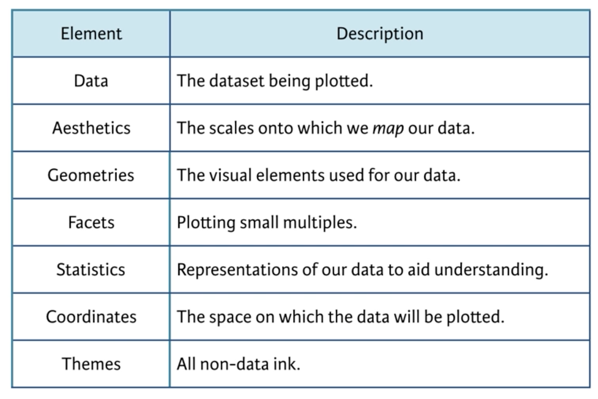
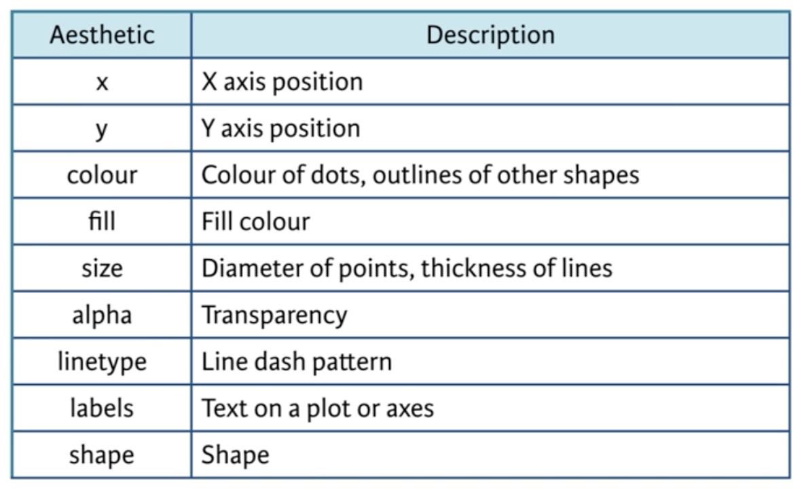

```{r setup, include=FALSE}
knitr::opts_chunk$set(eval=T, echo=T, cache=T, message=F, warning=F)

source("create_datasets.R")

library(dplyr)
library(ggplot2)
```

# My Introduction

  - Course notes from the [Data Vizualization with ggplot2 (Part 1)](https://www.datacamp.com/courses/data-visualization-with-ggplot2-1) course on DataCamp
  
## Whats Covered

These notes are split into two documents due to size.

  - Doc A 
    - Introduction 
    - Data
    - Aesthetics
  - Doc B 
    - Geometries
    - qplot and wrap-up

## Aditional Resources
  
&nbsp; &nbsp;

***  
# Introduction
***  

## Introduction

  - Data visualization is statistics and graphical designed combined
    - The function is to accurately represent the data
    - The form is important to communicate the point well
  - Choose your audience first
    - Exploratory plots are for yourself and maye colleagues and meant to confirm and analyze
    - Explanatory plots are for a reader and are meant to inform and persuade

### -- Explore and Explain

  - Exploratory plots are
    - meant for a specialist audience
    - usaually data-heavy
    - rough first drafts with less attention to making it pretty

### -- Exploring ggplot2, part 1

```{r}

# Load the ggplot2 package
library(ggplot2)

# Explore the mtcars data frame with str()
str(mtcars)

# Execute the following command
ggplot(mtcars, aes(x = cyl, y = mpg)) +
  geom_point()

```

### -- Exploring ggplot2, part 2

  - We need to tell ggplot2 that `cyl` is a categorical variable by wrapping it in `factor()`
  
```{r}

# Load the ggplot2 package
library(ggplot2)

# Change the command below so that cyl is treated as factor
ggplot(mtcars, aes(x = factor(cyl), y = mpg)) +
  geom_point()

```

## Grammar of Graphics

  - Leland Wilkinson, Grammar of Graphics, 1999
  - 2 principles
    - graphics are made up of distinct layers of the grammatical elements
    - meanigful plots are build around appropriate asthetical mappings
  - Layers
    - The first 3 layers are essential for a plot. 
    - The last 4 are optional
    - This course focuses on the first 3 layers
    
  - Each of these layers has specific elements that can be added or manipulated to create a plot
    - this is just a sample of some of the elements in each layer to get the jist
    
  
### -- Exporing ggplot2, part 3

```{r}

# A scatter plot has been made for you
ggplot(mtcars, aes(x = wt, y = mpg)) +
  geom_point()

# Replace ___ with the correct column
ggplot(mtcars, aes(x = wt, y = mpg, color = disp)) +
  geom_point()

# Replace ___ with the correct column
ggplot(mtcars, aes(x = wt, y = mpg, size = disp)) +
  geom_point()

```

### -- Understanding variables

  - some aestethics, like `color` can be mapped to either a discreate or continuous variable
    - for example you can use a qualitative color scale for discrete data or a sequential color scale for continuous data
  - but other aesthetics, like `shape`, only make sense on a discreate variable
    - i.e. there is no continuous variation between shapes. 
  
```{r, error=T}

ggplot(mtcars, aes(x = wt, y = mpg, shape = disp)) +
  geom_point()

```

## ggplot2

   - Lets take a look at an example plot that uses all the layers
    - I have noted each layer with comments
    - Only the first 3 layers (data, aesthetics, geometry) are required to get a plot
  - This is a nice example of the big picture
  - We will go into a lot more detail on the first 3 layers in the rest of this class

```{r}
str(iris)
levels(iris$Species) <- c("Setosa", "Versicolor", "Virginica")

## Data and Aesthetics Layer (essential)
p <- ggplot(iris, aes(x = Sepal.Length, y = Sepal.Width)) + 
  
  ## Geometries Layer (essential)
  geom_jitter(alpha = 0.6)
p

p <- p +  
  ## Facets (optional)
  facet_grid(. ~ Species) +

  ## Statistics (optional)
  stat_smooth(method = "lm", se = F, col = "red") + 
  
  ## Coordinates Layer (optional)
  scale_y_continuous("Sepal Width (cm)", limits = c(2,5), expand = c(0,0)) + 
  scale_x_continuous("Sepal Length (cm)", limits = c(4,8), expand = c(0,0)) + 
  coord_equal()
p 
 
  
p <- p + 
  ## Theme Layer (optional)
  theme(panel.background = element_blank(),
        plot.background = element_blank(),
        legend.background = element_blank(), 
        legend.key = element_blank(), 
        strip.background = element_blank(), 
        axis.text = element_text(colour = "black"), 
        axis.ticks = element_line(colour = "black"), 
        panel.grid.major = element_blank(), 
        panel.grid.minor = element_blank(), 
        axis.line = element_line(colour = "black"), 
        strip.text = element_blank(), 
        panel.margin = unit(1, "lines")
        )
p

```

### -- Exploring ggplot2, part 4

```{r}

# Explore the diamonds data frame with str()
str(diamonds)

# Add geom_point() with +
ggplot(diamonds, aes(x = carat, y = price)) +
  geom_point()


# Add geom_point() and geom_smooth() with +
ggplot(diamonds, aes(x = carat, y = price)) +
  geom_point() + 
  geom_smooth()

```

### -- Exploring ggplot2, part 5

```{r}

# 1 - The plot you created in the previous exercise
# ggplot(diamonds, aes(x = carat, y = price)) +
#   geom_point() +
#   geom_smooth()

# 2 - Copy the above command but show only the smooth line
ggplot(diamonds, aes(x = carat, y = price)) +
  geom_smooth()

# 3 - Copy the above command and assign the correct value to col in aes()
ggplot(diamonds, aes(x = carat, y = price, color = clarity)) +
  geom_smooth()

# 4 - Keep the color settings from previous command. Plot only the points with argument alpha.
ggplot(diamonds, aes(x = carat, y = price, color = clarity)) +
  geom_point(alpha = .4)

```

### -- Understanding the grammar, part 1

```{r}

# Create the object containing the data and aes layers: dia_plot
dia_plot <- ggplot(diamonds, aes(x = carat, y = price))

# Add a geom layer with + and geom_point()
dia_plot + geom_point()

# Add the same geom layer, but with aes() inside
dia_plot + geom_point(aes(color = clarity))

```

### -- Understanding the grammar, part 2

```{r}

# 1 - The dia_plot object has been created for you
dia_plot <- ggplot(diamonds, aes(x = carat, y = price))

# 2 - Expand dia_plot by adding geom_point() with alpha set to 0.2
dia_plot <- dia_plot + geom_point(alpha = 0.2)

# 3 - Plot dia_plot with additional geom_smooth() with se set to FALSE
dia_plot + geom_smooth(se = F)

# 4 - Copy the command from above and add aes() with the correct mapping to geom_smooth()
dia_plot + geom_smooth(aes(col = clarity), se = F)

```

&nbsp; &nbsp;

***  
# Data
***  

## Objects and Layers

  - The structure of our data will influence how we plot it
    - In general we should start with tidy data and then spread a variable if needed for a specific plot
  - The base plotting system has many limitations including
    - Plot does not get redrawn when adding more data. points will not bee seen if outside the original scale
    - plotisdearn as an image and not returned as an object that we can add to
    - Need to manually add legend
    - No unified framework for ploting. Its just a bunch of different chart commands

### -- base package and ggplot2, part 1 - plot

  - You can set the color based on a factor variable
    - This is kind of a trick because the factors are integers 1 and 2 underneath. Thats the only reason it works.
    

```{r}

# Plot the correct variables of mtcars
plot(mtcars$wt, mtcars$mpg, col = mtcars$cyl)

# Change cyl inside mtcars to a factor
mtcars$fcyl <- as.factor(mtcars$cyl)

# Make the same plot as in the first instruction
plot(mtcars$wt, mtcars$mpg, col = mtcars$fcyl)

```

### -- base package and ggplot2, part 2 - lm

  - Its a bit cumbersome to get multiple linear models onto the chart
    - the `lm`s need to be calculated separately and wrapped into the `abline` function with `lapply`. wah
    - Also the legend is totally manual. boo
    
```{r}

# Use lm() to calculate a linear model and save it as carModel
carModel <- lm(mpg ~ wt, data = mtcars)

# Basic plot
mtcars$cyl <- as.factor(mtcars$cyl)
plot(mtcars$wt, mtcars$mpg, col = mtcars$cyl)

# Call abline() with carModel as first argument and set lty to 2
abline(carModel, lty = 2)


```

```{r, results='hide'}

# Plot each subset efficiently with lapply
# You don't have to edit this code
plot(mtcars$wt, mtcars$mpg, col = mtcars$cyl)

## this prints out a bunch of null values in list because nothing is returned from the abline function
## I have added results='hide' to prevent all that printing in the notebook
lapply(mtcars$cyl, function(x) {
  abline(lm(mpg ~ wt, mtcars, subset = (cyl == x)), col = x)
  })

# This code will draw the legend of the plot
# You don't have to edit this code
legend(x = 5, y = 33, legend = levels(mtcars$cyl),
       col = 1:3, pch = 1, bty = "n")
```

### -- base package and ggplot2, part 3

```{r}

# Plot 1: add geom_point() to this command to create a scatter plot
ggplot(mtcars, aes(x = wt, y = mpg, col = cyl)) +
  geom_point()  # Fill in using instructions Plot 1

# Plot 2: include the lines of the linear models, per cyl
ggplot(mtcars, aes(x = wt, y = mpg, col = cyl)) +
  geom_point() + # Copy from Plot 1
  geom_smooth(method = 'lm', se = F)   # Fill in using instructions Plot 2

# Plot 3: include a lm for the entire dataset in its whole
ggplot(mtcars, aes(x = wt, y = mpg, col = cyl)) + 
  geom_point() + # Copy from Plot 2
  geom_smooth(method = 'lm', se = F) + # Copy from Plot 2
  geom_smooth(aes(group = 1), method = 'lm', se = F, linetype = 2)   # Fill in using instructions Plot 3

```

### -- ggplot2 compared to base package

  - ggplot2 has many advantages over the base R graphics system. Some things include:
    - it creates plotting objects, which can be manipulated
    - it takes care of a lot of the leg work for you, such as choosing nice color pallettes and making legends
    - it is built upon the grammar of graphics plotting philosophy, making it more flexible and intuitive for understanding the relationship between your visuals and your data

## Tidy Data

  - In general we should start with tidy data and then spread a variable if needed for a specific plot
  - The exercises here are backwards. they have you plot first, then create the dataset needed in the next exercise. 
    - I will flip them so it works

### -- Variables to visuals, tidy dataset

```{r}

# Load the tidyr package
library(tidyr)

str(iris)

# Fill in the ___ to produce to the correct iris.tidy dataset
iris.tidy <- iris %>%
  gather(key, Value, -Species) %>%
  separate(key, c("Part", "Measure"), "\\.")
  
str(iris.tidy)

```

### -- Variables to visuals, tidy chart

  - Because `length` and `width` are in a column, we can easily split on this variable in the `facet_grid`

```{r}

# Think about which dataset you would use to get the plot shown right
# Fill in the ___ to produce the plot given to the right
ggplot(iris.tidy, aes(x = Species, y = Value, col = Part)) +
  geom_jitter() +
  facet_grid(. ~ Measure)

```

### -- Variables to visuals, wide dataset

```{r}

# Add column with unique ids (don't need to change)
iris$Flower <- 1:nrow(iris)

# Fill in the ___ to produce to the correct iris.wide dataset
iris.wide <- iris %>%
  gather(key, value, -Flower, -Species) %>%
  separate(key, c("Part", "Measure"), "\\.") %>%
  spread(Measure, value)

```

### -- Variables to visuals, wide chart

  - Now, if we want to compare `length` vs `width` on the x and y axis we need to have them in sepeate columns so we can assign one variable to each aesthetic `x` and `y`

```{r}

# The 3 data frames (iris, iris.wide and iris.tidy) are available in your environment
# Execute head() on iris, iris.wide and iris.tidy (in that order)
head(iris)
head(iris.tidy)
head(iris.wide)

# Think about which dataset you would use to get the plot shown right
# Fill in the ___ to produce the plot given to the right
ggplot(iris.wide, aes(x = Length, y = Width, color = Part)) +
  geom_jitter() +
  facet_grid(. ~ Species)

```


&nbsp; &nbsp;

***  
# Aesthetics
***  

## Visible Aesthetics
  
  - Aestetics are mappings of a variable onto an axis, shape, color, size, etc
    - They are called in the `aes()` function
  - Attributes are set on all elements of a variable, regardless of its individual values
    - Setting all the points to be a shape of square and color red is an example of this
    - These are set in the geom layer
  - Here are some of the most common aesthetics
    
    
### -- All about aesthetics, part 1

```{r}

str(mtcars)

# 1 - Map mpg to x and cyl to y
ggplot(mtcars, aes(mpg, cyl)) +
  geom_point()
  
# 2 - Reverse: Map cyl to x and mpg to y
ggplot(mtcars, aes(cyl, mpg)) +
  geom_point()

# 3 - Map wt to x, mpg to y and cyl to col
ggplot(mtcars, aes(x = wt, y = mpg, col = cyl)) +
  geom_point()

# 4 - Change shape and size of the points in the above plot
## here the shape and size are attributes
## the wt mpg and cyl are mapped to aesthetics, x, y, and color
ggplot(mtcars, aes(wt, mpg, col = cyl)) +
  geom_point(shape = 1, size = 4)

```

### -- All about aesthetics, part 2

```{r}

mtcars$am <- factor(mtcars$am)

# am and cyl are factors, wt is numeric
class(mtcars$am)
class(mtcars$cyl)
class(mtcars$wt)

# 1 - Map cyl to fill
ggplot(mtcars, aes(x = wt, y = mpg, fill = cyl)) +
  geom_point(shape = 1, size = 4)

```
  
  - This does nothing because shape 1 has no fill value, only color

```{r}
# 2 - Change shape and alpha of the points in the above plot

ggplot(mtcars, aes(x = wt, y = mpg, fill = cyl)) +
  geom_point(shape = 21, size = 4, alpha= .6)

```

  - This changes the fill color of the points but not the border because its shape 21 which has both

```{r}
# 3 - Map am to col in the above plot
ggplot(mtcars, aes(x = wt, y = mpg, fill = cyl, col = am)) +
  geom_point(shape = 21, size = 4, alpha= .6, stroke = 1.5)

```

  - This controls both the fill and border color of shape 21
  - I adjusted the stroke (or border width) here so I can actually see the border

### -- All about aesthetics, part 3

```{r}

# Map cyl to size
ggplot(mtcars, aes(wt, mpg, size = cyl)) + geom_point()

# Map cyl to alpha
ggplot(mtcars, aes(wt, mpg, alpha = cyl)) + geom_point()

# Map cyl to shape 
ggplot(mtcars, aes(wt, mpg, shape = cyl)) + geom_point()

# Map cyl to label
ggplot(mtcars, aes(wt, mpg, label = cyl)) + geom_text()

```

### -- All about attributes, part 1

  - Shapes in R can have a value from 1-25. 
    - Shapes 1-20 can only accept a `color` aesthetic
    - Shapes 21-25 have both a `color` and a `fill` aesthetic. 
    - See the pch argument in par() for further discussion.
  - Hex colors are accepted

```{r}

# 1 - First scatter plot, with col aesthetic:
ggplot(mtcars, aes(wt, mpg, col = cyl)) + 
  geom_point()

```

```{r}

# Define a hexadecimal color
my_color <- "#4ABEFF"

# 2 - Plot 1, but set col attributes in geom layer:
ggplot(mtcars, aes(wt, mpg, col = cyl)) + 
  geom_point(col = my_color)

```

  - Notice that this removed the legend
  
```{r}

# 3 - Plot 2, with fill instead of col aesthetic, plut shape and size attributes in geom layer.
ggplot(mtcars, aes(wt, mpg, fill = cyl)) + 
  geom_point(size = 10, shape = 23, color = my_color, stroke = 1.5)

```
  
### -- All about attributes, part 2

  - I gotta make the size on these larger or its really hard to see the aesthetics
  
```{r}

# Expand to draw points with alpha 0.5
ggplot(mtcars, aes(x = wt, y = mpg, fill = cyl)) +
  geom_point(alpha = 0.5, size = 4)

# Expand to draw points with shape 24 and color yellow
ggplot(mtcars, aes(x = wt, y = mpg, fill = cyl)) +
  geom_point(shape = 24, color = 'yellow', size = 4)

# Expand to draw text with label rownames(mtcars) and color red
ggplot(mtcars, aes(x = wt, y = mpg, fill = cyl)) +
  geom_text(label = rownames(mtcars), color = 'red')

```

### -- Going all out

  - `mtcars` variables:
    - `mpg` -- Miles/(US) gallon
    - `cyl` -- Number of cylinders
    - `disp` -- Displacement (cu.in.)
    - `hp` -- Gross horsepower
    - `drat` -- Rear axle ratio
    - `wt` -- Weight (lb/1000)
    - `qsec` -- 1/4 mile time
    - `vs` -- V/S engine.
    - `am` -- Transmission (0 = automatic, 1 = manual)
    - `gear` -- Number of forward gears
    - `carb` -- Number of carburetors

```{r}

# Map mpg onto x, qsec onto y and factor(cyl) onto col
ggplot(mtcars, aes(mpg, qsec, col = factor(cyl))) + 
  geom_point()

# Add mapping: factor(am) onto shape
ggplot(mtcars, 
  aes(mpg, qsec, 
    col = factor(cyl), 
    shape = factor(am)
    )) + 
  geom_point()

# Add mapping: (hp/wt) onto size
ggplot(mtcars, 
  aes(mpg, qsec, 
    col = factor(cyl), 
    shape = factor(am),
    size = (hp/wt)
    )) + 
  geom_point()

```

### -- Aesthetics for categorical and continuous variables

   - label & shape are restricted to categorical data
   
## Modifying Aesthetics

  - Position
    - identity (most common)
    - dodge
    - stack
    - fill
    - jitter
    - jitterdodge
  - Scale names
    - 2st part of name is the scale to modify. Every aesthetic has an associated scale function
    - 3nd part must match the type of data in the variable (discrete, continuous)
  - Example scale names
    - scale_x_discrete
    - scale_y_continuous
    - scale_color_...
    - scale_fill_...
    - scale_shape_...
    - scale_linetype_...

### -- Position

```{r}

cyl.am <- ggplot(mtcars, aes(x = factor(cyl), fill = factor(am)))

# The base layer, cyl.am, is available for you
# Add geom (position = "stack" by default)
cyl.am + 
  geom_bar()

# Fill - show proportion
cyl.am + 
  geom_bar(position = "fill")  

# Dodging - principles of similarity and proximity
cyl.am +
  geom_bar(position = "dodge") 

# Clean up the axes with scale_ functions
val = c("#E41A1C", "#377EB8")
lab = c("Manual", "Automatic")
cyl.am +
  geom_bar(position = "dodge") +
  scale_x_discrete(name = "Cylinders") + 
  scale_y_continuous(name = "Number") +
  scale_fill_manual(name = "Transmission", 
                    values = val,
                    labels = lab) 
```

### -- Setting a dummy aesthetic

```{r}

## This will give an error because its missing y aesthetic
# ggplot(mtcars, aes(x = mpg)) + geom_point()

# 1 - Create jittered plot of mtcars, mpg onto x, 0 onto y
ggplot(mtcars, aes(x = mpg, y = 0)) +
  geom_jitter()

# 2 - Add function to change y axis limits
ggplot(mtcars, aes(x = mpg, y = 0)) +
  geom_jitter() +
  scale_y_continuous(limits = c(-2,2))

```

## Aesthetics Best Practices

  - Best aesthetic mappings for continuous variables
  
  - Best aesthetic mapping for categorical variables
  
  
  
### -- Overplotting 1 - Point shape and transparency

```{r}

# Basic scatter plot: wt on x-axis and mpg on y-axis; map cyl to col
ggplot(mtcars, aes(wt, mpg, col = cyl)) +
  geom_point(size = 4)

# Hollow circles - an improvement
ggplot(mtcars, aes(wt, mpg, col = cyl)) +
  geom_point(size = 4, shape = 1)

# Add transparency - very nice
ggplot(mtcars, aes(wt, mpg, col = cyl)) +
  geom_point(size = 4, alpha = .6)

```

### -- Overplotting 2 - alpha with large datasets

```{r}

# Scatter plot: carat (x), price (y), clarity (color)
ggplot(diamonds, aes(carat, price, col = clarity)) + 
  geom_point()


# Adjust for overplotting
ggplot(diamonds, aes(carat, price, col = clarity)) + 
  geom_point(alpha = 0.5)


# Scatter plot: clarity (x), carat (y), price (color)
ggplot(diamonds, aes(clarity, carat, col = price)) + 
  geom_point(alpha = 0.5)

# Dot plot with jittering
ggplot(diamonds, aes(clarity, carat, col = price)) + 
  geom_point(alpha = 0.5, position = "jitter")

```
