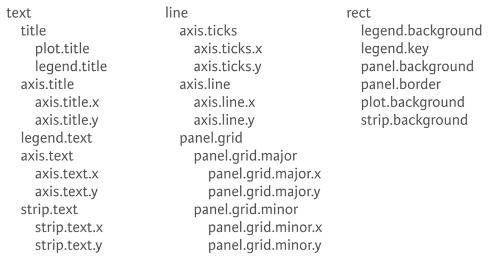

```{r setup, include=FALSE}
knitr::opts_chunk$set(eval=T, echo=T, cache=T, message=F, warning=F)

source("create_datasets.R")

library(dplyr)
library(ggplot2)
library(car)
library(RColorBrewer)
library(Hmisc)

```

# Introduction

  - Course notes from the [Data Vizualization with ggplot2 (Part 2)](https://www.datacamp.com/courses/data-visualization-with-ggplot2-2) course on DataCamp
  
## Whats Covered

  - Statistics
  - Coordinates and Facets
  - Themes
  - Best Practices
  - Case Study
  
&nbsp; &nbsp;

***  
# Statistics
***  

## Stats and Geoms

  - There are `geom_` and `stat_` functions
    - `stat_bin` is the default stat for the `geom_histogram`, `geom_bar`, and `geom_freqpoly`
    - `geom_smooth` calls `stat_smooth` with the default arguments based on the data. 
    - You can call many differnt methods in `geom_smooth`, like `lm`. 
  - There are a lot of geom and stat functions. 
    - Some are good for working with large datasets like `bindot`, `binhex` and `bin2d` and `contour`
    - We will work with these more in the next course
    <div style="width:350px">
    
    </div>

### -- Smoothing

```{r}

# ggplot2 is already loaded

# Explore the mtcars data frame with str()
str(mtcars)

# A scatter plot with LOESS smooth:
ggplot(mtcars, aes(x = wt, y = mpg)) +
  geom_point() + 
  geom_smooth()


# A scatter plot with an ordinary Least Squares linear model:
ggplot(mtcars, aes(x = wt, y = mpg)) +
  geom_point() + 
  geom_smooth(method = "lm")


# The previous plot, without CI ribbon:
ggplot(mtcars, aes(x = wt, y = mpg)) +
  geom_point() + 
  geom_smooth(method = "lm", se = F)


# The previous plot, without points:
ggplot(mtcars, aes(x = wt, y = mpg)) + 
  geom_smooth(method = "lm", se = F)

```

### -- Grouping variables

```{r}

# Define cyl as a factor variable
## In this ggplot command our smooth is calculated for each subgroup 
## because there is an invisible aesthetic, group which inherits from col.
ggplot(mtcars, aes(x = wt, y = mpg, col = factor(cyl))) +
  geom_point() +
  stat_smooth(method = "lm", se = F)

# Setting the group to 1 in the aes() will override the groups
ggplot(mtcars, aes(x = wt, y = mpg, col = factor(cyl))) +
  geom_point() +
  stat_smooth(method = "lm", se = F) + 
  stat_smooth(aes(group = 1), method = "lm", se = F)

```

### -- Modifying stat_smooth

```{r}

# Plot 1: change the LOESS span
## The span determines the size of the window used to fit the model
ggplot(mtcars, aes(x = wt, y = mpg)) +
  geom_point() +
  geom_smooth(se = F, span = 0.7)

# Plot 2: Set the overall model to LOESS and use a span of 0.7
ggplot(mtcars, aes(x = wt, y = mpg, col = factor(cyl))) +
  geom_point() +
  stat_smooth(method = "lm", se = F) +
  stat_smooth(
    aes(group = 1), 
    method = "loess", 
    span = 0.7,
    se = F, 
    col = "black")

# Plot 3: Set col to "All", inside the aes layer of stat_smooth()
## This adds it to the legend with label "All"
ggplot(mtcars, aes(x = wt, y = mpg, col = factor(cyl))) +
  geom_point() +
  stat_smooth(method = "lm", se = F) +
  stat_smooth(
    aes(group = 1, col = "All"), 
    method = "loess",
    se = F, 
    span = 0.7)

# Plot 4: Add scale_color_manual to change the colors
myColors <- c(brewer.pal(3, "Dark2"), "black")

ggplot(mtcars, aes(x = wt, y = mpg, col = factor(cyl))) +
  geom_point() +
  stat_smooth(method = "lm", se = F, span = 0.75) +
  stat_smooth(
    aes(group = 1, col="All"), 
    method = "loess", 
    se = F, 
    span = 0.7) +
  scale_color_manual("Cylinders", values = myColors)
```

### -- Modifying stat_smooth (2)

```{r}

# Plot 1: Jittered scatter plot, add a linear model (lm) smooth:
ggplot(Vocab, aes(x = education, y = vocabulary)) +
  geom_jitter(alpha = 0.2) +
  stat_smooth(method = "lm", se = F)


# Plot 2: Only lm, colored by year
ggplot(Vocab, aes(x = education, y = vocabulary, col = factor(year))) +
  stat_smooth(method = "lm", se = F)

# Plot 3: Set a color brewer palette
## This will give a warning and not work becuse the default palette
## "Blues" only has 9 colors, but we have 16 years
ggplot(Vocab, 
       aes(x = education, y = vocabulary, col = factor(year))) +
  stat_smooth(method = "lm", se = F) + 
  scale_color_brewer()

# Plot 4: Add the group, specify alpha and size
ggplot(Vocab, 
       aes(x = education, y = vocabulary, col = year, group = factor(year))) +
  stat_smooth( method = "lm", 
              se = F, 
              alpha = 0.6, 
              size = 2) +
  scale_color_gradientn(colors = brewer.pal(9,"YlOrRd"))
```

### -- Quantiles

```{r}

# Use stat_quantile instead of stat_smooth:
## The resulting plot will be a mess, because there are three quartiles drawn by default. 
ggplot(Vocab, 
       aes(x = education, y = vocabulary, 
           col = year, group = factor(year))) +
  stat_quantile(alpha = 0.6, size = 2) +
  scale_color_gradientn(colors = brewer.pal(9,"YlOrRd"))

# Set quantile to just 0.5:
ggplot(Vocab, 
       aes(x = education, y = vocabulary, 
           col = year, group = factor(year))) +
  stat_quantile(quantiles = 0.5, alpha = 0.6, size = 2) +
  scale_color_gradientn(colors = brewer.pal(9,"YlOrRd"))

```

### -- Sum

```{r}

# Plot with linear and loess model
p <- ggplot(Vocab, aes(x = education, y = vocabulary)) +
       stat_smooth(method = "loess", aes(col = "red"), se = F) +
       stat_smooth(method = "lm", aes(col = "blue"), se = F) +
       scale_color_discrete("Model", labels = c("red" = "LOESS", "blue" = "lm"))

# Add stat_sum
p + stat_sum() 

# Add stat_sum and set size range
p + stat_sum() + scale_size(range = c(1,10))

```

## Stats outside Geoms


### -- Preparations

```{r}

# Display structure of mtcars
str(mtcars)

# Convert cyl and am to factors:
mtcars$cyl <- as.factor(mtcars$cyl)
mtcars$am <- as.factor(mtcars$am)

# Define positions:
posn.d <- position_dodge(width = 0.1)
posn.jd <- position_jitterdodge(jitter.width = 0.1, dodge.width = 0.2)
posn.j <- position_jitter(width = 0.2)

# base layers:
wt.cyl.am <- ggplot(mtcars, aes(cyl, wt, col = am, fill = am, group = am))

```

### -- Plotting variations

```{r}

# wt.cyl.am, posn.d, posn.jd and posn.j are available

# Plot 1: Jittered, dodged scatter plot with transparent points
wt.cyl.am +
  geom_point(position = posn.jd, alpha = 0.6)
  
# Plot 2: Mean and SD - the easy way
wt.cyl.am +
  geom_point(
    position = posn.jd, 
    alpha = 0.6
    ) + 
  stat_summary(
    fun.data = mean_sdl, 
    fun.args = list(mult = 1), 
    position = posn.d
    )

  
# Plot 3: Mean and 95% CI - the easy way
wt.cyl.am +
  geom_point(
    position = posn.jd, 
    alpha = 0.6) + 
  stat_summary(
    fun.data = mean_cl_normal, 
    position = posn.d)

  
# Plot 4: Mean and SD - with T-tipped error bars - fill in ___
wt.cyl.am +
  stat_summary(
    geom = "point", 
    fun.y = mean, 
    position = posn.d) +
  stat_summary(
    geom = "errorbar", 
    fun.data = mean_sdl, 
    fun.args = list(mult = 1), 
    position = posn.d, 
    width = 0.1)

```

### -- Custom Functions

```{r}

# Play vector xx is available
xx <- 1:100

mean_sdl(xx, mult = 1)

# Function to save range for use in ggplot 
gg_range <- function(x) {
 
  data.frame(ymin = min(x), # Min
             ymax = max(x)) # Max
}

gg_range(xx)

# Function to Custom function:
med_IQR <- function(x) {

  data.frame(y = median(x), # Median
             ymin = quantile(x)[2], # 1st quartile
             ymax = quantile(x)[4])  # 3rd quartile
}

med_IQR(xx)

```

### -- Custom Functions (2)

```{r}

# The base ggplot command, you don't have to change this
wt.cyl.am <- ggplot(mtcars, aes(x = cyl,y = wt, col = am, fill = am, group = am))

# Add three stat_summary calls to wt.cyl.am
wt.cyl.am + 
  stat_summary(
    geom = "linerange", 
    fun.data = med_IQR, 
    position = posn.d, 
    size = 3) +
  stat_summary(
    geom = "linerange", 
    fun.data = gg_range, 
    position = posn.d, 
    size = 3, 
    alpha = 0.4) +
  stat_summary(
    geom = "point", 
    fun.y = median, 
    position = posn.d, 
    size = 3, 
    col = "black", 
    shape = "X")

```

&nbsp; &nbsp;

***  
# Coordinates and Facets
***  

## Coordinates Layer


### -- Zooming In

```{r}

# Basic ggplot() command, coded for you
p <- ggplot(mtcars, aes(x = wt, y = hp, col = am)) + geom_point() + geom_smooth()

# Add scale_x_continuous
## The wrong way to zoom in. You lose data and the stats will dissapear or be incorrect.
p + scale_x_continuous(limits = c(3,6), expand = c(0,0))

# The proper way to zoom in:
p + coord_cartesian(xlim = c(3,6))

```

### -- Aspect Ratio

```{r}

# Complete basic scatter plot function
base.plot <- ggplot(iris, aes(x = Sepal.Length, y = Sepal.Width, col = Species)) +
               geom_jitter() +
               geom_smooth(method = "lm", se = F)

# Plot base.plot: default aspect ratio
base.plot

# Fix aspect ratio (1:1) of base.plot
base.plot + coord_equal()

```

### -- Pie Charts

```{r}

# Create stacked bar plot: thin.bar
thin.bar <- ggplot(mtcars, aes(x = 1, fill = cyl)) +
              geom_bar()

thin.bar

# Convert thin.bar to pie chart
thin.bar + coord_polar(theta = "y")

# Create stacked bar plot: wide.bar
wide.bar <- ggplot(mtcars, aes(x = 1, fill = cyl)) +
              geom_bar(width = 1)

wide.bar

# Convert wide.bar to pie chart
wide.bar + coord_polar(theta = "y")

```

## Facets Layer


### -- Facets: the basics

```{r}

# Basic scatter plot:
p <- ggplot(mtcars, aes(x = wt, y = mpg)) +
  geom_point()

# Separate rows according to transmission type, am
p + facet_grid(am ~ .)

# Separate columns according to cylinders, cyl
p + facet_grid(. ~ cyl)

# Separate by both columns and rows 
p + facet_grid(am ~ cyl)

```

### -- Many variables

  - We will plot over 6 variables. 
  - This is just to show how you could do it. This gets a bit messy. 
    - Two variables on color. 
    - Two on the x and y axis
    - Two on the facet grid
    - And then we add size for seven variables.

```{r}

# Code to create the cyl_am col and myCol vector
mtcars$cyl_am <- paste(mtcars$cyl, mtcars$am, sep = "_")

myCol <- rbind(brewer.pal(9, "Blues")[c(3,6,8)],
               brewer.pal(9, "Reds")[c(3,6,8)])

# Basic scatter plot, add color scale:
ggplot(mtcars, aes(x = wt, y = mpg, col = cyl_am)) +
  geom_point() + 
  scale_color_manual(values = myCol)

  
# Facet according on rows and columns.
ggplot(mtcars, aes(x = wt, y = mpg, col = cyl_am)) +
  geom_point() + 
  scale_color_manual(values = myCol) + 
  facet_grid(gear ~ vs)

# Add more variables
ggplot(mtcars, aes(x = wt, y = mpg, col = cyl_am, size = disp)) +
  geom_point() + 
  scale_color_manual(values = myCol) + 
  facet_grid(gear ~ vs)

```

### -- Dropping levels

```{r}

head(mamsleep)
str(mamsleep)

# Basic scatter plot
ggplot(mamsleep, aes(time, name, col = sleep)) +
  geom_point()

# Facet rows accoding to vore
ggplot(mamsleep, aes(time, name, col = sleep)) +
  geom_point() + 
  facet_grid(vore ~ .)

# Specify scale and space arguments to free up rows
ggplot(mamsleep, aes(time, name, col = sleep)) +
  geom_point() + 
  facet_grid(vore ~ ., scale = "free_y", space = "free_y")

```

&nbsp; &nbsp;

***  
# Themes
***  

## Themes from Scratch

  - Themes cover all the non data ink
  - 3 types
    - text -- `element_text()`
    - line -- `element_line()`
    - rectangle -- `element_rect()`
  - Here are all the elements
    - In practice you will call the most specific element that you want to modify
    <div style="width:350px">
    
    </div>

### -- Rectangles

```{r}

## I have to recreate the base plot object myself
## It is already provided in the exercise.
## This is close enough to the one they have. 
z <- ggplot(mtcars, aes(wt, mpg, col = cyl)) + 
  geom_point() + 
  stat_smooth(method = "lm", se = F) + 
  facet_grid(. ~ cyl)

myPink <- "#FEE0D2"

# Plot 1: change the plot background color to myPink:
z + theme(
  plot.background = element_rect(fill = myPink))

# Plot 2: adjust the border to be a black line of size 3
z + theme(
  plot.background = element_rect(
    fill = myPink, 
    color = "black",
    size = 3))

# Plot 3: set panel.background, legend.key, legend.background and strip.background to element_blank()
## You can call theme multiple times as I do here
## And setting up theme elements in advance is common
uniform_panels <- theme(panel.background = element_blank(), 
                        legend.key = element_blank(), 
                        legend.background=element_blank(), 
                        strip.background = element_blank())
z <- z + 
  theme(
    plot.background = element_rect(
      fill = myPink, 
      color = "black",
      size = 3)) +
  uniform_panels
z                              
```

### -- Lines

```{r}

# Extend z with theme() function and three arguments
z <- z + theme(
  panel.grid = element_blank(),
  axis.line = element_line(color = "black"),
  axis.ticks = element_line(color = "black")
  )
z
```

### -- Text

```{r}

myRed <- "#99000D"

# Extend z with theme() function and four arguments
z <- z + theme(
 strip.text = element_text(size = 16, color = myRed),
 axis.title.y = element_text(color = myRed, hjust = 0, face = "italic"),
 axis.title.x = element_text(color = myRed, hjust = 0, face = "italic"),
 axis.text = element_text(color = "black")
  )

z
```

### -- Legends

```{r}

# Move legend by position
z + theme(
  legend.position = c(0.85, 0.85)
  )

# Change direction
z + theme(
  legend.direction = "horizontal"
  )

# Change location by name
z + theme(
  legend.position = "bottom"
  )

# Remove legend entirely
z + theme(
  legend.position = "none"
  )

```

### -- Positions

```{r}

library(grid)

# Increase spacing between facets
z + theme(
  panel.spacing.x = unit(2, "cm")
  )

# Add code to remove any excess plot margin space
z + theme(
  panel.spacing.x = unit(2, "cm"),
  plot.margin = unit(c(0,0,0,0), "cm")
  )

```

## Recycling Themes


### -- Update Themes

```{r}

z2 <- ggplot(mtcars, aes(wt, mpg, col = cyl)) + 
  geom_point() + 
  stat_smooth(method = "lm", se = F) + 
  facet_grid(. ~ cyl)

# Theme layer saved as an object, theme_pink
theme_pink <- theme(panel.background = element_blank(),
                    legend.key = element_blank(),
                    legend.background = element_blank(),
                    strip.background = element_blank(),
                    plot.background = element_rect(fill = myPink, color = "black", size = 3),
                    panel.grid = element_blank(),
                    axis.line = element_line(color = "black"),
                    axis.ticks = element_line(color = "black"),
                    strip.text = element_text(size = 16, color = myRed),
                    axis.title.y = element_text(color = myRed, hjust = 0, face = "italic"),
                    axis.title.x = element_text(color = myRed, hjust = 0, face = "italic"),
                    axis.text = element_text(color = "black"),
                    legend.position = "none")
  
# Apply theme_pink to z2
z2
z2 + theme_pink

# Change code so that old theme is saved as old
## Theme_update can be used to update a theme
## or to store the current setting in a variable for backup
old <- theme_update()
theme_update(panel.background = element_blank(),
             legend.key = element_blank(),
             legend.background = element_blank(),
             strip.background = element_blank(),
             plot.background = element_rect(fill = myPink, color = "black", size = 3),
             panel.grid = element_blank(),
             axis.line = element_line(color = "black"),
             axis.ticks = element_line(color = "black"),
             strip.text = element_text(size = 16, color = myRed),
             axis.title.y = element_text(color = myRed, hjust = 0, face = "italic"),
             axis.title.x = element_text(color = myRed, hjust = 0, face = "italic"),
             axis.text = element_text(color = "black"),
             legend.position = "none")

# Display the plot z2
z2

# Restore the old plot
theme_set(old)
z2

```

### -- Exploring ggthemes

```{r}

# Load ggthemes package
library(ggthemes)

# Apply theme_tufte
z2 + theme_tufte()


# Apply theme_tufte, modified:
z2 + theme_tufte() + 
  theme(
    legend.position = c(0.9, 0.9),
    legend.title = element_text(face = "italic", size = 12),
    axis.title = element_text(face = "bold", size = 14)
  )
 
```

&nbsp; &nbsp;

***  
# Best Practices
***  

## Best Practices: Bar Plots


### -- Bar Plots (1)

  - Dynamite are not ideal
    - The bars give the impression of having data where there is none. e.g. at 0
    - And there is no data where there is some, e.g. above the error bars. 
    - We also have no idea how many data points are in each group
    - And we can't tell if there is bi-modal or skewed data

```{r}

# Base layers
m <- ggplot(mtcars, aes(x = cyl, y = wt))

# Draw dynamite plot
m +
  stat_summary(fun.y = mean, geom = "bar", fill = "skyblue") +
  stat_summary(fun.data = mean_sdl, fun.args = list(mult = 1), geom = "errorbar", width = 0.1)

```

### -- Bar Plots (2)

  - We need to dodge the bars and the error bars manually if we want to split on a variable

```{r}

# Base layers
m <- ggplot(mtcars, aes(x = cyl,y = wt, col = am, fill = am))

# Plot 1: Draw dynamite plot
m +
  stat_summary(
    fun.y = mean, 
    geom = "bar") +
  stat_summary(
    fun.data = mean_sdl, 
    fun.args = list(mult = 1), 
    geom = "errorbar", 
    width = 0.1)

# Plot 2: Set position dodge in each stat function
m +
  stat_summary(
    fun.y = mean, 
    geom = "bar", 
    position = "dodge") +
  stat_summary(
    fun.data = mean_sdl, 
    fun.args = list(mult = 1), 
    geom = "errorbar", 
    width = 0.1, 
    position = "dodge")

# Set your dodge posn manually
posn.d <- position_dodge(0.9)

# Plot 3:  Redraw dynamite plot
m +
  stat_summary(
    fun.y = mean, 
    geom = "bar", 
    position = posn.d) +
  stat_summary(
    fun.data = mean_sdl, 
    fun.args = list(mult = 1), 
    geom = "errorbar", 
    width = 0.1, 
    position = posn.d)

```

### -- Bar Plots (3)

```{r}

## Some provided summary data
mtcars.cyl

# Base layers
m <- ggplot(mtcars.cyl, aes(x = cyl, y = wt.avg))

# Plot 1: Draw bar plot
m + geom_bar(stat = "identity", fill = "skyblue")

# Plot 2: Add width aesthetic
m + 
  geom_bar(
    stat = "identity", 
    fill = "skyblue",
    aes(width = prop))
  
# Plot 3: Add error bars
m + 
  geom_bar(
    stat = "identity", 
    fill = "skyblue",
    aes(width = prop)) + 
  geom_errorbar(
    aes(ymin = wt.avg - sd, 
        ymax = wt.avg + sd),
    width = 0.1)

```

## Best Practices: Pie Charts

  - Pie charts have 3 mediocre encoding elements
    - angle, area, and length (of the outer crust)
  - Its much better to just use a bar chart (which just uses length)
    - Use bar plot with `position = 'fill'`
    - Especially when we have multiple groups and hence multiple pies
  
### -- Pie Charts (1)

```{r}

# Convert bar chart to pie chart
ggplot(mtcars, aes(x = cyl, fill = factor(am))) +
  geom_bar(position = "fill")
  
# Convert bar chart to pie chart
ggplot(mtcars, aes(x = factor(1), fill = factor(am))) +
  geom_bar(position = "fill", width = 1) + 
  facet_grid(. ~ cyl) + 
  coord_polar(theta = "y")

```

### -- Pie Charts (2)

```{r}

# Parallel coordinates plot using GGally
library(GGally)

# All columns except am
group_by_am <- 9
my_names_am <- (1:11)[-group_by_am]

# Basic parallel plot - each variable plotted as a z-score transformation
ggparcoord(mtcars, my_names_am, groupColumn = group_by_am, alpha = 0.8)

```

### -- Plot Matrix (1)

  - The relationship between the variables drat and mpg is shown in two areas. 
  - What is the correlation between these two variables?

```{r}
mtcars2 <- mtcars %>%
  select(mpg, disp, drat, wt, qsec)

GGally::ggpairs(mtcars2)
```
 
  - 0.681
  
### -- Plot Matrix (2)

  - What is the relationship between disp and cyl?
  
```{r}

mtcars3 <- mtcars %>%
  select(mpg, cyl, disp, hp, drat)

GGally::ggpairs(mtcars3)

```
  
  - As `cyl` increases, so to does the `disp`
  
## Best Practices: Heat Maps

  - The instructor says that heat maps are one of the hardest charts to get information from
    - Color on a continuous scale is hard to interpret
    - Its even worth on a heatmap because the perception changes based on the neighboring colors
  - But they look cool and do give a wow factor
  - What are better options
    - Use position for the continuous scale variable and map color on to discrete variables if needed
  - Personally I really like heat maps. But there are some good alternatives presented here. 

### -- Heat Maps

```{r, fig.height = 9}

str(barley)

# Create color palette
myColors <- brewer.pal(9, "Reds")

# Build the heat map from scratch
ggplot(barley, aes(year, variety, fill = yield)) + 
  geom_tile() + 
  facet_wrap( ~ site, ncol = 1) + 
  scale_fill_gradientn(colors = myColors)

```

### -- Heat Maps Alternatives (1)

```{r, fig.width = 8}

# Line plots
ggplot(barley, aes(year, yield, col = variety, group = variety)) + 
  geom_line() + 
  facet_wrap( ~ site, nrow = 1)

```

### -- Heat Maps Alternatives (2)

```{r}

# Create overlapping ribbon plot from scratch
ggplot(barley, aes(year, yield, colour = site, group = site, fill = site)) + 
  stat_summary(fun.y = mean, geom = "line") + 
  stat_summary(
    fun.data = mean_sdl, 
    fun.args = list(mult = 1), 
    geom = "ribbon", 
    col = NA, 
    alpha = 0.1)
  
```

&nbsp; &nbsp;

***  
# Case Study
***  

## CHIS - Descriptive Statistics


### -- Exploring Data

  - The data file on the course site returned an error saying unauthorized so I could not download the original
  - I just copied the first 10,000 rows of the adult data frame from datacamp console with dput()
    - I saved it as an Rds file and load in the create_datasets.R script
    - The datset is the datacamp class is over 44k rows
    - I think this is enough data to use here to explore
  - Data variables
    - `RBMI`: BMI Category description
    - `BMI_P`: BMI value
    - `RACEHPR2`: race
    - `SRSEX`: sex
    - `SRAGE_P`: age
    - `MARIT2`: Marital status
    - `AB1`: General Health Condition
    - `ASTCUR`: Current Asthma Status
    - `AB51`: Type I or Type II Diabetes
    - `POVLL`: Poverty level
  
```{r}

summary(adult)
str(adult)

# Age histogram
ggplot(adult, aes(x = SRAGE_P)) +
  geom_histogram()

# BMI histogram
ggplot(adult, aes(x = BMI_P)) +
  geom_histogram()

# Age colored by BMI, default binwidth
ggplot(adult, aes(x = SRAGE_P, fill= factor(RBMI))) +
  geom_histogram(binwidth = 1)
  
```

  - There are some unusual values at age 85
  - And the default bin width which is the range/30 is awkward here. It should be 1.

### -- Data Cleaning

```{r}

# Remove individual aboves 84
adult <- adult[adult$SRAGE_P <= 84, ]

# Remove individuals with a BMI below 16 and above or equal to 52
adult <- adult[adult$BMI_P >= 16 & adult$BMI_P < 52, ]

# Relabel the race variable:
adult$RACEHPR2 <- factor(adult$RACEHPR2, labels = c("Latino", "Asian", "African American", "White"))

str(adult)
table(adult$RACEHPR2)

# Relabel the BMI categories variable:
adult$RBMI <- factor(adult$RBMI, labels = c("Under-weight", "Normal-weight", "Over-weight", "Obese"))

str(adult)
table(adult$RBMI)

```

### -- Multiple Histograms

```{r}

# The dataset adult is available

# The color scale used in the plot
BMI_fill <- scale_fill_brewer("BMI Category", palette = "Reds")

# Theme to fix category display in faceted plot
fix_strips <- theme(
  strip.text.y = element_text(angle = 0, hjust = 0, vjust = 0.1, size = 14),
  strip.background = element_blank(),
  legend.position = "none")

# Histogram, add BMI_fill and customizations
ggplot(adult, aes (x = SRAGE_P, fill= factor(RBMI))) +
  geom_histogram(binwidth = 1) +
  fix_strips + 
  BMI_fill + 
  facet_grid(RBMI ~ .) + 
  theme_classic()

```

### -- Alternatives

```{r}

# Plot 1 - Count histogram
ggplot(adult, aes (x = SRAGE_P, fill= factor(RBMI))) +
  geom_histogram(binwidth = 1) +
  BMI_fill

# Plot 2 - Density histogram
## This plot looks really strange, because we get the density within each BMI category, not within each age group!
ggplot(adult, aes(x = SRAGE_P, fill= factor(RBMI))) +
  geom_histogram(aes(y = ..density..), binwidth = 1) +
  BMI_fill

# Plot 3 - Faceted count histogram
ggplot(adult, aes (x = SRAGE_P, fill= factor(RBMI))) +
  geom_histogram(binwidth = 1) +
  BMI_fill + 
  facet_grid(RBMI ~ .)

# Plot 4 - Faceted density histogram
## Plots 3 and 4 can be useful if we are interested in the frequency distribution within each BMI category.
ggplot(adult, aes(x = SRAGE_P, fill= factor(RBMI))) +
  geom_histogram(aes(y = ..density..), binwidth = 1) +
  BMI_fill + 
  facet_grid(RBMI ~ .)

# Plot 5 - Density histogram with position = "fill"
## This is not an accurate representation, as density calculates the proportion across category, and not across bin.
ggplot(adult, aes(x = SRAGE_P, fill= factor(RBMI))) +
  geom_histogram(aes(y = ..density..), binwidth = 1, position = "fill") +
  BMI_fill

# Plot 6 - The accurate histogram
ggplot(adult, aes(x = SRAGE_P, fill= factor(RBMI))) +
  geom_histogram(aes(y = ..count../sum(..count..)), binwidth = 1, position = "fill") +
  BMI_fill

```

### -- Do Things Manually

  - The last plot is a neat frequency histogram with multiple sub-catgories
  - But we can't facet the plot becasue the calculation occurs on the fly inside ggplot2
  - In this section we will do the freqency calculation manually so we can facet the plot woth the frequencies

```{r}

# An attempt to facet the accurate frequency histogram from before (failed)
ggplot(adult, aes (x = SRAGE_P, fill= factor(RBMI))) +
  geom_histogram(aes(y = ..count../sum(..count..)), binwidth = 1, position = "fill") +
  BMI_fill +
  facet_grid(RBMI ~ .)

# Create DF with table()
DF <- table(adult$RBMI, adult$SRAGE_P)

# Use apply on DF to get frequency of each group
DF_freq <- apply(DF, 2, function(x) x/sum(x))

# Load reshape2 and use melt on DF to create DF_melted
library(reshape2)
DF_melted <- melt(DF_freq)

# Change names of DF_melted
names(DF_melted) <- c("FILL","X","value")
head(DF_melted)

# Add code to make this a faceted plot
ggplot(DF_melted, aes(x = X, y = value, fill = FILL)) +
  geom_bar(stat = "identity", position = "stack") +
  BMI_fill +
  facet_grid(FILL ~ .)

```

## CHIS - Mosaic Plots

  - Instead of bars with equal width, a mosic plot will create rectangles with the size representative of the proportion
  - A Chi-Square test asks if the proportions of one variable (BMI) within groups of another variable (age) stray from the null model of equal proportions
    - The mosaic plot is a visual representation of this
    - The residuals of the chi-square test tell us if a group is over or under represented
    - High residuals mean over rep and low residuals mean under rep

### -- Merimeko/Mosaic Plot

```{r}

# The initial contingency table
DF <- as.data.frame.matrix(table(adult$SRAGE_P, adult$RBMI))

head(DF)

# Add the columns groupsSum, xmax and xmin. Remove groupSum again.
DF$groupSum <- rowSums(DF)
DF$xmax <- cumsum(DF$groupSum)
DF$xmin <- DF$xmax - DF$groupSum

head(DF)

# The groupSum column needs to be removed, don't remove this line
DF$groupSum <- NULL

# Copy row names to variable X
DF$X <- row.names(DF)

head(DF)

# Melt the dataset
library(reshape2)
DF_melted <- melt(DF, id.vars = c("X","xmin","xmax"), variable.name = "FILL")

head(DF_melted)

# dplyr call to calculate ymin and ymax - don't change
library(dplyr)
DF_melted <- DF_melted %>%
  group_by(X) %>%
  mutate(ymax = cumsum(value/sum(value)),
         ymin = ymax - value/sum(value))
         
head(DF_melted)

# Plot rectangles - don't change.
library(ggthemes)
ggplot(DF_melted, aes(ymin = ymin,
                 ymax = ymax,
                 xmin = xmin,
                 xmax = xmax,
                 fill = FILL)) +
  geom_rect(colour = "white") +
  scale_x_continuous(expand = c(0,0)) +
  scale_y_continuous(expand = c(0,0)) +
  BMI_fill +
  theme_tufte()

```

### -- Adding statistics

```{r}

# Perform chi.sq test (RBMI and SRAGE_P)
results <- chisq.test(table(adult$RBMI, adult$SRAGE_P))
results
results$residuals[,1:10]

# Melt results$residuals and store as resid
resid <- melt(results$residuals)

# Change names of resid
names(resid)
names(resid) <- c("FILL","X","residual")
names(resid)

# merge the two datasets:
head(resid)
head(DF_melted)
DF_all <- merge(DF_melted, resid)
head(DF_all)

# Update plot command
library(ggthemes)
ggplot(DF_all, aes(ymin = ymin,
                   ymax = ymax,
                   xmin = xmin,
                   xmax = xmax,
                   fill = residual)) +
  geom_rect() +
  scale_fill_gradient2() +
  scale_x_continuous(expand = c(0,0)) +
  scale_y_continuous(expand = c(0,0)) +
  theme_tufte()

```

### -- Adding text

```{r}

# Position for labels on x axis
DF_all$xtext <- DF_all$xmin + (DF_all$xmax - DF_all$xmin)/2

# Position for labels on y axis (don't change)
index <- DF_all$xmax == max(DF_all$xmax)
DF_all$ytext <- DF_all$ymin[index] + (DF_all$ymax[index] - DF_all$ymin[index])/2

head(DF_all)

# Plot
ggplot(DF_all, 
    aes(ymin = ymin, ymax = ymax, 
        xmin = xmin, xmax = xmax, 
        fill = residual)) +
  geom_rect(col = "white") +
  # geom_text for ages (i.e. the x axis)
  geom_text(
    aes(x = xtext,label = X),
    y = 1,
    size = 3,
    angle = 90,
    hjust = 1,
    show.legend = FALSE) +
  # geom_text for BMI (i.e. the fill axis)
  geom_text(
    aes(x = max(xmax), y = ytext, label = FILL),
    size = 3,
    hjust = 1,
    show.legend  = FALSE) +
  scale_fill_gradient2() +
  theme_tufte() +
  theme(legend.position = "bottom")

```

### -- Generalizations

```{r}

# Load all packages
library(ggplot2)
library(reshape2)
library(dplyr)
library(ggthemes)

# Script generalized into a function
mosaicGG <- function(data, X, FILL) {

  # Proportions in raw data
  DF <- as.data.frame.matrix(table(data[[X]], data[[FILL]]))
  DF$groupSum <- rowSums(DF)
  DF$xmax <- cumsum(DF$groupSum)
  DF$xmin <- DF$xmax - DF$groupSum
  DF$X <- row.names(DF)
  DF$groupSum <- NULL
  DF_melted <- melt(DF, id = c("X", "xmin", "xmax"), variable.name = "FILL")
  library(dplyr)
  DF_melted <- DF_melted %>%
    group_by(X) %>%
    mutate(ymax = cumsum(value/sum(value)),
           ymin = ymax - value/sum(value))

  # Chi-sq test
  results <- chisq.test(table(data[[FILL]], data[[X]])) # fill and then x
  resid <- melt(results$residuals)
  names(resid) <- c("FILL", "X", "residual")

  # Merge data
  DF_all <- merge(DF_melted, resid)

  # Positions for labels
  DF_all$xtext <- DF_all$xmin + (DF_all$xmax - DF_all$xmin)/2
  index <- DF_all$xmax == max(DF_all$xmax)
  DF_all$ytext <- DF_all$ymin[index] + (DF_all$ymax[index] - DF_all$ymin[index])/2

  # plot:
  g <- ggplot(DF_all, aes(ymin = ymin,  ymax = ymax, xmin = xmin,
                          xmax = xmax, fill = residual)) +
  geom_rect(col = "white") +
  geom_text(aes(x = xtext, label = X),
            y = 1, size = 3, angle = 90, hjust = 1, show.legend = FALSE) +
  geom_text(aes(x = max(xmax),  y = ytext, label = FILL),
            size = 3, hjust = 1, show.legend = FALSE) +
  scale_fill_gradient2("Residuals") +
  scale_x_continuous("Individuals", expand = c(0,0)) +
  scale_y_continuous("Proportion", expand = c(0,0)) +
  theme_tufte() +
  theme(legend.position = "bottom")
  print(g)
}

# BMI described by age
mosaicGG(adult, "SRAGE_P", "RBMI")

# Poverty described by age
mosaicGG(adult, "SRAGE_P", "POVLL")

# mtcars: am described by cyl
mosaicGG(mtcars, "cyl", "am")

# Vocab: vocabulary described by education
library(car)
mosaicGG(Vocab, "education", "vocabulary")
```
