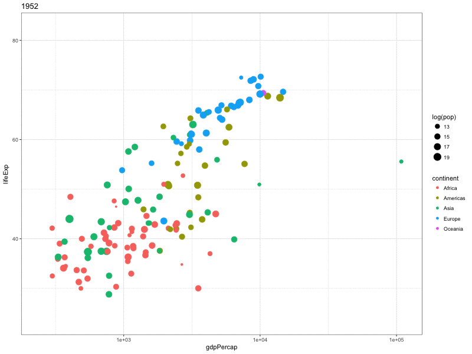

```{r setup, include=FALSE}
knitr::opts_chunk$set(eval=T, echo=T, cache=T, message=F, warning=F)

```

# Introduction

  - Course notes from the [Data Vizualization with ggplot2 (Part 3)](https://www.datacamp.com/courses/data-visualization-with-ggplot2-part-3) course on DataCamp
  
## Whats Covered

Part A:

  - Statistical plots
    - Aesthetics review, 
    - box plots, density plots 
    - multiple groups/variables
  - Plots for specific data types (Part 1)
    - graphics of large data
    - Ternary plots
    - Network plots
    - Diagnostic plots

**Part B:**

  - Plots for specific data types (Part 2)
    - choropleths
    - cartographic maps
    - animations
    
Part C:

  - ggplot2 internals
    - grid graphics, grid grapshics in ggplot2
    - ggplot objects
    - gridExtra
  - Data Munging and Visualization Case Study
    - Bag plot case study, weather case study

## Libraries and Data

```{r} 

source("create_datasets.R")
load('data/test_datasets.RData')

library(readr)
library(dplyr)
library(ggplot2)
library(purrr)

library(maps)
library(ggmap)
library(ggthemes)
library(viridis)
library(rgdal)
library(ggfortify)
library(animation)
library(gganimate)
library(gapminder)
library(car)

```

&nbsp; &nbsp;

***  
# Plots for specific data types (Part 2)
***  

## Choropleths

### -- Working with maps from the maps package: USA

```{r}

# library(maps)
# library(ggmap)

# Use map_data() to create usa and inspect
usa <- map_data("usa")

str(usa)
head(usa)
table(usa$group)

# Build the map
ggplot(usa, aes(x = long, y = lat, group = group)) +
  geom_polygon() +
  coord_map() +
  theme_nothing()

```

### -- Working with maps from the maps package: adding points

```{r}

# usa, cities, and all required packages are available
# library(readr)
cities <- read_tsv('https://assets.datacamp.com/production/course_862/datasets/US_Cities.txt')

head(usa)
head(cities)

## Need this to get the theme_map() and scale_color_viridis() functions
# library(ggthemes)
# library(viridis)

# Finish plot 1
ggplot(usa, aes(x = long, y = lat, group = group)) +
  geom_polygon() +
  geom_point(data = cities, aes(group = State, size = Pop_est),
             col = "red", shape = 16, alpha = 0.6) +
  coord_map() +
  theme_map()

# Arrange cities
cities_arr <- arrange(cities, Pop_est)

# Copy-paste plot 1 and adapt
ggplot(usa, aes(x = long, y = lat, group = group)) +
  geom_polygon(fill = "grey90") +
  geom_point(data = cities_arr, aes(group = State, col = Pop_est),
             shape = 16, size = 2) +
  coord_map() +
  theme_map() +
  scale_color_viridis()

```

- Pretty much only new york shows up as a yellow dot.
  - LA is the green dot
  - Adjusting the scale here would help. 

```{r}
## New york really tips the scale
## The colors might look better on a log scale
cities_arr %>%
  arrange(desc(Pop_est)) %>%
  head(10)

```
  
### -- State choropleth

```{r}

# pop and all required packages are available

# Use map_data() to create state
state <- map_data("state")
head(state)

# Map of states
ggplot(state, aes(x = long, y = lat, fill = region, group = group)) +
  geom_polygon(col = "white") +
  coord_map() +
  theme_nothing()

# Merge state and pop: state2
state2 <- merge(state, pop)
head(state2)

# Map of states with populations
ggplot(state2, aes(x = long, y = lat, fill = Pop_est, group = group)) +
  geom_polygon(col = "white") +
  coord_map() +
  theme_map()

```

### -- Map from shapefiles

```{r}

# Import shape information: germany
# library(rgdal)
germany <- readOGR(dsn = 'data/shape_files', layer = "DEU_adm1")

# fortify germany: bundes
bundes <- fortify(germany)

# Plot map of germany
ggplot(bundes, aes(x = long, y = lat, group = group)) +
    geom_polygon(fill = "blue", col = "white") +
    coord_map() +
    theme_nothing()
    
```

### -- Choropleth from shapefiles

```{r}

# germany, bundes and unemp are available
head(bundes)

# re-add state names to bundes
bundes$state <- factor(as.numeric(bundes$id))
levels(bundes$state) <- germany$NAME_1

head(bundes)
head(unemp)

# Merge bundes and unemp: bundes_unemp
bundes_unemp <- merge(bundes, unemp)

# Update the ggplot call
ggplot(bundes_unemp, aes(x = long, y = lat, group = group, fill = unemployment)) +
  geom_polygon() +
  coord_map() +
  theme_map()

```

## Cartographic Maps

### -- Different templates

```{r}

# Load the ggmap package
# library(ggmap)

# Create london_map_13 with get_map
london_map_13 <- get_map("London, England", zoom = 13)

# Create the map of london
ggmap(london_map_13)

# Experiment with get_map() and use ggmap() to plot it!
ggmap(get_map(
    "London, England", 
    zoom = 13, 
    maptype = "toner",
    source = "stamen"))

```

### -- Mapping points onto a cartographic map

```{r}

# london_sites and ggmap are available
london_sites <- c("Tower of London, London", "Buckingham Palace, London", "Tower Bridge, London", 
  "Westminster Abbey, London", "Queen Elizabeth Olympic Park, London"
  )

# Use geocode() to create xx
xx <- geocode(london_sites)

# Add a location column to xx
xx$location <- sub(", London","",london_sites)

# Get map data
london_ton_13 <- get_map(location = "London, England", zoom = 13,
                         source = "stamen", maptype = "toner")

# Add a geom_points layer
ggmap(london_ton_13) + 
  geom_point(data = xx, aes(col = location), size = 6)

```

### -- Using a bounding box

```{r}

# london_sites and ggmap are available

# Build xx
xx <- geocode(london_sites)
xx$location <- sub(", London", "", london_sites)
xx$location[5] <- "Queen Elizabeth\nOlympic Park"

# Create bounding box: bbox
bbox <- make_bbox(lon = xx$lon, lat = xx$lat, f = 0.3)

# Re-run get_map to use bbox
london_ton_13 <- get_map(location = bbox, zoom = 13,
                         source = "stamen", maptype = "toner")

# Map from previous exercise
ggmap(london_ton_13) +
  geom_point(data = xx, aes(col = location), size = 6)

# New map with labels
ggmap(london_ton_13) +
  geom_label(
    data = xx, 
    aes(label = location), 
    size = 4, 
    fontface = "bold", 
    fill = "grey90", 
    col = "#E41A1C")
             
```

### -- Combine cartographic and choropleth maps

```{r}

# bundes is available, as are all required packages

# Get the map data of "Germany"
germany_06 <- get_map(location = "Germany", zoom = 6)

# Plot map and polygon on top:
ggmap(germany_06) +
  geom_polygon(
    data = bundes,
    aes(x = long, y = lat, group = group),
    fill = NA, 
    col = "red") +
  coord_map()

```

## Animations

### -- The population pyramid

  - First, I needed to instal `ImageMagik` with homebrew
  - Once the gif is created I can just load it into the doc like an image
  
```{r}

# Inspect structure of japan
japan <- read_tsv('https://assets.datacamp.com/production/course_862/datasets/japanPOP.txt')
str(japan)

# Finish the code inside saveGIF
# library(animation)

saveGIF({

  # Loop through all time points
  for (i in unique(japan$time)) {

    # Subset japan: data
    data <- subset(japan, time == i)

    # Finish the ggplot command
    p <- ggplot(data, aes(x = AGE, y = POP, fill = SEX, width = 1)) +
      coord_flip() +
      geom_bar(data = data[data$SEX == "Female",], stat = "identity") +
      geom_bar(data = data[data$SEX == "Male",], stat = "identity") +
      ggtitle(i)

    print(p)

  }

}, movie.name = "pyramid.gif", interval = 0.1)

```

  

### -- Animations with gganimate

```{r}


## from the car library
head(Vocab)

# Update the static plot
p <- ggplot(Vocab, aes(x = education, y = vocabulary,
                       color = year, group = year,
                       frame = year, cumulative = T)) +
  stat_smooth(method = "lm", se = FALSE, size = 3)

# Call gganimate on p
# Form the gganimate library
animation <- gganimate(p, filename = "vocab.gif", interval = 0.5)

```
 

### -- Exploring Gapminder (Extra)

And one more because this is fun and I think its pretty powerful

```{r}

# library(gapminder)
head(gapminder)
theme_set(theme_bw())

p <- ggplot(gapminder, aes(gdpPercap, lifeExp, size = log(pop), color = continent, frame = year)) +
  geom_point() +
  scale_x_log10()


animation <- gganimate(p, "gapminder.gif", interval = 0.5, ani.width = 800, ani.height = 600)


```

 

