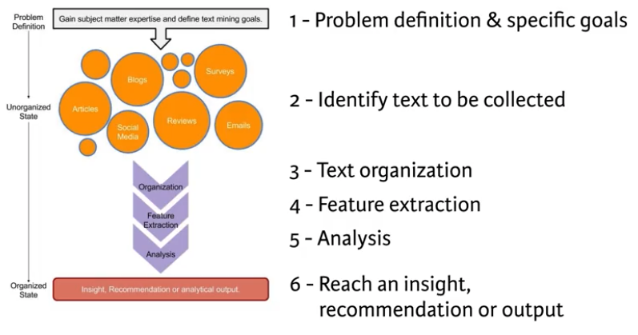

```{r setup, include=FALSE}
knitr::opts_chunk$set(eval=T, echo=T, cache=T, message=F, warning=F)
```

***  
# Introduction
***  

  - Course notes from the [Text Mining: Bag of Words](https://www.datacamp.com/courses/intro-to-text-mining-bag-of-words) course on DataCamp
    - Taught by Ted Kwartler
    
  
## Whats Covered

  - Jumping into text mining with bag of words
  - Word clouds and more interesting visuals
  - Adding to your tm skills
  - Battle of the tech giants for talent
  
## Additional Resources
  - [dendextend package vignette](https://cran.r-project.org/web/packages/dendextend/vignettes/introduction.html)
  
## Libraries and Data

```{r, cache=F} 

source('create_datasets.R')

## Need this line so qdap will load correctly (with java) when using knitr button. 
dyn.load('/Library/Java/JavaVirtualMachines/jdk1.8.0_131.jdk/Contents/Home/jre/lib/server/libjvm.dylib')

library(qdap)
library(dplyr)
library(tm)
library(wordcloud)
library(plotrix)
library(dendextend)
library(ggplot2)
library(ggthemes)
library(RWeka)

```


&nbsp; &nbsp;

***  
# Jumping into text mining with bag of words
***  

## What is text mining?

The simple definition:

  - the process of distilling actionable insights from text

Workflow:

  - problem definition and goals
  - identify text to be collected (need to undersatnd medium and data integrity)
  - text organization
  - feature extraction
  - analysis
  - reach an insight, answer problem questions

Two types of text mining:

  - semantic parsing
    - you care about word type and order
    - a word can be tagged as part of a sentence and a noun and a proper noun
    - it follows a tree structure to break up text as type  
  - bag of words
    - does not care about type of word or order, just analyses all the words as a single token
    - this course covers bag of words

### -- Quick taste of text mining

  - essentially, bag of words is a way to count terms, n-grams, across a collection of documents

```{r}

# qdap is loaded

# Print new_text to the console
new_text <- "DataCamp is the first online learning platform that focuses on building the best learning experience specifically for Data Science. We have offices in Boston and Belgium and to date, we trained over 250,000 (aspiring) data scientists in over 150 countries. These data science enthusiasts completed more than 9 million exercises. You can take free beginner courses, or subscribe for $25/month to get access to all premium courses."

# Find the 10 most frequent terms: term_count
term_count <- freq_terms(new_text, 10)

# Plot term_count
plot(term_count)

```

## Getting started

### -- Load some text

```{r}

# Import text data
tweets <- read.csv('https://assets.datacamp.com/production/course_935/datasets/coffee.csv', stringsAsFactors = F)

# View the structure of tweets
glimpse(tweets)

# Print out the number of rows in tweets
nrow(tweets)

# Isolate text from tweets: coffee_tweets
coffee_tweets <- tweets$text
head(coffee_tweets)

```

### -- Make the vector a VCorpus object (1)

  - There are two kinds of the corpus data type, the permanent corpus, PCorpus, and the volatile corpus, VCorpus. 
  - In essence, the difference between the two has to do with how the collection of documents is stored in your computer. 
  - In this course, we will use the volatile corpus, which is held in your computer's RAM rather than saved to disk, just to be more memory efficient.
  
```{r}

# the tm library is loaded

# Make a vector source: coffee_source
coffee_source <- VectorSource(coffee_tweets)

```

### -- Make the vector a VCorpus object (2)

  - The VCorpus object is a nested list, or list of lists. 
  - At each index of the VCorpus object, there is a PlainTextDocument object, which is essentially a list that contains the actual text data (content), as well as some corresponding metadata (meta). 
  
```{r}

# Make a volatile corpus: coffee_corpus
coffee_corpus <- VCorpus(coffee_source)

# Print out coffee_corpus
coffee_corpus

# Print data on the 15th tweet in coffee_corpus
coffee_corpus[[15]]

# Print the content of the 15th tweet in coffee_corpus
coffee_corpus[[15]]$content

```

### -- Make a VCorpus from a data frame

```{r}

# Print example_text to the console
example_text <- structure(list(num = 1:3, Author1 = c("Text mining is a great time.", 
"Text analysis provides insights", "qdap and tm are used in text mining"
), Author2 = c("R is a great language", "R has many uses", "DataCamp is cool!"
)), .Names = c("num", "Author1", "Author2"), row.names = c(NA, 
-3L), class = "data.frame")

example_text

# Create a DataframeSource on columns 2 and 3: df_source
df_source <- DataframeSource(example_text[,2:3])
df_source

# Convert df_source to a corpus: df_corpus
df_corpus <- VCorpus(df_source)

# Examine df_corpus
df_corpus
df_corpus[[3]]
df_corpus[[3]]$content

# Create a VectorSource on column 3: vec_source
vec_source <- VectorSource(example_text[,3])

# Convert vec_source to a corpus: vec_corpus
vec_corpus <- VCorpus(vec_source)

# Examine vec_corpus
vec_corpus
vec_corpus[[3]]
vec_corpus[[3]]$content

```

## Cleaning and preprocessing text

Common preprocessing functions and uses:
  
    

Form base R:

  - `tolower`
    - helpful for term aggregation but can be harmful if you are trying to identify proper nouns like cities

From tm package:

  - `removePunctiation`
    - very helpful with social media, but harmful if you are trying to identify emoticons with punctuation like smiley faces
  - `removeNumbers`
    - don't do this if you currencies or quantities
  - `stripWhiteSpace`
    - sometimes there is extra lines or whitespace
  - `removeWords`
    - usually words like 'the' and 'of' are not very helpful

Other useful tm functions

  - `tm_map` takes a corpus and a processing funciton and transforms the corpus
    - if the function is not from the tm library than wrap it in `content_transformer()` function
  - `stemDocument` functions can also be very helpful
    - but you often have tokens that are not words
    - use stem Completion to turn the stems back into words

From the qdap package  

  - `bracketX()`: Remove all text within brackets (e.g. "It's (so) cool" becomes "It's cool")
  - `replace_number()`: Replace numbers with their word equivalents (e.g. "2" becomes "two")
  - `replace_abbreviation()`: Replace abbreviations with their full text equivalents (e.g. "Sr" becomes "Senior")
  - `replace_contraction()`: Convert contractions back to their base words (e.g. "shouldn't" becomes "should not")
  - `replace_symbol()`: Replace common symbols with their word equivalents (e.g. "$" becomes "dollar")

### -- Common cleaning functions from tm

```{r}

# Create the object: text
text <- "<b>She</b> woke up at       6 A.M. It\'s so early!  She was only 10% awake and began drinking coffee in front of her computer."

# All lowercase
tolower(text)

# Remove punctuation
removePunctuation(text)

# Remove numbers
removeNumbers(text)

# Remove whitespace
stripWhitespace(text)

```

### -- Cleaning with qdap

```{r}

## text is still loaded in your workspace
text

# Remove text within brackets
bracketX(text)

# Replace numbers with words
replace_number(text)

# Replace abbreviations
replace_abbreviation(text)

# Replace contractions
replace_contraction(text)

# Replace symbols with words
replace_symbol(text)

```

### -- All about stop words

  - tm has 174 stop words on the list
  - you will likely need to add to this list
  - since we searched for all tweets with 'coffee' we need to pull that word out. It does not add insight and will be over emphasized in the frequency analysis. 

```{r}

## text is preloaded into your workspace
text

# List standard English stop words
stopwords("en")

# Print text without standard stop words
removeWords(text, stopwords('en'))

# Add "coffee" and "bean" to the list: new_stops
new_stops <- c("coffee", "bean", stopwords("en"))

# Remove stop words from text
removeWords(text, new_stops)

```

### -- Intro to word stemming and stem completion

  - I needed to install the `SnowballC` package for the `stemDocument` function to work
  
```{r}

# Create complicate
complicate <- c("complicated", "complication", "complicatedly")

# Perform word stemming: stem_doc
stem_doc <- stemDocument(complicate)

# Create the completion dictionary: comp_dict
comp_dict <- c("complicate")

# Perform stem completion: complete_text 
complete_text <- stemCompletion(stem_doc, comp_dict)

# Print complete_text
complete_text

```

### -- Word stemming and stem completion on a sentence

  - `stemDocument` treats the whole sentence as one word

```{r}

text_data <- "In a complicated haste, Tom rushed to fix a new complication, too complicatedly."
stemDocument(text_data)

```

Here is the correct way to stem a sentence

```{r}

# Remove punctuation: rm_punc
rm_punc <- removePunctuation(text_data)

# Create character vector: n_char_vec
n_char_vec <- unlist(strsplit(rm_punc, split = ' '))

# Perform word stemming: stem_doc
stem_doc <- stemDocument(n_char_vec) 

# Print stem_doc
stem_doc

# Re-complete stemmed document: complete_doc
comp_dict
complete_doc <- stemCompletion(stem_doc, comp_dict)

# Print complete_doc
complete_doc

```


### -- Apply preprocessing steps to a corpus

  - the `tm_map` function is used to apply a processing function to a corpus
  - the `tm` package functions do not need `content_transformer()`, but base R and `qdap` functions do.
  
```{r}

# Alter the function code to match the instructions
clean_corpus <- function(corpus){
  corpus <- tm_map(corpus, stripWhitespace)
  corpus <- tm_map(corpus, removePunctuation)
  corpus <- tm_map(corpus, content_transformer(tolower))
  corpus <- tm_map(corpus, removeWords, c(stopwords("en"), "coffee", "mug"))
  return(corpus)
}

# Apply your customized function to the tweet_corp: clean_corp
tweet_corp
coffee_corpus
clean_corp <- clean_corpus(coffee_corpus)

# Print out a cleaned up tweet
clean_corp[[20]][1]

# Print out the same tweet in original form
tweet_corp[[20]][1]

```

## The TDM & DTM

  - Once you have a clean corpus you need to change your data structure into a term-doc or doc-term matrix for analysis
  - The qdap package relies on the word frequency matrix but this course does not focus on this since it is less popular and can be made from a term-document metrix
  
  

### -- Make a document-term matrix

  - The document-term matrix is used when you want to have each document represented as a row. 
  - This can be useful if you are comparing authors within rows, or the data is arranged chronologically and you want to preserve the time series.
  
```{r}

# Create the dtm from the corpus: coffee_dtm
clean_corp
coffee_dtm <- DocumentTermMatrix(clean_corp)

# Print out coffee_dtm data
coffee_dtm

# Convert coffee_dtm to a matrix: coffee_m
coffee_m <- as.matrix(coffee_dtm)

# Print the dimensions of coffee_m
dim(coffee_m)

# Review a portion of the matrix
coffee_m[14:16, 100:105]

```

### -- Make a term-document matrix

  - The TDM is often the matrix used for language analysis. 
  - This is because you likely have more terms than authors or documents and life is generally easier when you have more rows than columns. 
  - An easy way to start analyzing the information is to change the matrix into a simple matrix using as.matrix() on the TDM.
  
```{r}

# Create a TDM from clean_corp: coffee_tdm
coffee_tdm <- TermDocumentMatrix(clean_corp)

# Print coffee_tdm data
coffee_tdm

# Convert coffee_tdm to a matrix: coffee_m
coffee_m <- as.matrix(coffee_tdm)

# Print the dimensions of the matrix
dim(coffee_m)

# Review a portion of the matrix
coffee_m[ 100:105, 14:16]

```

&nbsp; &nbsp;

***  
# Word clouds and more interesting visuals
***  

## Common text mining visuals

  - Visuals are nice becasuse the human brain is pretty good at quickly processing visual information
  - Word clouds are probably over used in text mining, but they are still a good way to get a glimpse of common terms. 

### -- Frequent terms with tm

```{r}

# Create a matrix: coffee_m
coffee_m <- as.matrix(coffee_tdm)

# Calculate the rowSums: term_frequency
term_frequency <- rowSums(coffee_m)

# Sort term_frequency in descending order
term_frequency <- sort(term_frequency, decreasing = T)

# View the top 10 most common words
term_frequency[1:10]

# Plot a barchart of the 10 most common words
barplot(term_frequency[1:10], col = "tan", las = 2)

```

### -- Frequent terms with qdap

```{r}

head(tweets$text)
head(Top200Words)

# Create frequency
frequency <- freq_terms(tweets$text, 
  top = 10, 
  stopwords = c(Top200Words, "coffee"),
  at.least = 3
  )

# Make a frequency barchart
plot(frequency)

# Create frequency2
frequency2 <- freq_terms(tweets$text,
  top = 10,
  at.least = 3, 
  stopwords = c(tm::stopwords("en"), "coffee")
  )

# Make a frequency2 barchart
plot(frequency2)

```

## Intro to word clouds

### -- A simple word cloud

  - They skip all the steps to get the chardonnay corpus cleaned and the term frequency steps are done in the video
  - I will do them all here so I can work with this data and make the same charts as in the exercises
  - Don't forget to just grab the text column when creating the Vector Source like I did the first time. 

```{r}

# Import chardonnay tweet data
chardonnay_tweets <- read.csv('https://assets.datacamp.com/production/course_935/datasets/chardonnay.csv', stringsAsFactors = F)

head(chardonnay_tweets$text)

# Make a vector source
chardonnay_source <- VectorSource(chardonnay_tweets$text)

# Make a volatile corpus
chardonnay_corpus <- VCorpus(chardonnay_source)

# Clean the corpus
clean_corpus <- function(corpus){
  corpus <- tm_map(corpus, stripWhitespace)
  corpus <- tm_map(corpus, removePunctuation)
  corpus <- tm_map(corpus, content_transformer(tolower))
  corpus <- tm_map(corpus, removeWords, stopwords("en"))
  return(corpus)
}

chardonnay_clean_corp <- clean_corpus(chardonnay_corpus)

# Convert TDM to matrix
chardonnay_tdm <- TermDocumentMatrix(chardonnay_clean_corp)
chardonnay_m <- as.matrix(chardonnay_tdm)

# Sum rows and frequency data frame
chardonnay_term_freq <- rowSums(chardonnay_m)

head(chardonnay_term_freq)

chardonnay_word_freqs <- data.frame(
  term = names(chardonnay_term_freq),
  num = chardonnay_term_freq
)

head(chardonnay_word_freqs)

# The wordcloud package is loaded

# Create a wordcloud for the values in word_freqs
wordcloud(chardonnay_word_freqs$term, chardonnay_word_freqs$num,
  max.words = 100, colors = "red")
```

### -- Stop words and word clouds

  - The word chardonnay is obviously in all the tweets, so it dominates the word cloud. Here we change the cleaning function to include obvious word. 
  - Then once the corpus is cleaned we need to repeat the tdm and matrix and data frame steps
    - Is there a faster way to do all this??

```{r}

# Add new stop words to clean_corpus()
clean_corpus <- function(corpus){
  corpus <- tm_map(corpus, removePunctuation)
  corpus <- tm_map(corpus, stripWhitespace)
  corpus <- tm_map(corpus, removeNumbers)
  corpus <- tm_map(corpus, content_transformer(tolower))
  corpus <- tm_map(corpus, removeWords, 
    c(stopwords("en"), "amp", "chardonnay", "wine", "glass"))
  return(corpus)
}

# Create clean_chardonnay
chardonnay_clean_corp <- clean_corpus(chardonnay_corpus)

# Create chardonnay_tdm
chardonnay_tdm <- TermDocumentMatrix(chardonnay_clean_corp)

# Create chardonnay_m
chardonnay_m <- as.matrix(chardonnay_tdm)

# Create chardonnay_words
chardonnay_words <- rowSums(chardonnay_m)

```

### -- Plot the better word cloud

```{r}

# Sort the chardonnay_words in descending order
chardonnay_words <- sort(chardonnay_words, decreasing = T)

# Print the 6 most frequent chardonnay terms
head(chardonnay_words)

# Create chardonnay_freqs
chardonnay_freqs <- data.frame(
  term = names(chardonnay_words),
  num = chardonnay_words
  )

# Create a wordcloud for the values in word_freqs
wordcloud(chardonnay_freqs$term, chardonnay_freqs$num,
  max.words = 50, colors = 'red')

```

  - Why is marvin gaye in these tweets. That makes no sense to me. Especially since marvin is in there so many more time. weird. 
  
### -- Improve word cloud colors

  - R has tons of colors. You can chose any.
  - Apparently the word cloud will split te words by color based on even counts or something. 
  
```{r}

# Print the list of colors
head(colors(),50)

# Print the wordcloud with the specified colors
wordcloud(chardonnay_freqs$term,
  chardonnay_freqs$num,
  max.words = 100, 
  colors = c("grey80","darkgoldenrod1", "tomato")
  )

```

### -- Use prebuilt color palettes

  - The function brewer.pal() allows you to select colors from a palette. 
  - Specify the number of distinct colors needed (e.g. 8) and the predefined palette to select from (e.g. "Greens"). 
  - Often in word clouds, very faint colors are washed out so it may make sense to remove the first couple from a brewer.pal() selection, leaving only the darkest.

Here's an example:

```{r}

green_pal <- brewer.pal(8, "Greens")
munsell::plot_hex(green_pal) 

green_pal <- green_pal[-(1:2)]
munsell::plot_hex(green_pal) 

```

- Now, here is how we use color brewer with wordcloud

```{r}

# List the available colors
display.brewer.all()

# Create purple_orange
purple_orange <- brewer.pal(10, "PuOr")

# Drop 2 faintest colors
## In this case the faintest colors are in the middle as it fades from orange to purple
munsell::plot_hex(purple_orange) 
purple_orange <- purple_orange[-(5:6)]

# Create a wordcloud with purple_orange palette
wordcloud(chardonnay_freqs$term,
  chardonnay_freqs$num,
  max.words = 100, 
  colors = purple_orange)

```

## Other word clouds and word networks

### -- Find common words

```{r}
# Combine both corpora: all_tweets
all_coffee <- paste(coffee_tweets, collapse = "")
all_chardonnay <- paste(chardonnay_tweets$text, collapse = "")
all_tweets <- c(all_coffee, all_chardonnay)

# clean all_tweets
all_tweets <- VectorSource(all_tweets)
all_corpus <- VCorpus(all_tweets)

```

### -- Visualize common words

```{r}

# Add new stop words to clean_corpus()
clean_corpus <- function(corpus){
  corpus <- tm_map(corpus, removePunctuation)
  corpus <- tm_map(corpus, stripWhitespace)
  corpus <- tm_map(corpus, removeNumbers)
  corpus <- tm_map(corpus, content_transformer(tolower))
  corpus <- tm_map(corpus, removeWords, 
    c(stopwords("en"), "amp", "chardonnay", "wine", "glass", "coffee"))
  return(corpus)
}
all_clean <- clean_corpus(all_corpus)
all_tdm <- TermDocumentMatrix(all_clean)
all_m <- as.matrix(all_tdm)

# Make commonalitiy cloud
commonality.cloud(all_m, 
                  colors = "steelblue1",
                  max.words = 100)

```

  - The only thing that stands out here to me is `chocolate`. 
  - A lot of the other large words just seem to be common words that were not cleaned form the stop words list

### -- Visualize dissimilar words

  - the comparison cloud shows the disjuntion between corpora
  - we need to name the column names becasue they will be used in the visualization

```{r}

# Clean the corpus
all_clean <- clean_corpus(all_corpus)

# Create all_tdm
all_tdm <- TermDocumentMatrix(all_clean)

# Give the columns distinct names
colnames(all_tdm) <- c("coffee", "chardonnay")

# Create all_m
all_m <- as.matrix(all_tdm)

# Create comparison cloud
comparison.cloud(all_m,
                 colors = c("orange", "blue"),
                 max.words = 50)

```


### -- Polarized tag cloud

  - the problem with the `commonality.cloud` is that it does not show you where the words show up proportonately. 
  - the `pyramid.plot` shows you both the common words and where there show up most. 
    - some words are in both copora evenly, and some show much more in 1 corpus
  - there is also a ggplot2 version of this plot I would like to check out later

```{r}

# Identify terms shared by both documents
common_words <- subset(
  all_m,
  all_m[, 1] > 0 & all_m[, 2] > 0
)

head(common_words)

# calc common words and difference
difference <- abs(common_words[, 1] - common_words[, 2])
common_words <- cbind(common_words, difference)
common_words <- common_words[order(common_words[, 3],
                                   decreasing = T), ]
head(common_words)

top25_df <- data.frame(x = common_words[1:25, 1],
                       y = common_words[1:25, 2],
                       labels = rownames(common_words[1:25, ]))

# The plotrix package has been loaded

# Make pyramid plot
pyramid.plot(top25_df$x, top25_df$y,
             labels = top25_df$labels, 
             main = "Words in Common",
             gap = 18,
             laxlab = NULL,
             raxlab = NULL, 
             unit = NULL,
             top.labels = c("Coffee",
                            "Words",
                            "Chardonnay")
             )

```

### -- Visualize word networks

  - Another way to view word connections is to treat them as a network, similar to a social network. 
  - Word networks show term association and cohesion. 
  - A word of caution: these visuals can become very dense and hard to interpret visually.
  - In a network graph, the circles are called nodes and represent individual terms, while the lines connecting the circles are called edges and represent the connections between the terms.
  
```{r}

# Create word network
word_associate(
  coffee_tweets,
  match.string = c("barista"),
  stopwords = c(Top200Words, "coffee", "amp"),
  network.plot = T,
  cloud.colors = c("gray85", "darkred")
  )

# Add title
title(main = "Barista Coffee Tweet Associations")

```

### -- Teaser: simple word clustering

Misc but important things covered in next chapter:

  - TDM/DTM weighting
  - Dealing with TDM/DTM sparsity
  - Capturing metadata
  - Simple word clustering for topics
  - Analysis on more than one word
  
```{r}

coffee_tdm2 <- removeSparseTerms(coffee_tdm, sparse = 0.975)

hc <- hclust(d = dist(coffee_tdm2, method = "euclidean"), method = "complete")

# Plot a dendrogram
plot(hc)

```

&nbsp; &nbsp;

***  
# Adding to your tm skills
***  

## Simple word clustering

### -- Distance matrix and dendrogram

```{r}

rain <- structure(list(city = structure(c(2L, 4L, 1L, 3L), .Label = c("Boston", 
  "Cleveland", "New Orleans", "Portland"), class = "factor"), rainfall = c(39.14, 
  39.14, 43.77, 62.45)), .Names = c("city", "rainfall"), row.names = c(NA, 
  -4L), class = "data.frame")

rain

# Create dist_rain
dist_rain <- dist(rain[ ,2])

# View the distance matrix
dist_rain

# Create hc
hc <- hclust(dist_rain)

# Plot hc
plot(hc, labels = rain$city)


```

### -- Make a distance matrix and dendrogram from a TDM

  - TDMs and DTMs are sparse, meaning they contain mostly zeros. 
  - You won't be able to easily interpret a dendrogram that is so cluttered, especially if you are working on more text.
  - A good TDM has between 25 and 70 terms. 
  - The lower the sparse value, the fewer terms are kept. The closer it is to 1, the more are kept. 
    - This value basically says how sparse a term is allowed to be and still included. 
    - 1 means 100% 0s are okay, .5 means ony 50% zeros are okay. 
    - You wil quicky end up with 0 terms if you drop much beow .90 I think. 
    
```{r}

# Print the dimensions of tweets_tdm
dim(chardonnay_tdm)

# Create tdm1
tdm1 <- removeSparseTerms(chardonnay_tdm, sparse = 0.95)

# Create tdm2
tdm2 <- removeSparseTerms(chardonnay_tdm, sparse = 0.975)

# Print tdm1
print(tdm1)
dim(tdm1)

# Print tdm2
print(tdm2)
dim(tdm2)

```

### -- Put it all together: a text based dendrogram

  - Remember, dendrograms reduce information to help you make sense of the data. 
  - This is much like how an average tells you something, but not everything, about a population. Both can be misleading. 
  - With text, there are often a lot of nonsensical clusters, but some valuable clusters may also appear.
  - You have to convert TDM and DTM objects to a matrix, and then data frame before using them with `dist()`
  

```{r}

# Create tweets_tdm2
chardonnay_tdm2 <- removeSparseTerms(chardonnay_tdm, sparse = 0.975)

# Create tdm_m
tdm_m <- as.matrix(chardonnay_tdm2)
tdm_m[1:10, 1:20]

# Create tdm_df
tdm_df <- as.data.frame(tdm_m)
head(tdm_df[,1:20])

# Create chardonnay_dist
chardonnay_dist <- dist(tdm_df)
head(chardonnay_dist)

# Create hc
hc <- hclust(chardonnay_dist)
hc

# Plot the dendrogram
plot(hc)

```

### -- Dendrogram aesthetics

  - You have to create a dendrogram object to add the aesthetics to
  
```{r}

# dendextend library is loaded

# Create hcd
hcd <- as.dendrogram(hc)

# Print the labels in hcd
labels(hcd)

# Change the branch color to red for "marvin" and "gaye"
hcd <- branches_attr_by_labels(hcd, c("marvin", "gaye"), color = "red")

# Plot hcd
plot(hcd)

# Add cluster rectangles 
rect.dendrogram(hcd, k = 2, border = "grey50")
```

### -- Using word association

  - Another way to think about word relationships is with the `findAssocs()` function in the tm package. 
    - For any given word, `findAssocs()` calculates its correlation with every other word in a TDM or DTM.
    - Scores range from 0 to 1. A score of 1 means that two words always appear together, while a score of 0 means that they never appear together.
  - To use `findAssocs()` pass in a TDM or DTM, the search term, and a minimum correlation. 
    - The function will return a list of all other terms that meet or exceed the minimum threshold.
    - Minimum correlation values are often relatively low because of word diversity. Don't be surprised if 0.10 demonstrates a strong pairwise term association.
    
```{r}

# Create associations
associations <- findAssocs(coffee_tdm, "venti", 0.2)

# View the venti associations
associations

# Create associations_df
associations_df <- list_vect2df(associations)[, 2:3]
head(associations_df)

# Plot the associations_df values (don't change this)
ggplot(associations_df, aes(y = associations_df[, 1])) + 
  geom_point(aes(x = associations_df[, 2]), 
             data = associations_df, size = 3) + 
  ggtitle("Word Associations to 'Venti'") + 
  theme_gdocs()

```

## Getting past single words

  - Using bi, tri, and n-grams will make your TDM and DTM much larger

Here is a simple example showing how the bigram will have more terms than the unigram:

```{r}

# Use only first 2 coffee tweets
coffee_tweets[1:2]
coffee_source_small <- VectorSource(coffee_tweets[1:2])
coffee_corpus_small <- VCorpus(coffee_source_small)

# Make a unigram DTM on first 2 coffee tweets
unigram_dtm <- DocumentTermMatrix(coffee_corpus_small)
unigram_dtm

# The RWeka package is already loaded

# Define bigram tokenizer
tokenizer <- function(x) NGramTokenizer(x, Weka_control(min = 2, max = 2))

# Make a bigram TDM
bigram_tdm <- TermDocumentMatrix(
  clean_corpus(coffee_corpus_small),
  control = list(tokenize = tokenizer)
)

bigram_tdm

```

### -- Changing n-grams

Here is another example with the full chardonnay_corpus

```{r}

# Make tokenizer function 
tokenizer <- function(x)
  NGramTokenizer(x, Weka_control(min = 2, max = 2))

# Create unigram_dtm

unigram_dtm <- DocumentTermMatrix(chardonnay_clean_corp)

# Create bigram_dtm
bigram_dtm <- DocumentTermMatrix(
  chardonnay_clean_corp,
  control = list(tokenize = tokenizer))

# Examine unigram_dtm
unigram_dtm

# Examine bigram_dtm
bigram_dtm
```

### -- How do bigrams affect word clouds?

  - I needed to make sure to use the clean corpus above or `http` would be the largest term in the word cloud. whoops 
  - I also notice here that the bigrams are much longer terms and so they don't fit together quite as well in the word cloud. 
  
```{r}

# Create bigram_dtm_m
bigram_dtm_m <- as.matrix(bigram_dtm)

# Create freq
freq <- colSums(bigram_dtm_m)

# Create bi_words
bi_words <- names(freq)

# Examine part of bi_words
bi_words[2577:2587]

# Plot a wordcloud
wordcloud(bi_words, freq, max.words = 15)

```

## Different frequency criteria

  - Another way to handle high frequency words (like 'coffee' in the coffee tweets) is to use Tfldf weighting (Term frequency-inverse document frequency)
    - This basically just de-emphasises words that show up in a lot of documents. The idea is that these words are either common words or they are words that don't give helpful information like 'coffee' in the coffee tweets.
  - You can also retain tweet info in the corpus
  
### -- Changing frequency weights

  - The TfIdf score increases by term occurrence but is penalized by the frequency of appearance among all documents.
  - From a common sense perspective, if a term appears often it must be important. 
    - This attribute is represented by term frequency (i.e. Tf), which is normalized by the length of the document. 
  - However, if the term appears in all documents, it is not likely to be insightful. 
    - This is captured in the inverse document frequency (i.e. Idf)  
    
```{r}

clean_corpus <- function(corpus){
  corpus <- tm_map(corpus, stripWhitespace)
  corpus <- tm_map(corpus, removePunctuation)
  corpus <- tm_map(corpus, content_transformer(tolower))
  corpus <- tm_map(corpus, removeWords, c(stopwords("en")))
  return(corpus)
}
coffee_clean_corpus <- clean_corpus(coffee_corpus)

# Create tdm and matrix with normal weighting
tf_tdm <- TermDocumentMatrix(coffee_clean_corpus)
tf_tdm_m <- as.matrix(tf_tdm)
tf_tdm_m[510:520, 5:10]

# Create tdm and matrix with tf-idf weighting
tf_idf_tdm <- TermDocumentMatrix(
  coffee_clean_corpus, 
  control = list(weighting = weightTfIdf)
  )
tf_idf_tdm_m <- as.matrix(tf_idf_tdm)
tf_idf_tdm_m[510:520, 5:10]

```

  - Notice how coffee is 1 in the first term matrix and much less in the second
  
### -- Capturing metadata in tm

```{r}

# Create mapping to metadata
custom_reader <- readTabular(
  mapping = list(
    content = "text",
    id = "num",
    author = "screenName",
    date = "created"))

# Create VCorpus including metadata
text_corpus <- VCorpus(
  DataframeSource(tweets),
  readerControl = list(reader = custom_reader)
  )
text_corpus <- clean_corpus(text_corpus)
text_corpus[[1]][1]
text_corpus[[1]][2]

```

&nbsp; &nbsp;

***  
# Battle of the tech giants for talent
***  

## Amazon vs. Google

  - Here we will go through all of the steps to convert online reviews of google and amazon to an organized text dataset that gives us insight on what its like to work at these two companies. 
  - The focus is on answering the questions:
    - How is pay percieved by employees
    - How is work life balanced percieved by employees
  - We will follow the text mining process shown here:
  
  

### -- Step 1: Problem definition

  - Does Amazon or Google have a better perceived pay according to online reviews?
  - Does Amazon or Google have a better work-life balance according to current employees?
  
### -- Step 2: Identifying the text sources

```{r}

amzn <- read.csv('https://assets.datacamp.com/production/course_935/datasets/500_amzn.csv')
goog <- read.csv('https://assets.datacamp.com/production/course_935/datasets/500_goog.csv')

```

```{r}
# Print the structure of amzn
str(amzn)

# Create amzn_pros
amzn_pros <- amzn$pros

# Create amzn_cons
amzn_cons <- amzn$cons

# Print the structure of goog
str(goog)

# Create goog_pros
goog_pros <- goog$pros

# Create goog_cons
goog_cons <- goog$cons

```

## Step 3: Text organization

  - qdap library functions work directly on text vectors
  - tm cleaning functions work on a corpus
  
```{r}

# Clean with qdap
qdap_clean <- function(x) {
  x <- replace_abbreviation(x)
  x <- replace_contraction(x)
  x <- replace_number(x)
  x <- replace_ordinal(x)
  x <- replace_symbol(x)
  x <- tolower(x)
  return(x)
}

# Clean with tm
tm_clean <- function(corpus) {
  corpus <- tm_map(corpus, removePunctuation)
  corpus <- tm_map(corpus, stripWhitespace)
  corpus <- tm_map(corpus, removeWords, 
                   c(stopwords("en"), "Google", "Amazon", "company"))
  return(corpus)
}

```

### -- Text organization

  - Here we use the qdap cleaning function, then make a corpus and use the tm cleaning function on amazon data. 
  
```{r}

# Alter amzn_pros
amzn_pros <- qdap_clean(amzn_pros)

# Alter amzn_cons
amzn_cons <- qdap_clean(amzn_cons)

# I need to remove NAs before creating the corpus so the RWeka tokenizer will work later
# maybe this should be done in a cleaning funtion. Just seeing if this works for now. 
amzn_pros[which(is.na(amzn_pros))] <- "NULL"
amzn_cons[which(is.na(amzn_cons))] <- "NULL"

# Create az_p_corp 
az_p_corp <- VCorpus(VectorSource(amzn_pros))

# Create az_c_corp
az_c_corp <- VCorpus(VectorSource(amzn_cons))

# Create amzn_pros_corp
amzn_pros_corp <- tm_clean(az_p_corp)

# Create amzn_cons_corp
amzn_cons_corp <- tm_clean(az_c_corp)

```

### -- Working with Google reviews

```{r}

# Apply qdap_clean to goog_pros
goog_pros <- qdap_clean(goog_pros)

# Apply qdap_clean to goog_cons
goog_cons <- qdap_clean(goog_cons)

# remove NAs
goog_pros[which(is.na(goog_pros))] <- "NULL"
goog_cons[which(is.na(goog_cons))] <- "NULL"

# Create goog_p_corp
goog_p_corp <- VCorpus(VectorSource(goog_pros))

# Create goog_c_corp
goog_c_corp <- VCorpus(VectorSource(goog_cons))

# Create goog_pros_corp
goog_pros_corp <- tm_clean(goog_p_corp)

# Create goog_cons_corp
goog_cons_corp <- tm_clean(goog_c_corp)

```

## Steps 4 & 5: Feature extraction & analysis

  - The only feature extraction that we will do in this example is to make a bi-gram tdm 
    - We will create a tokenizer that can be used as a control when making the tdm
    - We will set it to create bi-grams
  - Next we do analysis on the extracted feature
    - We will calcualte term frequencies and review the top tokens
    - Will will create a variety of plot to examine and compare the positive and negative comments from the two companies
  
```{r}

# Create a tokenizer
tokenizer <- function(x) NGramTokenizer(x, Weka_control(min = 2, max = 2))

```

### -- Feature extraction & analysis: amzn_pros

```{r}

# Create amzn_p_tdm
amzn_p_tdm <- TermDocumentMatrix(
  amzn_pros_corp, 
  control = list(tokenize = tokenizer)
  )

# Create amzn_p_tdm_m
amzn_p_tdm_m <- as.matrix(amzn_p_tdm)

# Create amzn_p_freq
amzn_p_freq <- rowSums(amzn_p_tdm_m)

# Plot a wordcloud using amzn_p_freq values
wordcloud(names(amzn_p_freq),
  amzn_p_freq,
  max.words = 25, 
  color = "blue")
```

### -- Feature extraction & analysis: amzn_cons

```{r}

# Create amzn_c_tdm
amzn_c_tdm <- TermDocumentMatrix(
  amzn_cons_corp,
  control = list(tokenize = tokenizer))

# Create amzn_c_tdm_m
amzn_c_tdm_m <- as.matrix(amzn_c_tdm)

# Create amzn_c_freq
amzn_c_freq <- rowSums(amzn_c_tdm_m)

# Plot a wordcloud of negative Amazon bigrams
wordcloud(names(amzn_c_freq), amzn_c_freq,
  max.words = 25, color = "red")

```

### -- amzn_cons dendrogram

```{r}

# Create amzn_c_tdm
amzn_c_tdm <- TermDocumentMatrix(
  amzn_cons_corp, 
  control = list(tokenize = tokenizer))

# Print amzn_c_tdm to the console
amzn_c_tdm

# Create amzn_c_tdm2 by removing sparse terms 
amzn_c_tdm2 <- removeSparseTerms(amzn_c_tdm, sparse = .993)

# Create hc as a cluster of distance values
hc <- hclust(
  d = dist(amzn_c_tdm2, method = "euclidean"), 
  method = "complete")

# Produce a plot of hc
plot(hc)

```

### -- Word association

```{r}

# Create amzn_p_tdm
amzn_p_tdm <- TermDocumentMatrix(
  amzn_pros_corp,
  control = list(tokenize = tokenizer)
)

# Create amzn_p_m
amzn_p_m <- as.matrix(amzn_p_tdm)

# Create amzn_p_freq
amzn_p_freq <- rowSums(amzn_p_m)

# Create term_frequency
term_frequency <- sort(amzn_p_freq, decreasing = T)

# Print the 5 most common terms
term_frequency[1:5]

# Find associations with fast paced
associations <- findAssocs(amzn_p_tdm, "fast paced", 0.2)
head(associations$`fast paced`, 20)

```

### -- Quick review of Google reviews

  - I need to create the all_goog_corpus for this exercise as it is given in the course
    - I'll go back to the beginning and extract both the pros and cons columns from the `goog` dataset
    - Then create the corpus from a vector source
  
```{r}

# Create goog_pros
str(goog)
all_goog_corpus <- VCorpus(VectorSource(goog[,3:4]))

```

```{r}

str(all_goog_corpus)

# Create all_goog_corp
all_goog_corp <- tm_clean(all_goog_corpus)

# Create all_tdm
all_tdm <- TermDocumentMatrix(all_goog_corp)

# Name the columns of all_tdm
colnames(all_tdm) <- c("Goog_Pros", "Goog_Cons")

# Create all_m
all_m <- as.matrix(all_tdm)
head(all_m)

# Build a comparison cloud
comparison.cloud(all_m,
  colors = c("#F44336", "#2196f3"),
  max.words = 100)

```

### -- Cage match! Amazon vs. Google pro reviews

  - Here, also, I need to create the object `all_tdm_m` before I can use the exercise code

```{r}

str(goog)
str(amzn)

# create a data frame of just the positive revies
# google is longer by one so here I simply add a null to amazon reviews to get same length
pros <- data.frame(
  amzn_pros = c(as.character(amzn$pros), 'NULL'),
  goog_pros = as.character(goog$pros),
  stringsAsFactors = F
)

pros[is.na(pros)] <- "NULL"
pros <- qdap_clean(pros)

# Create a corpus
all_pros_corp <- VCorpus(VectorSource(pros))
all_pros_corp <- tm_clean(all_pros_corp)

# Create a tdm with bi-grams
all_tdm <- TermDocumentMatrix(
  all_pros_corp,
  control = list(tokenize = tokenizer)
)

# Create amzn_p_m
all_tdm_m <- as.matrix(all_tdm)

```

```{r}

head(all_tdm_m)

# Create common_words
common_words <- subset(all_tdm_m, 
  all_tdm_m[, 1] > 0 & all_tdm_m[, 2] > 0)

# Create difference
difference <- abs(common_words[, 1] - common_words[, 2])

# Add difference to common_words
common_words <- cbind(common_words, difference)

# Order the data frame from most differences to least
common_words <- common_words[order(common_words[,3], decreasing = T), ]

# Create top15_df
top15_df <- data.frame(
  x = common_words[1:15, 1],
  y = common_words[1:15, 2],
  labels = rownames(common_words[1:15, ])
  )

# Create the pyramid plot
pyramid.plot(top15_df$x, top15_df$y, 
             labels = top15_df$labels, 
             gap = 12, 
             top.labels = c("Amzn", "Pro Words", "Google"), 
             main = "Words in Common", unit = NULL)

```

### -- Cage match, part 2! Negative reviews

  - Here I need to repeat the process but for negative reviews

```{r}

# create a data frame of just the positive revies
# google is longer by one so here I simply add a null to amazon reviews to get same length
cons <- data.frame(
  amzn_cons = c(as.character(amzn$cons), 'NULL'),
  goog_cons = as.character(goog$cons),
  stringsAsFactors = F
)
cons[is.na(cons)] <- "NULL"
cons <- qdap_clean(cons)

# Create a corpus
all_cons_corp <- VCorpus(VectorSource(cons))
all_cons_corp <- tm_clean(all_cons_corp)

# Create a tdm with bi-grams
all_tdm <- TermDocumentMatrix(
  all_cons_corp,
  control = list(tokenize = tokenizer)
)

# Create amzn_p_m
all_tdm_m <- as.matrix(all_tdm)

```

```{r}

# Create common_words
common_words <- subset(
  all_tdm_m,
  all_tdm_m[, 1] > 0 & all_tdm_m[, 2] > 0
)

# Create difference
difference <- abs(common_words[, 1] - common_words[, 2])

# Bind difference to common_words
common_words <- cbind(common_words, difference)

# Order the data frame from most differences to least
common_words <- common_words[order(common_words[, 3], decreasing = T), ]

# Create top15_df
top15_df <- data.frame(x = common_words[1:15, 1],
                       y = common_words[1:15, 2],
                       labels = rownames(common_words[1:15, ]))

# Create the pyramid plot
pyramid.plot(top15_df$x, top15_df$y,
             labels = top15_df$labels, 
             main = "Words in Common",
             top.labels = c("Amzn",
                            "Cons Words",
                            "Google"),
             gap = 12,
             unit = NULL
             )

```

## Step 6: Reach a conclusion

### -- Draw conclusions, insights, or recommendations

  - It appears that google has a better work-life balance
  - Recommendation to amazon recruiters
    - Identify candidates that view an intense workload as an opportunity to learn fast and give them ample opportunity.

## Finished!

  - Again this feels like just the tip of the iceberg
  - I learned a ton of new packages and techniques in this class
  - I can imagine this leading to so very useful analysis for product teams that use feedback to guide the product work
  