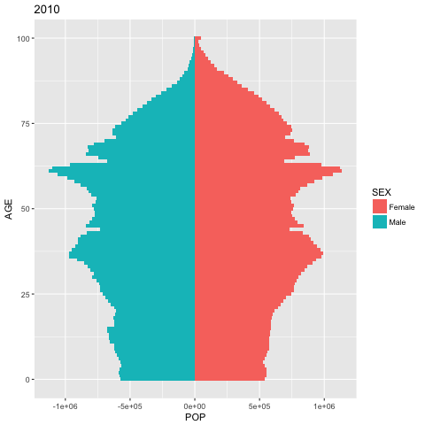
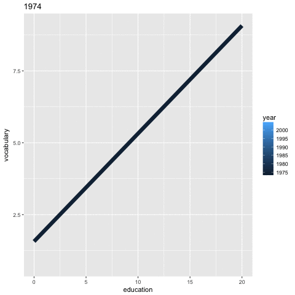

```{r setup, include=FALSE}
knitr::opts_chunk$set(eval=T, echo=T, cache=T, message=F, warning=F)

source("create_datasets.R")
load('data/test_datasets.RData')

library(readr)
library(dplyr)
library(ggplot2)
library(purrr)
library(car)
library(devtools)
# devtools::install_github("dgrtwo/gganimate")
library(gganimate)
library(grid)
library(gtable)
library(aplpack)
library(ggtern)
library(geomnet)
library(ggmap)
library(ggfortify)
library(maps)
library(ggthemes)
library(viridis)
library(rgdal)
library(animation)


```

# Introduction

  - Course notes from the [Data Vizualization with ggplot2 (Part 3)](https://www.datacamp.com/courses/data-visualization-with-ggplot2-part-3) course on DataCamp
  
## Whats Covered

  - Statistical plots
    - Aesthetics review, 
    - box plots, density plots 
    - multiple groups/variables
  - Plots for specific data types (Part 1)
    - graphics of large data
    - Ternary plots
    - Network plots
    - Diagnostic plots
  - Plots for specific data types (Part 2)
    - choropleths
    - cartographic maps
    - animations
  - ggplot2 internals
    - grid graphics, grid grapshics in ggplot2
    - ggplot objects
    - gridExtra
  - Data Munging and Visualization Case Study
    - Bag plot case study, weather case study
  
&nbsp; &nbsp;

***  
# Statistical plots
***  

## Introduction

### -- Refresher (1)

```{r}

# Create movies_small
library(ggplot2movies)
set.seed(123)
movies_small <- movies[sample(nrow(movies), 1000), ]
movies_small$rating <- factor(round(movies_small$rating))

# Explore movies_small with str()
str(movies_small)

# Build a scatter plot with mean and 95% CI
ggplot(movies_small, aes(x = rating, y = votes)) +
  geom_point() +
  stat_summary(fun.data = "mean_cl_normal",
               geom = "crossbar",
               width = 0.2,
               col = "red") +
  scale_y_log10()

```

### -- Refresher (2)

```{r}

str(diamonds)

# Reproduce the plot
ggplot(diamonds, aes(x = carat, y = price, col = color)) +
  geom_point(alpha = 0.5, size = 0.5, shape = 16) +
  scale_x_log10(expression(log[10](Carat)), limits = c(0.1, 10)) +
  scale_y_log10(expression(log[10](Price)), limits = c(100, 100000)) +
  scale_color_brewer(palette = "YlOrRd") +
  coord_equal() +
  theme_classic()
  
```

### -- Refresher (3)

```{r}

# Add smooth layer and facet the plot
ggplot(diamonds, aes(x = carat, y = price, col = color)) +
  stat_smooth(method = "lm") + 
  scale_x_log10(expression(log[10](Carat)), limits = c(0.1,10)) +
  scale_y_log10(expression(log[10](Price)), limits = c(100,100000)) +
  scale_color_brewer(palette = "YlOrRd") +
  coord_equal() +
  theme_classic()

```

## Box Plots

### -- Transformations

```{r}

# movies_small is available

# Add a boxplot geom
d <- ggplot(movies_small, aes(x = rating, y = votes)) +
  geom_point() +
  geom_boxplot() +
  stat_summary(fun.data = "mean_cl_normal",
               geom = "crossbar",
               width = 0.2,
               col = "red")

# Untransformed plot
d

# Transform the scale
d + scale_y_log10()

# Transform the coordinates
## coord_trans is different to scale transformations in that it occurs after statistical transformation and will affect the visual appearance of geoms - there is no guarantee that straight lines will continue to be straight.

## This does not work in my case. 
## It likely is from the statitics having a zero value.
## d + coord_trans(y = "log10")

# It works fine without the stats layer
ggplot(movies_small, aes(x = rating, y = votes)) +
  geom_point() +
  geom_boxplot() +
  coord_trans(y = "log10")

```

This is the example from the documentation which actually works

```{r}
# Three ways of doing transformation in ggplot:

#  * by transforming the data
ggplot(diamonds, aes(log10(carat), log10(price))) +
  geom_point()

#  * by transforming the scales
ggplot(diamonds, aes(carat, price)) +
  geom_point() +
  scale_x_log10() +
  scale_y_log10()

#  * by transforming the coordinate system:
ggplot(diamonds, aes(carat, price)) +
  geom_point() +
  coord_trans(x = "log10", y = "log10")

# The difference between transforming the scales and
# transforming the coordinate system is that scale
# transformation occurs BEFORE statistics, and coordinate
# transformation afterwards.  Coordinate transformation also
# changes the shape of geoms:

d <- subset(diamonds, carat > 0.5)

ggplot(d, aes(carat, price)) +
  geom_point() +
  geom_smooth(method = "lm") +
  scale_x_log10() +
  scale_y_log10()

ggplot(d, aes(carat, price)) +
  geom_point() +
  geom_smooth(method = "lm") +
  coord_trans(x = "log10", y = "log10")

```

### -- Cut it up!

```{r}

# Plot object p
p <- ggplot(diamonds, aes(x = carat, y = price))

# Use cut_interval
p + geom_boxplot(aes(group = cut_interval(carat, n = 10)))

# Use cut_number
p + geom_boxplot(aes(group = cut_number(carat, n = 10)))

# Use cut_width
p + geom_boxplot(aes(group = cut_width(carat, width = 0.25)))

```

  - If you only have continuous variables, you can convert them into ordinal variables using any of the following functions:
    - `cut_interval(x, n)` makes n groups from vector x with equal range.
    - `cut_number(x, n)` makes n groups from vector x with (approximately) equal numbers of observations.
    - `cut_width(x, width)` makes groups of width width from vector x.

### -- Understanding quartiles

  - Notice how the IQR becomes more consistent across methods as the sample size increases

```{r}
plot_quart <- function(n) {
  set.seed(123)
  playData <- data.frame(raw.values = rnorm(n, 1, 6))

  quan.summary <- data.frame(t(sapply(1:9, function(x) quantile(playData$raw.values, type = x))))
  names(quan.summary) <- c("Min", "Q1", "Median", "Q3", "Max")
  quan.summary$Type <- as.factor(1:9)

  library(reshape2)
  quan.summary <- melt(quan.summary, id = "Type")
  quan.summary <- list(quartiles = quan.summary, values = playData)

  ggplot(quan.summary$quartiles, aes(x = Type, y = value, col = variable)) +
    geom_point() +
    geom_rug(data = quan.summary$values, aes(y = raw.values), sides = "l", inherit.aes = F)
}

plot_quart(4)
plot_quart(10)
plot_quart(50)
plot_quart(100)
```
  
## Density Plots

### -- geom_density()

```{r}

# test_datasets.RData has been loaded

str(ch1_test_data)

# Calculating density: d
d <- density(ch1_test_data$norm, bw = "nrd0", kernel = "gaussian")

# Use which.max() to calculate mode
mode <- d$x[which.max(d$y)]

# Finish the ggplot call
ggplot(ch1_test_data, aes(x = norm)) +
  geom_density() +
  geom_rug() +
  geom_vline(xintercept = mode, col = "red")

```

### -- Combine density plots and histogram

```{r}

# ch1_test_data is available

# Arguments you'll need later on
fun_args <- list(mean = mean(ch1_test_data$norm), sd = sd(ch1_test_data$norm))

# Finish the ggplot
ggplot(ch1_test_data, aes(x = norm)) + 
  geom_histogram(aes(y = ..density..)) + 
  geom_density(col = "red") + 
  stat_function(
    fun = dnorm, 
    args = fun_args, 
    col = "blue")

```

### -- Adjusting density plots

There are three parameters that you may be tempted to adjust in a density plot:

  - bw - the smoothing bandwidth to be used, see ?density for details
  - adjust - adjustment of the bandwidth, see density for details
  - kernel - kernel used for density estimation, defined as
    - "g" = gaussian
    - "r" = rectangular
    - "t" = triangular
    - "e" = epanechnikov
    - "b" = biweight
    - "c" = cosine
    - "o" = optcosine

```{r}

# small_data is available
small_data <- structure(list(x = c(-3.5, 0, 0.5, 6)), .Names = "x", row.names = c(NA, 
-4L), class = "data.frame")

# Get the bandwith
get_bw <- density(small_data$x)$bw

# Basic plotting object
p <- ggplot(small_data, aes(x = x)) +
  geom_rug() +
  coord_cartesian(ylim = c(0,0.5))

# Create three plots
p + geom_density()
p + geom_density(adjust = 0.25)
p + geom_density(bw = 0.25 * get_bw)

# Create two plots
## rectangular kernel
p + geom_density(kernel = "r")
## epanechnikov kernel
p + geom_density(kernel = "e")

```

## Multiple Groups/Variables

### -- Box plots with varying width

  - One way to represent the sample size, *n*, is to use variable witdths for the boxes. 

```{r, fig.width=9}

# Finish the plot
ggplot(diamonds, aes(x = cut, y = price, col = color)) + 
  geom_boxplot(varwidth = T) + 
  facet_grid(. ~ color)

```

### -- Mulitple density plots

```{r}

# ch1_test_data and ch1_test_data2 are available
str(ch1_test_data)
str(ch1_test_data2)

# Plot with ch1_test_data
ggplot(ch1_test_data, aes(x = norm)) +
  geom_rug() + 
  geom_density()

# Plot two distributions with ch1_test_data2
ggplot(ch1_test_data2, aes(x = value, fill = dist, col = dist)) +
  geom_rug(alpha = 0.6) + 
  geom_density(alpha = 0.6)

```

### -- Multiple density plots (2)

```{r}

# Individual densities
ggplot(mammals[mammals$vore == "Insectivore", ], 
    aes(x = sleep_total, fill = vore)) +
  geom_density(col = NA, alpha = 0.35) +
  scale_x_continuous(limits = c(0, 24)) +
  coord_cartesian(ylim = c(0, 0.3))

# With faceting
ggplot(mammals, aes(x = sleep_total, fill = vore)) +
  geom_density(col = NA, alpha = 0.35) +
  scale_x_continuous(limits = c(0, 24)) +
  coord_cartesian(ylim = c(0, 0.3)) +
  facet_wrap( ~ vore, nrow = 2)

# Note that by default, the x ranges fill the scale
ggplot(mammals, aes(x = sleep_total, fill = vore)) +
  geom_density(col = NA, alpha = 0.35) +
  scale_x_continuous(limits = c(0, 24)) +
  coord_cartesian(ylim = c(0, 0.3))

# Trim each density plot individually
ggplot(mammals, aes(x = sleep_total, fill = vore)) +
  geom_density(col = NA, alpha = 0.35, trim = T) +
  scale_x_continuous(limits=c(0,24)) +
  coord_cartesian(ylim = c(0, 0.3))

```

### -- Weighted density plots

  - When plotting a single variable, the density plots (and their bandwidths) are calculated separate for each variable (see the plot from the previous exercise, provided).
  - However, when you compare several variables (such as eating habits) it's useful to see the density of each subset in relation to the whole data set. 

```{r}

# Unweighted density plot from before
ggplot(mammals, aes(x = sleep_total, fill = vore)) +
  geom_density(col = NA, alpha = 0.35) +
  scale_x_continuous(limits = c(0, 24)) +
  coord_cartesian(ylim = c(0, 0.3))

# Unweighted violin plot
ggplot(mammals, aes(x = vore, y = sleep_total, fill = vore)) +
  geom_violin()

# Calculate weighting measure
library(dplyr)
mammals2 <- mammals %>%
  group_by(vore) %>%
  mutate(n = n() / nrow(mammals)) -> mammals

str(mammals2, give.attr = F)
str(mammals, give.attr = F)

# Weighted density plot
## I remove the ylim because the y scale changes here
ggplot(mammals, aes(x = sleep_total, fill = vore)) +
  geom_density(aes(weight = n), col = NA, alpha = 0.35) +
  scale_x_continuous(limits = c(0, 24))

# Weighted violin plot
ggplot(mammals, aes(x = vore, y = sleep_total, fill = vore)) +
  geom_violin(aes(weight = n), col = NA)

```

### -- 2D density plots (1)

```{r}

# Base layers
p <- ggplot(faithful, aes(x = waiting, y = eruptions)) +
  scale_y_continuous(limits = c(1, 5.5), expand = c(0, 0)) +
  scale_x_continuous(limits = c(40, 100), expand = c(0, 0)) +
  coord_fixed(60 / 4.5)

# 1 - Use geom_density_2d()
p + geom_density_2d()

# 2 - Use stat_density_2d() with arguments
p + stat_density_2d(aes(col = ..level..), h = c(5, 0.5))

```

### -- 2D density plots (2)

```{r}

# Load in the viridis package
library(viridis)

# Add viridis color scale
ggplot(faithful, aes(x = waiting, y = eruptions)) +
  scale_y_continuous(limits = c(1, 5.5), expand = c(0,0)) +
  scale_x_continuous(limits = c(40, 100), expand = c(0,0)) +
  coord_fixed(60/4.5) +
  stat_density_2d(geom = "tile", aes(fill = ..density..), h=c(5,.5), contour = FALSE) +
  scale_fill_viridis()

```


&nbsp; &nbsp;

***  
# Plots for specific data types (Part 1)
***  

## Graphics of Large Data

### -- Pair plots and correlation matrices

```{r}

# pairs
pairs(iris[1:4])

# chart.Correlation
library(PerformanceAnalytics)

chart.Correlation(iris[1:4])

# ggpairs
library(GGally)

mtcars_fact <- mtcars %>%
  mutate(
    cyl = as.factor(cyl),
    vs = as.factor(vs),
    am = as.factor(am),
    gear = as.factor(gear),
    carb = as.factor(carb)
  )

ggpairs(mtcars_fact[1:3])

```

### -- Create a correlation matrix in ggplot2

```{r}

library(ggplot2)
library(reshape2)

cor_list <- function(x) {
  L <- M <- cor(x)
  
  M[lower.tri(M, diag = TRUE)] <- NA
  M <- melt(M)
  names(M)[3] <- "points"
  
  L[upper.tri(L, diag = TRUE)] <- NA
  L <- melt(L)
  names(L)[3] <- "labels"
  
  merge(M, L)
}

# Calculate xx with cor_list
library(dplyr)

xx <- iris %>%
  group_by(Species) %>%
  do(cor_list(.[1:4])) 

# Finish the plot
ggplot(xx, aes(x = Var1, y = Var2)) +
  geom_point(
    aes(col = points, size = abs(points)), 
    shape = 16
    ) +
  geom_text(
    aes(col = labels, size = abs(labels), label = round(labels, 2))
    ) +
  scale_size(range = c(0, 6)) +
  scale_color_gradient2("r", limits = c(-1, 1)) +
  scale_y_discrete("", limits = rev(levels(xx$Var1))) +
  scale_x_discrete("") +
  guides(size = FALSE) +
  geom_abline(slope = -1, intercept = nlevels(xx$Var1) + 1) +
  coord_fixed() +
  facet_grid(. ~ Species) +
  theme(axis.text.y = element_text(angle = 45, hjust = 1),
        axis.text.x = element_text(angle = 45, hjust = 1),
        strip.background = element_blank())

```

## Ternary Plots

### -- Proportional/stacked bar plots

```{r}

# Explore africa
load('data/africa.RData')
africa_sample <- sample_n(africa, 50)
str(africa_sample)
head(africa_sample)

# Add an ID column from the row.names
africa_sample$ID <- row.names(africa_sample)

# Gather africa_sample
library(tidyr)
africa_sample_tidy <- gather(africa_sample, key, value, -ID)
head(africa_sample_tidy)

# Finish the ggplot command
ggplot(africa_sample_tidy, aes(x = factor(ID), y = value, fill = key)) +
  geom_col() +
  coord_flip()

```

### -- Producing ternary plots

```{r}

# The ggtern library is loaded

# Build ternary plot
str(africa)
ggtern(africa, aes(x = Sand, y = Silt, z = Clay)) +
  geom_point(shape = 16, alpha = 0.2)

```

### -- Adjusting ternary plots

```{r}

# ggtern and ggplot2 are loaded

# Plot 1
ggtern(africa, aes(x = Sand, y = Silt, z = Clay)) +
  geom_density_tern()

# Plot 2
ggtern(africa, aes(x = Sand, y = Silt, z = Clay)) +
  stat_density_tern(geom = 'polygon', aes(fill = ..level.., alpha = ..level..)) +
  guides(fill = FALSE)

```

  - Just playing around and trying to make my own pretty plot
    - I want something like the faithful density but on the tern
    - This is a start
    
```{r}

## I want to see all the points on there
ggtern(africa, aes(x = Sand, y = Silt, z = Clay)) +
  geom_point(alpha = 0.1, color = "navyblue", size = .5) + 
  stat_density_tern(
    geom = 'polygon', 
    aes(fill = ..level.., alpha = ..level..),
    bins = 100
    ) +
  guides(alpha = FALSE) + 
  scale_fill_viridis()

```

## Network Plots

### -- Build the network (1)

```{r}

# Load geomnet & examine structure of madmen
# The geomnet library is loaded
str(madmen)

## This is a much better way to see whats in each list. Love it. 
## library(purrr)
madmen %>% purrr::map(head)

# Merge edges and vertices
mmnet <- merge(madmen$edges, madmen$vertices,
               by.x = "Name1", by.y = "label",
               all = TRUE)

# Examine structure of mmnet
head(mmnet)
str(mmnet)

```

### -- Build the network (2)

```{r}

# geomnet is pre-loaded

# Merge edges and vertices
mmnet <- merge(madmen$edges, madmen$vertices,
               by.x = "Name1", by.y = "label",
               all = TRUE)

head(mmnet)

# Finish the ggplot command
ggplot(data = mmnet, aes(from_id = Name1, to_id = Name2)) +
  geom_net(
    aes(col = Gender),
    size = 6,
    linewidth = 1,
    labelon = T,
    fontsize = 3,
    labelcolour = "black")

```

### -- Adjusting the network

```{r}

# geomnet is pre-loaded
# ggmap is already loaded

# Merge edges and vertices
mmnet <- merge(madmen$edges, madmen$vertices,
               by.x = "Name1", by.y = "label",
               all = TRUE)

# Tweak the network plot
ggplot(data = mmnet, aes(from_id = Name1, to_id = Name2)) +
  geom_net(
    aes(col = Gender),
    size = 6,
    linewidth = 1,
    labelon = TRUE,
    fontsize = 3,
    labelcolour = "black",
    directed = T) +
  scale_color_manual(values = c("#FF69B4", "#0099ff")) +
  xlim(c(-0.05, 1.05)) +
  theme_nothing() +
  theme(legend.key = element_blank())

```

## Diagnostic Plots

### -- Autoplot on linear models

```{r, fig.width = 9}

# Create linear model: res
res <- lm(Volume ~ Girth, data = trees)

# Plot res
plot(res)

# Import ggfortify and use autoplot()
# library(ggfortify)
autoplot(res, ncol = 2)

```

### -- ggfortify - time series

```{r}

# ggfortify and Canada are available

# Inspect structure of Canada
str(Canada)
head(Canada)

# Call plot() on Canada
plot(Canada)

# Call autoplot() on Canada
# autoplot is from the ggfortify library
autoplot(Canada)

```

### -- Distance matrices and Multi-Dimensional Scaling (MDS)

  - The cmdscale() function from the stats package performs Classical Multi-Dimensional Scaling and returns point coodinates as a matrix. 
  - Although autoplot() will work on this object, it will produce a heatmap, and not a scatter plot. 
  - However, if either eig = TRUE, add = TRUE or x.ret = TRUE is specified, cmdscale() will return a list instead of matrix. 
  - In these cases, the list method for autoplot() in the ggfortify package can deal with the output. 
  - Specifics on multi-dimensional scaling is beyond the scope of this course, however details on the method and these arguments can be found in the help pages `?cmdscale`.

```{r}

# ggfortify and eurodist are available
str(eurodist)

# Autoplot + ggplot2 tweaking
autoplot(eurodist) + 
  coord_fixed()

# Autoplot of MDS
autoplot(cmdscale(eurodist, eig = TRUE), 
         label = TRUE, 
         label.size = 3, 
         size = 0)

```

### -- Plotting K-means clustering

  - You must explicitly pass the original data to the autoplot function via the data argument, since kmeans objects don't contain the original data.

```{r}

# Perform clustering
iris_k <- kmeans(iris[-5], 3)

# Autoplot: color according to cluster
autoplot(iris_k, data = iris, frame = T)

# Autoplot: above, plus shape according to species
autoplot(iris_k, data = iris, frame = T, shape = 'Species')

```

&nbsp; &nbsp;

***  
# Plots for specific data types (Part 2)
***  

## Choropleths

### -- Working with maps from the maps package: USA

```{r}

# library(maps)
# library(ggmap)

# Use map_data() to create usa and inspect
usa <- map_data("usa")

str(usa)
head(usa)
table(usa$group)

# Build the map
ggplot(usa, aes(x = long, y = lat, group = group)) +
  geom_polygon() +
  coord_map() +
  theme_nothing()

```

### -- Working with maps from the maps package: adding points

```{r}

# usa, cities, and all required packages are available
# library(readr)
cities <- read_tsv('https://assets.datacamp.com/production/course_862/datasets/US_Cities.txt')

head(usa)
head(cities)

## Need this to get the theme_map() and scale_color_viridis() functions
# library(ggthemes)
# library(viridis)

# Finish plot 1
ggplot(usa, aes(x = long, y = lat, group = group)) +
  geom_polygon() +
  geom_point(data = cities, aes(group = State, size = Pop_est),
             col = "red", shape = 16, alpha = 0.6) +
  coord_map() +
  theme_map()

# Arrange cities
cities_arr <- arrange(cities, Pop_est)

# Copy-paste plot 1 and adapt
ggplot(usa, aes(x = long, y = lat, group = group)) +
  geom_polygon(fill = "grey90") +
  geom_point(data = cities_arr, aes(group = State, col = Pop_est),
             shape = 16, size = 2) +
  coord_map() +
  theme_map() +
  scale_color_viridis()

```

- Pretty much only new york shows up as a yellow dot.
  - LA is the green dot
  - Adjusting the scale here would help. 

```{r}
## New york really tips the scale
## The colors might look better on a log scale
cities_arr %>%
  arrange(desc(Pop_est)) %>%
  head(10)

```
  
### -- State choropleth

```{r}

# pop and all required packages are available

# Use map_data() to create state
state <- map_data("state")
head(state)

# Map of states
ggplot(state, aes(x = long, y = lat, fill = region, group = group)) +
  geom_polygon(col = "white") +
  coord_map() +
  theme_nothing()

# Merge state and pop: state2
state2 <- merge(state, pop)
head(state2)

# Map of states with populations
ggplot(state2, aes(x = long, y = lat, fill = Pop_est, group = group)) +
  geom_polygon(col = "white") +
  coord_map() +
  theme_map()

```

### -- Map from shapefiles

```{r}

# Import shape information: germany
# library(rgdal)
germany <- readOGR(dsn = 'data/shape_files', layer = "DEU_adm1")

# fortify germany: bundes
bundes <- fortify(germany)

# Plot map of germany
ggplot(bundes, aes(x = long, y = lat, group = group)) +
    geom_polygon(fill = "blue", col = "white") +
    coord_map() +
    theme_nothing()
    
```

### -- Choropleth from shapefiles

```{r}

# germany, bundes and unemp are available
head(bundes)

# re-add state names to bundes
bundes$state <- factor(as.numeric(bundes$id))
levels(bundes$state) <- germany$NAME_1

head(bundes)
head(unemp)

# Merge bundes and unemp: bundes_unemp
bundes_unemp <- merge(bundes, unemp)

# Update the ggplot call
ggplot(bundes_unemp, aes(x = long, y = lat, group = group, fill = unemployment)) +
  geom_polygon() +
  coord_map() +
  theme_map()

```

## Cartographic Maps

### -- Different templates

```{r}

# Load the ggmap package
# library(ggmap)

# Create london_map_13 with get_map
london_map_13 <- get_map("London, England", zoom = 13)

# Create the map of london
ggmap(london_map_13)

# Experiment with get_map() and use ggmap() to plot it!
ggmap(get_map(
    "London, England", 
    zoom = 13, 
    maptype = "toner",
    source = "stamen"))

```

### -- Mapping points onto a cartographic map

```{r}

# london_sites and ggmap are available
london_sites <- c("Tower of London, London", "Buckingham Palace, London", "Tower Bridge, London", 
  "Westminster Abbey, London", "Queen Elizabeth Olympic Park, London"
  )

# Use geocode() to create xx
xx <- geocode(london_sites)

# Add a location column to xx
xx$location <- sub(", London","",london_sites)

# Get map data
london_ton_13 <- get_map(location = "London, England", zoom = 13,
                         source = "stamen", maptype = "toner")

# Add a geom_points layer
ggmap(london_ton_13) + 
  geom_point(data = xx, aes(col = location), size = 6)

```

### -- Using a bounding box

```{r}

# london_sites and ggmap are available

# Build xx
xx <- geocode(london_sites)
xx$location <- sub(", London", "", london_sites)
xx$location[5] <- "Queen Elizabeth\nOlympic Park"

# Create bounding box: bbox
bbox <- make_bbox(lon = xx$lon, lat = xx$lat, f = 0.3)

# Re-run get_map to use bbox
london_ton_13 <- get_map(location = bbox, zoom = 13,
                         source = "stamen", maptype = "toner")

# Map from previous exercise
ggmap(london_ton_13) +
  geom_point(data = xx, aes(col = location), size = 6)

# New map with labels
ggmap(london_ton_13) +
  geom_label(
    data = xx, 
    aes(label = location), 
    size = 4, 
    fontface = "bold", 
    fill = "grey90", 
    col = "#E41A1C")
             
```

### -- Combine cartographic and choropleth maps

```{r}

# bundes is available, as are all required packages

# Get the map data of "Germany"
germany_06 <- get_map(location = "Germany", zoom = 6)

# Plot map and polygon on top:
ggmap(germany_06) +
  geom_polygon(
    data = bundes,
    aes(x = long, y = lat, group = group),
    fill = NA, 
    col = "red") +
  coord_map()

```

## Animations

### -- The population pyramid

  - First, I needed to instal `ImageMagik` with homebrew
  - Once the gif is created I can just load it into the doc like an image
  
```{r}

# Inspect structure of japan
japan <- read_tsv('https://assets.datacamp.com/production/course_862/datasets/japanPOP.txt')
str(japan)

# Finish the code inside saveGIF
# library(animation)

saveGIF({

  # Loop through all time points
  for (i in unique(japan$time)) {

    # Subset japan: data
    data <- subset(japan, time == i)

    # Finish the ggplot command
    p <- ggplot(data, aes(x = AGE, y = POP, fill = SEX, width = 1)) +
      coord_flip() +
      geom_bar(data = data[data$SEX == "Female",], stat = "identity") +
      geom_bar(data = data[data$SEX == "Male",], stat = "identity") +
      ggtitle(i)

    print(p)

  }

}, movie.name = "pyramid.gif", interval = 0.1)

```

  

### -- Animations with gganimate

```{r}


## from the car library
head(Vocab)

# Update the static plot
p <- ggplot(Vocab, aes(x = education, y = vocabulary,
                       color = year, group = year,
                       frame = year, cumulative = T)) +
  stat_smooth(method = "lm", se = FALSE, size = 3)

# Call gganimate on p
# Form the gganimate library
animation <- gganimate(p, filename = "vocab.gif", interval = 0.5)

```
 

### -- Exploring Gapminder (Extra)

And one more because this is fun and I think its pretty powerful

```{r}

library(gapminder)
head(gapminder)
theme_set(theme_bw())

p <- ggplot(gapminder, aes(gdpPercap, lifeExp, size = log(pop), color = continent, frame = year)) +
  geom_point() +
  scale_x_log10()


animation <- gganimate(p, "gapminder.gif", interval = 0.5, ani.width = 800, ani.height = 600)


```

 

&nbsp; &nbsp;

***  
# ggplot2 internals
***  

## Grid Graphics

### -- Viewport basics (1)

```{r}
# the grid library is loaded

# Draw rectangle in null viewport
grid.rect(gp = gpar(fill = "grey90"))

# Write text in null viewport
grid.text("null viewport")

# Draw a line
grid.lines(x = c(0, 0.75), y = c(0.25, 1),
          gp = gpar(lty = 2, col = "red"))

```

### -- Viewport basics (2)

```{r}

# Populate null viewport
grid.rect(gp = gpar(fill = "grey90"))
grid.text("null viewport")
grid.lines(x = c(0,0.75), y = c(0.25, 1),
           gp = gpar(lty = 2, col = "red"))

# Create new viewport: vp
vp <- viewport(x = 0.5, y = 0.5, width = 0.5, height = 0.5, just = "center")

# Push vp
pushViewport(vp)

# Populate new viewport with rectangle
grid.rect(gp = gpar(fill = "blue"))

```

### -- Build a plot from scratch (1)

```{r}

# 1 - Create plot viewport: pvp
mar <- c(5, 4, 2, 2)
pvp <- plotViewport(mar)

# 2 - Push pvp
pushViewport(pvp)

# 3 - Add rectangle
grid.rect(gp = gpar(fill = "grey80"))

# Create data viewport: dvp
dvp <- dataViewport(xData = mtcars$wt, yData = mtcars$mpg)

# 4 - Push dvp
pushViewport(dvp)

# Add two axes
grid.xaxis()
grid.yaxis()

```

### -- Build a plot from scratch (2)

```{r}

# Work from before
pushViewport(plotViewport(c(5, 4, 2, 2)))
grid.rect(gp = gpar())
pushViewport(dataViewport(xData = mtcars$wt, yData = mtcars$mpg))
grid.xaxis()
grid.yaxis()

# 1 - Add text to x axis
grid.text("Weight", y = unit(-3, "lines"))

# 2 - Add text to y axis
grid.text("MPG", x = unit(-3, "lines"), rot = 90)

# 3 - Add points
grid.points(x = mtcars$wt, y = mtcars$mpg, pch = 16)

```

### -- Modifying a plot with grid.edit

```{r}

# Work from before
pushViewport(plotViewport(c(5, 4, 2, 2)))
grid.rect(gp = gpar())
pushViewport(dataViewport(xData = mtcars$wt, yData = mtcars$mpg))
grid.xaxis()
grid.yaxis()

# Work from before - add names
grid.text("Weight", y = unit(-3, "lines"), name = "xaxis")
grid.text("MPG", x = unit(-3, "lines"), rot = 90, name = "yaxis")
grid.points(x = mtcars$wt, y = mtcars$mpg, pch = 16, name = "datapoints")

# Edit "xaxis"
grid.edit("xaxis", label = "Weight (1000 lbs)")

# Edit "yaxis"
grid.edit("yaxis", label = "Miles/(US) gallon")

# Edit "datapoints"
grid.edit("datapoints", 
  gp = gpar(col = "#C3212766", cex = 2))

```

## Grid Graphics in ggplot2

### -- Exploring the gTable

```{r}

# A simple plot p
p <- ggplot(mtcars, aes(x = wt, y = mpg, col = factor(cyl))) + geom_point()

# Create gtab with ggplotGrob()
gtab <- ggplotGrob(p)

# Print out gtab
gtab

# Extract the grobs from gtab: gtab
g <- gtab$grob

# Draw only the legend
legend_index <- which(vapply(g, inherits, what = "gtable", logical(1)))
grid.draw(g[[legend_index]])

```

### -- Modifying the gTable

```{r}

# Code from before
p <- ggplot(mtcars, aes(x = wt, y = mpg, col = factor(cyl))) + geom_point()
gtab <- ggplotGrob(p)
g <- gtab$grobs
legend_index <- which(vapply(g, inherits, what = "gtable", logical(1)))
grid.draw(g[[legend_index]])

# the gtable library is loaded

# 1 - Show layout of legend grob
gtable_show_layout(g[[legend_index]])

# Create text grob
my_text <- textGrob(label = "Motor Trend, 1974", gp = gpar(fontsize = 7, col = "gray25"))

# 2 - Use gtable_add_grob to modify original gtab
new_legend <- gtable_add_grob(
  gtab$grobs[[legend_index]], my_text, 3, 2)

# 3 - Update in gtab
gtab$grobs[[legend_index]] <- new_legend

# 4 - Draw gtab
grid.draw(gtab)

```

## ggplot Objects

### -- Exploring ggplot objects

```{r}

# Simple plot p
p <- ggplot(mtcars, aes(x = wt, y = mpg, col = factor(cyl))) + geom_point()

# Examine class() and names()
class(p)
names(p)


# Print the scales sub-list
p$scales$scales

# Update p
p <- p +
  scale_x_continuous("Length", limits = c(4, 8), expand = c(0, 0)) +
  scale_y_continuous("Width", limits = c(2, 4.5), expand = c(0, 0))

# Print the scales sub-list
p$scales$scales

```

### -- ggplot_build and ggplot_gtable

```{r}

# Box plot of mtcars: p
p <- ggplot(mtcars, aes(x = factor(cyl), y = wt)) + geom_boxplot()

# Create pbuild
pbuild <- ggplot_build(p)

# a list of 3 elements
names(pbuild)

# Print out each element in pbuild
pbuild$data
pbuild$layout
pbuild$plot
pbuild$panel

# Create gtab from pbuild
gtab <- ggplot_gtable(pbuild)

# Draw gtab
grid.draw(gtab)

```

### -- Extracting details

```{r}

# Box plot of mtcars: p
p <- ggplot(mtcars, aes(x = factor(cyl), y = wt)) + geom_boxplot()

# Build pdata
pdata <- ggplot_build(p)$data

# confirm that the first element of the list is a data frame
class(pdata[[1]])

# Isolate this data frame
my_df <- pdata[[1]]

# The x labels
my_df$group <- ggplot_build(p)$layout$panel_ranges[[1]]$x.labels

# Print out specific variables
my_df[c(1:6, 11)]

```

## gridExtra

### -- Arranging plots (1)

```{r}

# Add a theme (legend at the bottom)
g1 <- ggplot(mtcars, aes(wt, mpg, col = cyl)) +
  geom_point(alpha = 0.5) +
  theme(legend.position = "bottom")

# Add a theme (no legend)
g2 <- ggplot(mtcars, aes(disp, fill = cyl)) +
  geom_histogram(position = "identity", alpha = 0.5, binwidth = 20) +
  theme(legend.position = "none")

# Load gridExtra
library(gridExtra)

# Call grid.arrange()
grid.arrange(g1, g2, ncol = 2)

```

### -- Arranging plots (2)

```{r}

# ggplot2, grid and gridExtra have been loaded for you
# Definitions of g1 and g2
g1 <- ggplot(mtcars, aes(wt, mpg, col = cyl)) +
  geom_point() +
  theme(legend.position = "bottom")

g2 <- ggplot(mtcars, aes(disp, fill = cyl)) +
  geom_histogram(binwidth = 20) +
  theme(legend.position = "none")

# Extract the legend from g1
my_legend <- ggplotGrob(g1)$grobs[[legend_index]]  

# Create g1_noleg
g1_noleg <- g1 + 
    theme(legend.position = "none")

# Calculate the height: legend_height
legend_height <- sum(my_legend$heights)

# Arrange g1_noleg, g2 and my_legend
grid.arrange(
  g1_noleg, g2, my_legend,
  layout_matrix = matrix(
    c(1,3,2,3), 
    ncol = 2),
    heights = unit.c(unit(1, "npc") - legend_height, legend_height))

```

&nbsp; &nbsp;

***  
# Data Munging and Visualization Case Study
***  

## Case Study I - Bag Plot

### -- Base package bag plot

```{r}

# test_datasets.RData has been loaded

# Call bagplot() on test_data
# The aplpack library has been loaded
head(ch5_test_data)
bagplot(ch5_test_data)

# Call compute.bagplot on test_data, assign to bag
bag <- compute.bagplot(ch5_test_data)

# Display information
bag$hull.loop
bag$hull.bag
bag$pxy.outlier

# Highlight components
points(bag$hull.loop, col = "green", pch = 16)
points(bag$hull.bag, col = "orange", pch = 16)
points(bag$pxy.outlier, col = "purple", pch = 16)

```

### -- Multilayer ggplot2 bag plot

```{r}

# bag and ch5_test_data are available

# Create data frames from matrices
hull.loop <- data.frame(x = bag$hull.loop[,1], y = bag$hull.loop[,2])
hull.bag <- data.frame(x = bag$hull.bag[,1], y = bag$hull.bag[,2])
pxy.outlier <- data.frame(x = bag$pxy.outlier[,1], y = bag$pxy.outlier[,2])

# Finish the ggplot command
ggplot(ch5_test_data, aes(x = x,  y = y)) +
  geom_polygon(data = hull.loop, fill = "green") +
  geom_polygon(data = hull.bag, fill = "orange") +
  geom_point(data = pxy.outlier, col = "purple", pch = 16, cex = 1.5)

```

### -- Creating ggproto functions

```{r}

# ggproto for StatLoop (hull.loop)
StatLoop <- ggproto(
  "StatLoop", 
  Stat,
  required_aes = c("x", "y"),
  compute_group = function(data, scales) {
    bag <- compute.bagplot(x = data$x, y = data$y)
    data.frame(x = bag$hull.loop[,1], y = bag$hull.loop[,2])
  })

# ggproto for StatBag (hull.bag)
StatBag <- ggproto(
  "StatBag", 
  Stat,
  required_aes = c("x", "y"),
  compute_group = function(data, scales) {
   bag <- compute.bagplot(x = data$x, y = data$y)
   data.frame(x = bag$hull.bag[,1], y = bag$hull.bag[,2])
  })

# ggproto for StatOut (pxy.outlier)
StatOut <- ggproto(
  "StatOut", 
  Stat,
  required_aes = c("x", "y"),
  compute_group = function(data, scales) {
   bag <- compute.bagplot(x = data$x, y = data$y)
   data.frame(x = bag$pxy.outlier[,1], y = bag$pxy.outlier[,2])
  })

```

### -- Creating stat_bag()

```{r}

# StatLoop, StatBag and StatOut are available

# Combine ggproto objects in layers to build stat_bag()
stat_bag <- function(mapping = NULL, data = NULL, geom = polygon,
                     position = "identity", na.rm = FALSE, show.legend = NA,
                     inherit.aes = TRUE, loop = FALSE, ...) {
  list(
    # StatLoop layer
    layer(
      stat = StatLoop, data = data, mapping = mapping, geom = geom, 
      position = position, show.legend = show.legend, inherit.aes = inherit.aes,
      params = list(na.rm = na.rm, alpha = 0.35, col = NA, ...)
    ),
    # StatBag layer
    layer(
      stat = StatBag, data = data, mapping = mapping, geom = geom, 
      position = position, show.legend = show.legend, inherit.aes = inherit.aes,
      params = list(na.rm = na.rm, alpha = 0.35, col = NA, ...)
    ),
    # StatOut layer
    layer(
      stat = StatOut, data = data, mapping = mapping, geom = "point", 
      position = position, show.legend = show.legend, inherit.aes = inherit.aes,
      params = list(na.rm = na.rm, alpha = 0.7, col = NA, shape = 21, ...)
    )
  )
}

```

### -- Use stat_bag()

```{r, error=T}

# hull.loop, hull.bag and pxy.outlier are available
# stat_bag, ch5_test_data and ch5_test_data2 are available

# Previous method
ggplot(ch5_test_data, aes(x = x,  y = y)) +
  geom_polygon(data = hull.loop, fill = "green") +
  geom_polygon(data = hull.bag, fill = "orange") +
  geom_point(data = pxy.outlier, col = "purple", pch = 16, cex = 1.5)

# stat_bag
ggplot(ch5_test_data, aes(x = x, y = y)) +
  stat_bag(fill = 'black')

# stat_bag on test_data2
ggplot(ch5_test_data2, aes(x = x, y = y, fill = treatment)) +
  stat_bag()

```

## Case Study II - Weather (Part 1)

### -- Step 1: Read in data and examine

```{r eval=F}

# Import weather data
weather_data_urls <- c(
  'https://assets.datacamp.com/production/course_862/datasets/NYNEWYOR.txt',
  'https://assets.datacamp.com/production/course_862/datasets/FRPARIS.txt',
  'https://assets.datacamp.com/production/course_862/datasets/ILREYKJV.txt',
  'https://assets.datacamp.com/production/course_862/datasets/UKLONDON.txt'
)
weather_data_files <- c("data/NYNEWYOR.txt","data/FRPARIS.txt", "data/ILREYKJV.txt", "data/UKLONDON.txt")

download.file(weather_data_urls, weather_data_files)  

```


```{r}
# Check out the NY weather data
weather <- read.fwf('data/NYNEWYOR.txt',
                    header = F,
                    col.names = c("month", "day", "year", "temp"),
                    widths = c(14, 14, 13, 4))

# Check structure of weather
str(weather)

# Create past with two filter() calls
past <- weather %>%
  filter(!(month == 2 & day == 29)) %>%
  filter(year != 2016)
  
# Check structure of past
str(past)
```

### -- Step 2: Summarize history

```{r}

# Create new version of past
past_summ <- past %>%
  group_by(year) %>%
  mutate(yearday = 1:length(day)) %>%
  ungroup() %>%
  filter(temp != -99) %>%
  group_by(yearday) %>%
  mutate(max = max(temp),
         min = min(temp),
         avg = mean(temp),
         CI_lower = Hmisc::smean.cl.normal(temp)[2],
         CI_upper = Hmisc::smean.cl.normal(temp)[3]) %>%
  ungroup()

# Structure of past_summ
str(past_summ)
head(past_summ)

Hmisc::smean.cl.normal(past$temp)[2]
table(past$temp)
table(past_summ$temp)

```

### -- Step 3: Plot history

```{r}

# Adapt historical plot
ggplot(past_summ, aes(x = yearday, y = temp)) +
  geom_point(
    col = "#EED8AE", 
    alpha = 0.3,
    shape = 16) +
  geom_linerange(
    aes(ymin = CI_lower, ymax = CI_upper), 
    col = "#8B7E66")

```

### -- Step 4: Plot present

```{r}

# weather and past are available in your workspace

# Create present
present <- weather %>%
  filter(!(month == 2 & day == 29)) %>%
  filter(year == max(year)) %>%
  group_by(year) %>%
  mutate(yearday = 1:length(day)) %>%
  ungroup() %>%
  filter(temp != -99)

# Add geom_line to ggplot command
ggplot(past_summ, aes(x = yearday, y = temp)) + 
  geom_point(
    col = "#EED8AE", 
    alpha = 0.3, 
    shape = 16) +
  geom_linerange(
    aes(ymin = CI_lower, ymax = CI_upper), 
    col = "#8B7E66") + 
  geom_line(data = present)

```

### -- Step 5: Find new record highs

```{r}

# Create past_highs
past_highs <- past_summ %>%
  group_by(yearday) %>%
  summarise(past_high = max(temp))

# Create record_high
record_high <- present %>%
  left_join(past_highs) %>%
  filter(temp > past_high)
  
record_high

# Add record_high information to plot
ggplot(past_summ, aes(x = yearday, y = temp)) + 
  geom_point(col = "#EED8AE", alpha = 0.3, shape = 16) +
  geom_linerange(aes(ymin = CI_lower, ymax = CI_upper), col = "#8B7E66") +
  geom_line(data = present) +
  geom_point(data = record_high, col = "#CD2626")

```

### -- Step 6: Efficiently calculate record highs and lows

```{r}

# Create past_extremes
past_extremes <- past_summ %>%
  group_by(yearday) %>%
  summarise(past_low = min(temp),
            past_high = max(temp))

# Create record_high_low
record_high_low <- present %>%
  left_join(past_extremes) %>%
  mutate(record = ifelse(temp < past_low, 
                         "#0000CD",
                         ifelse(temp > past_high, 
                                "#CD2626", 
                                "#00000000")))

# Structure of record_high_low
str(record_high_low)
head(record_high_low)

# Add point layer of record_high_low
p <- ggplot(past_summ, aes(x = yearday, y = temp)) + 
  geom_point(col = "#EED8AE", alpha = 0.3, shape = 16) +
  geom_linerange(aes(ymin = CI_lower, ymax = CI_upper), col = "#8B7E66") +
  geom_line(data = present) +
  geom_point(data = record_high_low, aes(col = record)) +
  scale_color_identity()
p

```

### -- Step 7: Custom legend

```{r}

# Finish the function draw_pop_legend
draw_pop_legend <- function(x = 0.6, y = 0.2, width = 0.2, height = 0.2, fontsize = 10) {
  
  # Finish viewport() function
  pushViewport(viewport(x = x, y = y, width = width, height = height, just = "center"))

  legend_labels <- c("Past record high",
                     "95% CI range",
                     "Current year",
                     "Past years",
                     "Past record low")

  legend_position <- c(0.9, 0.7, 0.5, 0.2, 0.1)
  
  # Finish grid.text() function
  grid.text(label = legend_labels, x = 0.12, y = legend_position, 
            just = "left", 
            gp = gpar(fontsize = fontsize, col = "grey20"))
  
  # Position dots, rectangle and line
  point_position_y <- c(0.1, 0.2, 0.9)
  point_position_x <- rep(0.06, length(point_position_y))
  grid.points(x = point_position_x, y = point_position_y, pch = 16,
              gp = gpar(col = c("#0000CD", "#EED8AE", "#CD2626")))
  grid.rect(x = 0.06, y = 0.5, width = 0.06, height = 0.4,
            gp = gpar(col = NA, fill = "#8B7E66"))
  grid.lines(x = c(0.03, 0.09), y = c(0.5, 0.5),
             gp = gpar(col = "black", lwd = 3))
  
  # Add popViewport() for bookkeeping
  popViewport()
}

# Plotting object p, from previous exercise
p

# Call draw_pop_legend()
draw_pop_legend()

```

## Case Study II - Weather (Part 2)

### -- Step 1: clean_weather()

```{r}

# Finish the clean_weather function
clean_weather <- function(file) {
  weather <- read.fwf(file,
                      header = FALSE,
                      col.names = c("month", "day", "year", "temp"),
                      widths = c(14, 14, 13, 4))
  weather %>%
    filter(!(month == 2 & day == 29)) %>%
    group_by(year) %>%
    mutate(yearday = 1:length(day)) %>%
    ungroup() %>%
    filter(temp != -99)
}

# Import NYNEWYOR.txt: my_data
my_data <- clean_weather('data/NYNEWYOR.txt')

```

```{r}
ny_weather_data_url <- 'https://assets.datacamp.com/production/course_862/datasets/NYNEWYOR.txt'
download.file(ny_weather_data_url, 'data/NYNEWYOR.txt')

```

### -- Step 2: Historical data

```{r}

# Create the stats object
StatHistorical <- ggproto("StatHistorical", Stat,
                    compute_group = function(data, scales, params) {
                      data <- data %>%
                        filter(year != max(year)) %>%
                        group_by(x) %>%
                        mutate(ymin = Hmisc::smean.cl.normal(y)[3],
                               ymax = Hmisc::smean.cl.normal(y)[2]) %>%
                        ungroup()
                    },
                    required_aes = c("x", "y", "year"))

# Create the layer
stat_historical <- function(mapping = NULL, data = NULL, geom = "point",
                            position = "identity", na.rm = FALSE, show.legend = NA, 
                            inherit.aes = TRUE, ...) {
  list(
    layer(
      stat = "identity", data = data, mapping = mapping, geom = geom,
      position = position, show.legend = show.legend, inherit.aes = inherit.aes,
      params = list(na.rm = na.rm, col = "#EED8AE", alpha = 0.3, shape = 16, ...)
    ),
    layer(
      stat = StatHistorical, data = data, mapping = mapping, geom = "linerange",
      position = position, show.legend = show.legend, inherit.aes = inherit.aes,
      params = list(na.rm = na.rm, col = "#8B7E66", ...)
    )
  )
}

# Build the plot
my_data <- clean_weather("data/NYNEWYOR.txt")
ggplot(my_data, aes(x = yearday, y = temp, year = year)) +
  stat_historical()

```

### -- Step 3: Present data

```{r}

# Create the stats object
StatPresent <- ggproto("StatPresent", Stat,
                       compute_group = function(data, scales, params) {
                         data <- filter(data, year == max(year))
                       },
                       required_aes = c("x", "y", "year"))

# Create the layer
stat_present <- function(mapping = NULL, data = NULL, geom = "line",
                       position = "identity", na.rm = FALSE, show.legend = NA, 
                       inherit.aes = TRUE, ...) {
  layer(
    stat = StatPresent, data = data, mapping = mapping, geom = geom,
    position = position, show.legend = show.legend, inherit.aes = inherit.aes,
    params = list(na.rm = na.rm, ...)
  )
}

# Build the plot
my_data <- clean_weather("data/NYNEWYOR.txt")
ggplot(my_data, aes(x = yearday, y = temp, year = year)) +
  stat_historical() +
  stat_present()

```

### -- Step 4: Extremes

```{r}

# Create the stats object
StatExtremes <- ggproto("StatExtremes", Stat,
                        compute_group = function(data, scales, params) {
                          
                          present <- data %>%
                            filter(year == max(year)) 
                          
                          past <- data %>%
                            filter(year != max(year)) 
                          
                          past_extremes <- past %>%
                            group_by(x) %>%
                            summarise(past_low = min(y),
                                      past_high = max(y))
                          
                          # transform data to contain extremes
                          data <- present %>%
                            left_join(past_extremes) %>%
                            mutate(record = ifelse(y < past_low, 
                                                   "#0000CD", 
                                                   ifelse(y > past_high, 
                                                          "#CD2626", 
                                                          "#00000000")))
                        },
                        required_aes = c("x", "y", "year"))

# Create the layer
stat_extremes <- function(mapping = NULL, data = NULL, geom = "point",
                          position = "identity", na.rm = FALSE, show.legend = NA, 
                          inherit.aes = TRUE, ...) {
  layer(
    stat = StatExtremes, data = data, mapping = mapping, geom = geom,
    position = position, show.legend = show.legend, inherit.aes = inherit.aes,
    params = list(na.rm = na.rm, ...)
  )
}

# Build the plot
my_data <- clean_weather("data/NYNEWYOR.txt")
ggplot(my_data, aes(x = yearday, y = temp, year = year)) +
  stat_historical() +
  stat_present() +
  stat_extremes(aes(col = ..record..)) +
  scale_color_identity() # Colour specification

```

### -- Step 5: Re-use plotting style

```{r}

# File paths of all datasets
my_files <- c("data/NYNEWYOR.txt","data/FRPARIS.txt", "data/ILREYKJV.txt", "data/UKLONDON.txt")

# Build my_data with a for loop
my_data <- NULL
for (file in my_files) {
  temp <- clean_weather(file)
  temp$id <- sub(".txt", "", file)
  my_data <- rbind(my_data, temp)
}

str(my_data)

# Build the final plot, from scratch!
ggplot(my_data, aes(x = yearday, y = temp, year = year)) +
  stat_historical() +
  stat_present() +
  stat_extremes(aes(col = ..record..)) +
  scale_color_identity() +  # specify colour here
  facet_wrap(~ id, ncol = 2)

```

## Wrap-up
