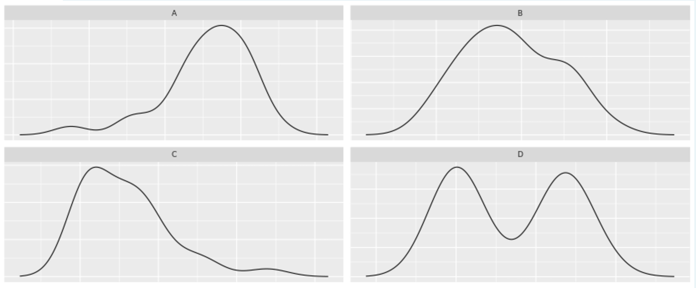

```{r setup, include=FALSE}
knitr::opts_chunk$set(eval=T, echo=T, cache=T, message=F, warning=F)
```

# Introduction

  - Course notes from the [Exploratory Data Analysis](https://www.datacamp.com/courses/exploratory-data-analysis) course on DataCamp
  
## Whats Covered

  - Exploring Categorical Data
  - Exploring Numerical Data
  - Numerical Summaries
  - Case Study

## Libraries and Data

```{r} 

source('create_datasets.R')

library(readr)
library(dplyr)
library(ggplot2)
library(openintro)

cars <- read.csv("https://assets.datacamp.com/production/course_1796/datasets/cars04.csv")
comics <- read.csv("https://assets.datacamp.com/production/course_1796/datasets/comics.csv")
life <- read.csv("https://assets.datacamp.com/production/course_1796/datasets/life_exp_raw.csv")

```


&nbsp; &nbsp;

***  
# Exploring Categorical Data
***  

## Exploring categorical data

### -- Bar chart expectations

  - Bar charts with categorical variables on the x axis and in the fill are a common way to see a contingency table visually. 
  - It essentialy what you would get if you used the `table` function with two variables
  - Which way you show the data can change the perception. 
  - Which variable you use for the fill or the position of the bars (fill, dodge, stack) all can give different perceptions
  
### -- Contingency table review

```{r}

# Print the first rows of the data
head(comics)

# Check levels of align
levels(comics$align)

# Check the levels of gender
levels(comics$gender)

# Create a 2-way contingency table
table(comics$align, comics$gender)

```

### -- Dropping levels

```{r}

# Load dplyr

# Print tab
tab <- table(comics$align, comics$gender)
tab

# Remove align level
comics <- comics %>%
  filter(align != 'Reformed Criminals') %>%
  droplevels()

levels(comics$align)

```

### -- Side-by-side barcharts

```{r}

# Load ggplot2

# Create side-by-side barchart of gender by alignment
ggplot(comics, aes(x = align, fill = gender)) + 
  geom_bar(position = "dodge")

# Create side-by-side barchart of alignment by gender
ggplot(comics, aes(x = gender, fill = align)) + 
  geom_bar(positio = "dodge") +
  theme(axis.text.x = element_text(angle = 90))

```

### -- Bar chart interpretation

  - Among characters with "Neutral" alignment, males are the most common.
  - In general, there is an association between gender and alignment.
  - There are more male characters than female characters in this dataset.

## Counts vs. proportions

```{r}

# simplify display format
options(scipen = 999, digits = 3) 

## create table of counts
tbl_cnt <- table(comics$id, comics$align)
tbl_cnt

# Proportional table
# All values add up to 1
prop.table(tbl_cnt)
sum(prop.table(tbl_cnt))

# All rows add up to 1
prop.table(tbl_cnt, 1)

# Coluns add up to 1
prop.table(tbl_cnt, 2)

```

  - Look at the proportion of bad characters in the secret and unknown groups
  - Note there are very few characters with id = unknown

```{r}

ggplot(comics, aes(x = id, fill = align)) + 
  geom_bar(position = "fill") + 
  ylab("proportion")

```

  - Swap the x and fill variables. Notice the most bad cahracters are secret (not unknown). 
  - Here you can see more clearly that there are very few characters at all with id = unknown

```{r}

ggplot(comics, aes(x = align, fill = id)) + 
  geom_bar(position = "fill") + 
  ylab("proportion")

```

### -- Conditional proportions

```{r}

tab <- table(comics$align, comics$gender)
options(scipen = 999, digits = 3) # Print fewer digits
prop.table(tab)     # Joint proportions
prop.table(tab, 2)

```

  - Approximately what proportion of all female characters are good?
    - 51%
    
### -- Counts vs. proportions (2)

```{r}

# Plot of gender by align
ggplot(comics, aes(x = align, fill = gender)) +
  geom_bar()
  
# Plot proportion of gender, conditional on align
ggplot(comics, aes(x = align, fill = gender)) + 
  geom_bar(position = "fill")

```

## Distribution of one variable

```{r}

# Can use table function on just one variable
# This is called a marginal distribution
table(comics$id)

# Simple barchart
ggplot(comics, aes(x = id)) + 
  geom_bar()

```

  - You can also facet to see variables indidually
  - A little easier than filtering each and plotting. 
  - This is a rearrangement of the bar chart we plotted earlier
    - We facte by alignment rather then coloring the stack. 
    - This can make it a little easier to answer some questions. 
  
```{r}

ggplot(comics, aes(x = id)) + 
  geom_bar() + 
  facet_wrap(~align)

```

### -- Marginal barchart

  - It makes more sense to put neutral between Bad and Good
  - We need to reorder the levels so it will chart this way
  - Otherwise it will defult to alphabetical
  
```{r}

# Change the order of the levels in align
comics$align <- factor(comics$align, 
                       levels = c("Bad", "Neutral", "Good"))

# Create plot of align
ggplot(comics, aes(x = align)) + 
  geom_bar()

```

### -- Conditional barchart

```{r}

# Plot of alignment broken down by gender
ggplot(comics, aes(x = align)) + 
  geom_bar() +
  facet_wrap(~ gender)

```

### -- Improve piechart

```{r}

# Put levels of flavor in decending order
lev <- c("apple", "key lime", "boston creme", "blueberry", "cherry", "pumpkin", "strawberry")
pies$flavor <- factor(pies$flavor, levels = lev)

head(pies$flavor)

# Create barchart of flavor
ggplot(pies, aes(x = flavor)) + 
  geom_bar(fill = "chartreuse") + 
  theme(axis.text.x = element_text(angle = 90))

```


&nbsp; &nbsp;

***  
# Exploring Numerical Data
***  

## Exploring numerical data

```{r}

# A dot plot shows all the datapoints
ggplot(cars, aes(x = weight)) + 
  geom_dotplot(dotsize = 0.4)

# A histogram groups the points into bins so it does not get overwhelming
ggplot(cars, aes(x = weight)) + 
  geom_histogram(dotsize = 0.4, binwidth = 500)

# A density plot gives a bigger picture representation of the distribution
# It more helpful when there is a lot of data
ggplot(cars, aes(x = weight)) + 
  geom_density()

# A boxplot is a good way to just show the summary info of the distriubtion
ggplot(cars, aes(x = 1, y = weight)) + 
  geom_boxplot() +
  coord_flip()

```

### -- Faceted histogram

```{r}

# Load package
library(ggplot2)

# Learn data structure
str(cars)

# Create faceted histogram
ggplot(cars, aes(x = city_mpg)) +
  geom_histogram() +
  facet_wrap(~ suv)

```

### -- Boxplots and density plots

```{r}

unique(cars$ncyl)
table(cars$ncyl)

# Filter cars with 4, 6, 8 cylinders
common_cyl <- filter(cars, ncyl %in% c(4,6,8))

# Create box plots of city mpg by ncyl
ggplot(common_cyl, aes(x = as.factor(ncyl), y = city_mpg)) +
  geom_boxplot()

# Create overlaid density plots for same data
ggplot(common_cyl, aes(x = city_mpg, fill = as.factor(ncyl))) +
  geom_density(alpha = .3)

```

### -- Compare distribution via plots

  - The highest mileage cars have 4 cylinders.
  - The typical 4 cylinder car gets better mileage than the typical 6 cylinder car, which gets better mileage than the typical 8 cylinder car.
  - Most of the 4 cylinder cars get better mileage than even the most efficient 8 cylinder cars.

## Distribution of one variable

### -- Marginal and conditional histograms

```{r}

# Create hist of horsepwr
cars %>%
  ggplot(aes(horsepwr)) +
  geom_histogram() +
  ggtitle("Horsepower distribution")

# Create hist of horsepwr for affordable cars
cars %>% 
  filter(msrp < 25000) %>%
  ggplot(aes(horsepwr)) +
  geom_histogram() +
  xlim(c(90, 550)) +
  ggtitle("Horsepower distribtion for msrp < 25000")

```

### -- Marginal and conditional histograms interpretation

  - The highest horsepower car in the less expensive range has just under 250 horsepower.
  
### -- Three binwidths

```{r}

# Create hist of horsepwr with binwidth of 3
cars %>%
  ggplot(aes(horsepwr)) +
  geom_histogram(binwidth = 3) +
  ggtitle("binwidth = 3")

# Create hist of horsepwr with binwidth of 30
cars %>%
  ggplot(aes(horsepwr)) +
  geom_histogram(binwidth = 30) +
  ggtitle("binwidth = 30")

# Create hist of horsepwr with binwidth of 60
cars %>%
  ggplot(aes(horsepwr)) +
  geom_histogram(binwidth = 60) +
  ggtitle("binwidth = 60")

```

## Box plots

### -- Box plots for outliers

```{r}

# Construct box plot of msrp
cars %>%
  ggplot(aes(x = 1, y = msrp)) +
  geom_boxplot()

# Exclude outliers from data
cars_no_out <- cars %>%
  filter(msrp < 100000)

# Construct box plot of msrp using the reduced dataset
cars_no_out %>%
  ggplot(aes(x = 1, y = msrp)) +
  geom_boxplot()

```

### -- Plot selection

```{r}

# Create plot of city_mpg
cars %>%
  ggplot(aes(x = 1, y = city_mpg)) +
  geom_boxplot()
  
cars %>%
  ggplot(aes(city_mpg)) +
  geom_density()

# Create plot of width
cars %>%
  ggplot(aes(x = 1, y = width)) +
  geom_boxplot()
  
cars %>%
  ggplot(aes(x = width)) +
  geom_density()

```

## Visualization in higher dimensions

### -- 3 variable plot

```{r}

# Facet hists using hwy mileage and ncyl
common_cyl %>%
  ggplot(aes(x = hwy_mpg)) +
  geom_histogram() +
  facet_grid(ncyl ~ suv) +
  ggtitle("hwy_mpg by ncyl and suv")

```

### -- Interpret 3 var plot

  - Across both SUVs and non-SUVs, mileage tends to decrease as the number of cylinders increases.

&nbsp; &nbsp;

***  
# Numerical Summaries
***  

## Measures of center

  - What is a `typical` value for life expectancy?
    - We will look at just a few data points here
    - And just the females
  
```{r}

head(life)

x <- head(round(life$Female.life.expectancy..years.), 11)
x

```

**mean**

  - balance point of the data
  - sensitive to extreme values

```{r}
sum(x)/11
mean(x)
```

**median**

  - middle value of the data
  - robust to extreme values
  - most approrpriate measure when working with skewed data
  
```{r}

sort(x)
median(x)

```

**mode**

  - most common value
    
```{r}

table(x)

```


### -- Calculate center measures

```{r}

str(gapminder)

# Create dataset of 2007 data
gap2007 <- filter(gapminder, year == 2007)

# Compute groupwise mean and median lifeExp
gap2007 %>%
  group_by(continent) %>%
  summarize(mean(lifeExp),
            median(lifeExp))

# Generate box plots of lifeExp for each continent
gap2007 %>%
  ggplot(aes(x = continent, y = lifeExp)) +
  geom_boxplot()

```

## Measures of variability

  - We wnat to know 'How much is the data spread out from the middle?'
  - Just looking at the data gives us a sense of this
    - But we want break it down to one number so we can compare sample distributions

```{r} 
x
```

  - We could just take the differnce between all points and the mean and add it up
    - But that would equal 0. Thats the idea of the mean.
  
```{r}
# Look at the difference between each point and the mean
sum(x - mean(x))
```

  - So we can square the differnce
    - But this number will keep getting bigger as you add more observations
    - We want something that is stable

```{r}
# Square each difference to get rid of negatives then sum
sum((x - mean(x))^2)
```

**Variance**

  - so we divide by n - 1
  - This is called the sample variance. One of the most useful measures of a sample distriution

```{r}
sum((x - mean(x))^2)/(length(x) - 1)
var(x)
```

**Standard Deviation**

  - Another very useful metric is the sample standard deviation
  - This is just the square root of the variance
  - The nice thing about the std dev is that it is in the same units as the original data
  - In this case its 1.17 years

```{r}
sqrt(sum((x - mean(x))^2)/(length(x) - 1))
sd(x)
```

**Inter Quartile Range**

  - The IQR is the middle 50% of the data
  - The nice thing about this one is that it is not sensitve to extreme values
  - All of the other measures listed here are sensitive to extreme values

```{r}
summary(x)
IQR(x)
```

**Range**

  - max and min are also interesting
  - as is the range, or the difference between max and min

```{r}
max(x)
min(x)
diff(range(x))
```

### -- Calculate spread measures

```{r}

str(gap2007)

# Compute groupwise measures of spread
gap2007 %>%
  group_by(continent) %>%
  summarize(sd(lifeExp),
            IQR(lifeExp),
            n())

# Generate overlaid density plots
gap2007 %>%
  ggplot(aes(x = lifeExp, fill = continent)) +
  geom_density(alpha = 0.3)

```

### -- Choose measures for center and spread

```{r}

# Compute stats for lifeExp in Americas
head(gap2007)

gap2007 %>%
  filter(continent == "Americas") %>%
  summarize(mean(lifeExp),
            sd(lifeExp))

# Compute stats for population
gap2007 %>%
  summarize(median(pop),
            IQR(pop))

```

## Shape and transformations

4 chracteristics of a distribution that are of interest:

  - center
    - already covered
  - spread or variablity
    - already covered
  - shape
    - modality: number of prominent humps (uni, bi, multi, or uniform - no humps)
    - skew (right, left, or symetric)
    - Can transform to fix skew
  - outliers
    
### -- Describe the shape

  
  
  - A: unimodal, left-skewed
  - B: unimodal, symmetric
  - C: unimodal, right-skewed
  - D: bimodal, symmetric
  
### -- Transformations

```{r}
# Create density plot of old variable
gap2007 %>%
  ggplot(aes(x = pop)) +
  geom_density()

# Transform the skewed pop variable
gap2007 <- gap2007 %>%
  mutate(log_pop = log(pop))

# Create density plot of new variable
gap2007 %>%
  ggplot(aes(x = log_pop)) +
  geom_density()
```

## Outliers

### -- Identify outliers

```{r}

# Filter for Asia, add column indicating outliers
str(gapminder)

gap_asia <- gap2007 %>%
  filter(continent == "Asia") %>%
  mutate(is_outlier = lifeExp < 50)

# Remove outliers, create box plot of lifeExp
gap_asia %>%
  filter(!is_outlier) %>%
  ggplot(aes(x = 1, y = lifeExp)) +
  geom_boxplot()

```


&nbsp; &nbsp;

***  
# Case Study
***  

## Introducing the data

### -- Spam and num_char

```{r}

# ggplot2, dplyr, and openintro are loaded

# Compute summary statistics
email %>%
  group_by(spam) %>%
  summarize( 
    median(num_char),
    IQR(num_char))

str(email)
table(email$spam)

email <- email %>%
  mutate(spam = factor(ifelse(spam == 0, "not-spam", "spam")))

# Create plot
email %>%
  mutate(log_num_char = log(num_char)) %>%
  ggplot(aes(x = spam, y = log_num_char)) +
  geom_boxplot()

```

### -- Spam and num_char interpretation

  - The median length of not-spam emails is greater than that of spam emails
  
### -- Spam and !!!

```{r}

# Compute center and spread for exclaim_mess by spam
email %>%
  group_by(spam) %>%
  summarize(
    median(exclaim_mess),
    IQR(exclaim_mess))  

table(email$exclaim_mess)

# Create plot for spam and exclaim_mess
email %>%
  mutate(log_exclaim_mess = log(exclaim_mess)) %>%
  ggplot(aes(x = log_exclaim_mess)) + 
  geom_histogram() + 
  facet_wrap(~ spam)

```

### -- Spam and !!! interpretation

  - The most common value of exclaim_mess in both classes of email is zero (a log(exclaim_mess) of -4.6 after adding .01).
  - Even after a transformation, the distribution of exclaim_mess in both classes of email is right-skewed.
  - The typical number of exclamations in the not-spam group appears to be slightly higher than in the spam group.

## Check-in 1

  - Zero inflation in the exclaim_mess variable
    - you can analyze the two part separatly
    - or turn it into a categorical variable of is-zero, not-zero
  - Could make a barchart
    - need to decide if you are more interested in counts or proportions

### -- Collapsing levels

```{r}

table(email$image)

# Create plot of proportion of spam by image
email %>%
  mutate(has_image = image > 0) %>%
  ggplot(aes(x = has_image, fill = spam)) +
  geom_bar(position = "fill")

```

### -- Image and spam interpretation

  - An email without an image is more likely to be not-spam than spam
  
### -- Data Integrity

```{r}

# Test if images count as attachments
sum(email$image > email$attach)

```

  - There are no emails with more images than attachments so these most be counted as attachments also
  
### -- Answering questions with chains

```{r}

## Within non-spam emails, is the typical length of emails shorter for 
## those that were sent to multiple people?
email %>%
   filter(spam == "not-spam") %>%
   group_by(to_multiple) %>%
   summarize(median(num_char))

```

  - Yes

```{r}

# Question 1
## For emails containing the word "dollar", does the typical spam email 
## contain a greater number of occurences of the word than the typical non-spam email?
table(email$dollar)

email %>%
  filter(dollar > 0) %>%
  group_by(spam) %>%
  summarize(median(dollar))

```

  - No

```{r}
# Question 2
## If you encounter an email with greater than 10 occurrences of the word "dollar", 
## is it more likely to be spam or not -spam?

email %>%
  filter(dollar > 10) %>%
  ggplot(aes(x = spam)) +
  geom_bar()

```

  - Not-spam, at least in this dataset
  
## Check-in 2

### -- What's in a number?

```{r}

levels(email$number)
table(email$number)

# Reorder levels
email$number <- factor(email$number, levels = c("none","small","big"))

# Construct plot of number
ggplot(email, aes(x = number)) +
  geom_bar() + 
  facet_wrap( ~ spam)

```

### -- What's in a number interpretation
  
  - Given that an email contains a small number, it is more likely to be not-spam.
  - Given that an email contains a big number, it is more likely to be not-spam.
  - Within both spam and not-spam, the most common number is a small one.


