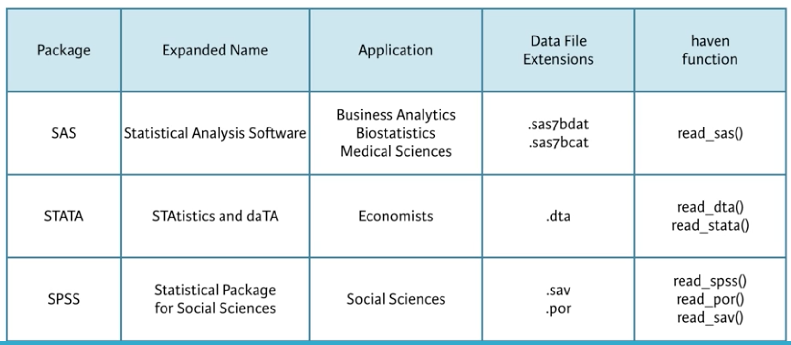

```{r setup, include=FALSE}
knitr::opts_chunk$set(eval=T, echo=T, cache=T, message=F, warning=F)

library(dplyr)
library(DBI)
library(RMySQL)
library(readr)
library(gdata)
library(readxl)
library(httr)
library(jsonlite)
library(haven)
library(foreign)

## Clean up the data directory
unlink("data/*")

```

***  
# Introduction
***  

Course notes for [Importing Data in R (Part 2)](https://www.datacamp.com/courses/importing-data-in-r-part-2)

## Whats Covered

  - Importing data from databases
    - `DBI`, `RMySQL`, SQL examples
    - connecting, fetching and disconnecting from DB
  - Importing data from the web
    - HTTP, HTTPS, 
    - `readr`, `gdata`, and `readxl` from the web, 
    - `httr`
    - JSON and `jsonlite`
  - Importing data form statistical sofware packages
    - `haven` and `foreign` with SAS, STATA, and SPSS files
  
&nbsp; &nbsp;

***  
# Importing data from databases (1)
***  

## Connect to a database
  
  - There are different packages for differnt database managment systems (DBMS)
  - RMySQL, RPostgres, ROracle, etc
  - All of these use DBI to connect

## Establish a connection

  - They have set up a database on aws that I can connect to for the exercise
  - You only need to connect once and then can run multiple queries on the data as I will do below
    
```{r}

## The DBI package is already loaded

# Edit dbConnect() call
con <- dbConnect(RMySQL::MySQL(), 
                 dbname = "tweater", 
                 host = "courses.csrrinzqubik.us-east-1.rds.amazonaws.com", 
                 port = 3306,
                 user = "student",
                 password = "datacamp")

```

## Inspect the connection
  
  - Con is a connection to the MySQL DB

```{r}

class(con)

```

## List the database tables

```{r}

## The DBI package is already loaded

## The MySQL database connection is already made with con

# Build a vector of table names: tables
tables <- dbListTables(con)

# Display structure of tables
str(tables)
```

## Import users

```{r}

# Import the users table from tweater: users
users <- dbReadTable(con, "users")

# Print users
users

```

## Import all tables

```{r}

# Get table names
table_names <- dbListTables(con)

# Import all tables
tables <- lapply(table_names, dbReadTable, conn = con)

# Print out tables
tables

```

&nbsp; &nbsp;

***  
# Importing data from databases (2)
***  

## SQL Queries from inside R

  - Running SQL queries in the DB is much more efficient than loading all of the data into R and then crunching
    - Escpecially for large table that are many millions of rows. 
    - Its best to query just the data you need from the table or crunch it in a sql query with a group by and summarize
    - Its not covered in this class but you can also write dplyr code and it will automtically convert it to sql and run it in the DB.

## Query tweater (1)

```{r}

# Import tweat_id column of comments where user_id is 1: elisabeth
elisabeth <- dbGetQuery(con, "select tweat_id from comments where user_id =  1")

# Print elisabeth
elisabeth

```

## Query tweater (2)

```{r}

# Import post column of tweats where date is higher than '2015-09-21': latest
latest <- dbGetQuery(con, "select post from tweats where date > '2015-09-21'")

# Print latest
latest

```

## Query tweater (3)

```{r}

# Create data frame specific
specific <- dbGetQuery(con, "select message from comments where tweat_id = 77 AND user_id > 4")

# Print specific
specific

```

## Query tweater (4)

```{r}

# Create data frame short
short <- dbGetQuery(con, "select id, name from users where CHAR_LENGTH(name) < 5")

# Print short
short

```

## Join the query madness!

```{r}
sql <- "SELECT post, message
        FROM tweats INNER JOIN comments on tweats.id = tweat_id
        WHERE tweat_id = 77"
df <- dbGetQuery(con, sql)
df
```

## DBI internals

  - Sometimes you want to control the data that is fetched
  - If so, you can use the DBI internal functions `dbSendQuery`, `dbFetch`, and `dbClearResults`

## Send - Fetch - Clear

```{r}

# Send query to the database
res <- dbSendQuery(con, "SELECT * FROM comments WHERE user_id > 4")

# Use dbFetch() twice
dbFetch(res, 2)
dbFetch(res, 2)

# Clear res
dbClearResult(res)

```

## Be polite and ...

  - Always disconnect from the database when you are done querying

```{r}

# Create the data frame  long_tweats
long_tweats <- dbGetQuery(con, "select post, date from tweats where CHAR_LENGTH(post) > 40")

# Print long_tweats
long_tweats

# Disconnect from the database
dbDisconnect(con)
```


&nbsp; &nbsp;

***  
# Importing data from the web (1)
***  

## HTTP

  - More and more data will be on the web
  - Or atleast on a remote server with http/https access
  - So its important to know that you can get data via an http request
  - This is simply asking a remove server for a file 
  
## Import flat files from the web

  - readr can grab a file from the web directly. 
  - It knows the location is a url and it will just work

```{r}

# The readr package is already loaded

# Import the csv file: pools
url_csv <- "http://s3.amazonaws.com/assets.datacamp.com/production/course_1478/datasets/swimming_pools.csv"
pools <- read_csv(url_csv)
head(pools)

# Import the txt file: potatoes
url_delim <- "http://s3.amazonaws.com/assets.datacamp.com/production/course_1478/datasets/potatoes.txt"
potatoes <- read_tsv(url_delim)
head(potatoes)

```

## Secure importing

  - This also works for https

```{r}

# https URL to the swimming_pools csv file.
url_csv <- "https://s3.amazonaws.com/assets.datacamp.com/production/course_1478/datasets/swimming_pools.csv"

# Import the file using read.csv(): pools1
pools1 <- read.csv(url_csv)
str(pools1)

# Import the file using read_csv(): pools2
pools2 <- read_csv(url_csv)
str(pools2)

```

## Downloading files

  - readxl can't pull excel files from http yet but you can download it and then read it in
  - or use gdata package to get it directly from the web

## Import Excel files form the web

```{r}

# The readxl and gdata packages are already loaded

# Specification of url: url_xls
url_xls <- "http://s3.amazonaws.com/assets.datacamp.com/production/course_1478/datasets/latitude.xls"

# Import the .xls file with gdata: excel_gdata
excel_gdata <- read.xls(url_xls)
str(excel_gdata)

# Download file behind URL, name it local_latitude.xls
download.file(url_xls,"data/local_latitude.xls")

# Import the local .xls file with readxl: excel_readxl
excel_readxl <- read_excel("data/local_latitude.xls")
str(excel_readxl)

```

## Downloading any file, secure or not

  - the `load` used to load `Rdata` files does not accept urls so if there is an `RData` file on the web you will need to download it first
  - you can pretty much download any file with `download.file`

```{r}

# https URL to the wine RData file.
url_rdata <- "https://s3.amazonaws.com/assets.datacamp.com/production/course_1478/datasets/wine.RData"

# Download the wine file to your working directory
download.file(url_rdata, "data/wine_local.RData")

# Load the wine data into your workspace using load()
load("data/wine_local.RData")

# Print out the summary of the wine data
summary(wine)

```

## Reading a txt file from the web

```{r}

## These all work
read.csv("http://s3.amazonaws.com/assets.datacamp.com/production/course_1478/datasets/swimming_pools.csv") %>% head()
read_tsv("http://s3.amazonaws.com/assets.datacamp.com/production/course_1478/datasets/potatoes.txt") %>% head() 
download.file("http://s3.amazonaws.com/assets.datacamp.com/production/course_1478/datasets/latitude.xlsx", "data/lat.xlsx")

## This will not work. you need to download the RData file first then load it
# load("https://s3.amazonaws.com/assets.datacamp.com/production/course_1478/datasets/wine.RData")

```

## HTTP? httr! (1)

```{r}

# The httr package is already loaded

# Get the url, save response to resp
url <- "http://www.example.com/"
resp <- GET(url)

# Print resp
resp

# Get the raw content of resp: raw_content
raw_content <- content(resp, as='raw')

# Print the head of raw_content
head(raw_content)

```

## HTTP? httr! (2)

```{r}

# Get the url
url <- "http://www.omdbapi.com/?apikey=ff21610b&t=Annie+Hall&y=&plot=short&r=json"
resp <- GET(url)

# Print resp
resp

# Print content of resp as text
content(resp, as = 'text')

# Print content of resp
content(resp)

```


&nbsp; &nbsp;

***  
# Importing data from the web (2)
***  

## APIs & JSON

  - APIs let you request or send data to a server via the web with
  - You use a url with set parameters and the server knows what data to return
    - It handles all the sql and query stuff so you don't need to know how the data is stored
    - You just need to know what parameters to put in the url to ask for the data you want
  - It will then provide structured data in return
  - JSON is the structure that is used almost always
  - JSON data easily translates to a list in R which can then be converted to a dataframe
  
## From JSON to R

```{r}

# The jsonlite package is already loaded

# wine_json is a JSON
wine_json <- '{"name":"Chateau Migraine", "year":1997, "alcohol_pct":12.4, "color":"red", "awarded":false}'

# Convert wine_json into a list: wine
wine <- fromJSON(wine_json)

# Print structure of wine
str(wine)

wine

```

## Quandl API

```{r}

# Definition of quandl_url
quandl_url <- "http://www.quandl.com/api/v1/datasets/IWS/INTERNET_INDIA.json?auth_token=i83asDsiWUUyfoypkgMz"

# Import Quandl data: quandl_data
quandl_data <- fromJSON(quandl_url)

# Print structure of quandl_data
str(quandl_data)

```

## OMDb API

```{r}

# Definition of the URLs
url_sw4 <- "http://www.omdbapi.com/?apikey=ff21610b&i=tt0076759&r=json"
url_sw3 <- "http://www.omdbapi.com/?apikey=ff21610b&i=tt0121766&r=json"

# Import two URLs with fromJSON(): sw4 and sw3
sw4 <- fromJSON(url_sw4)
sw3 <- fromJSON(url_sw3)


# Print out the Title element of both lists
sw4$Title
sw3$Title

# Is the release year of sw4 later than sw3?
str(sw4)
sw4$Year > sw3$Year

```

## JSON & jsonlite

  - JSON is an unordered arrary of name value pairs
    - the name is a string
    - the value can be pretty much any data type, including another json object or a json array
  - If each object has the same name value pairs it maps well to the rows of a data frame
    - But the data can also be very nested
  - The `jsonlite` package doe a good job of pulling json data into dataframes or lists
    - And it has functions like `minify` and `prettify` to help viewing of json data
  
## JSON practice (1)

```{r}

# The jsonlite package is already loaded

# Challenge 1
json1 <- '[1, 2, 3, 4, 5, 6]'
fromJSON(json1)


# Challenge 2
json2 <- '{"a": [1, 2, 3], "b": [4, 5, 6]}'
fromJSON(json2)

```

## JSON practice (2)

```{r}


# Challenge 1
json1 <- '[[1, 2], [3, 4]]'
fromJSON(json1)

# Challenge 2
json2 <- '[{"a": 1, "b": 2}, {"a": 3, "b": 4}, {"a": 5, "b": 6}]'
fromJSON(json2)

```

## toJSON() 

```{r}

# URL pointing to the .csv file
url_csv <- "http://s3.amazonaws.com/assets.datacamp.com/production/course_1478/datasets/water.csv"

# Import the .csv file located at url_csv
water <- read.csv(url_csv, stringsAsFactors=F)
str(water)

# Convert the data file according to the requirements
water_json <- toJSON(head(water))

# Print out water_json
water_json

```

## Minify and prettify

```{r}


# Convert mtcars to a pretty JSON: pretty_json
## I'm going to shorten this to just 3 rows to save output space
pretty_json <- toJSON(head(mtcars,3), pretty=T)

# Print pretty_json
pretty_json

# Minify pretty_json: mini_json
mini_json <- minify(pretty_json)

# Print mini_json
mini_json

```


&nbsp; &nbsp;

***  
# Importing data from statistical software packages
***  

## haven

  - `haven` can load data from a variety of differnt common statistical tools.
    - These tools each have different file types and haven has functions for all of them

 
  
## Import SAS data with haven

  - I can load the data directly from the datacamp assest directory online. Woot!
  
```{r}

# The haven package is already loaded

# Import sales.sas7bdat: sales
sales <- read_sas('http://assets.datacamp.com/course/importing_data_into_r/sales.sas7bdat')

# Display the structure of sales
str(sales)

```

## Import STATA data with haven

```{r}

# Import the data from the URL: sugar
sugar <- read_stata('http://assets.datacamp.com/production/course_1478/datasets/trade.dta')

# Structure of sugar
str(sugar)

# Convert values in Date column to dates
sugar$Date <- as.Date(as_factor(sugar$Date))

# Structure of sugar again
str(sugar)

```

## What does the graphic tell?


```{r}

sugar <- read_stata('http://assets.datacamp.com/production/course_1478/datasets/trade.dta')

plot(sugar$Import, sugar$Weight_I)

```

They are relatively positively correlated

## Import SPSS data with haven

```{r}

# Import person.sav: traits
traits <- read_sav('http://assets.datacamp.com/production/course_1478/datasets/person.sav')

# Summarize traits
summary(traits)

# Print out a subset
subset(traits,
  subset = Extroversion > 40 & Agreeableness > 40)

```

## Factorize, round two

```{r}

# Import SPSS data from the URL: work
work <- read_sav('http://s3.amazonaws.com/assets.datacamp.com/production/course_1478/datasets/employee.sav')

# Display summary of work$GENDER
summary(work$GENDER)

# Convert work$GENDER to a factor
work$GENDER <- as_factor(work$GENDER)

# Display summary of work$GENDER again
summary(work$GENDER)

```

## foreign

  - `foreign` can import data from SAS, STATA, SPSS as well as SYSTAT, Weka, and others. 
  - It was created by the R core team and is comprehensinve, though the arguments are less consistent than `haven`. 
  - `foreign` cannot import .sas7bdat for some reason, but only .xport libraries. Checkout `sas7bdata` package if you don't want to use haven
  
## Import STATA data with foreign (1)

```{r}

# The foreign package is already loaded

# Import florida.dta and name the resulting data frame florida
florida <- read.dta('http://s3.amazonaws.com/assets.datacamp.com/production/course_1478/datasets/florida.dta')

# Check tail() of florida
tail(florida)

```

## Import STATA data with foreign (2)

```{r}


# Specify the file path using file.path(): path
path <- 'http://s3.amazonaws.com/assets.datacamp.com/production/course_1478/datasets/edequality.dta'

# Create and print structure of edu_equal_1
edu_equal_1 <- read.dta(path)
str(edu_equal_1)

# Create and print structure of edu_equal_2
edu_equal_2 <- read.dta(path, convert.factors=F)
str(edu_equal_2)

# Create and print structure of edu_equal_3
edu_equal_3 <- read.dta(path, convert.underscore=T)
str(edu_equal_3)

```

## Do you know your data?

```{r}

## How many observations/individuals from Bulgaria have an income above 1000?
nrow(subset(edu_equal_1, ethnicity_head == 'Bulgaria' & income > 1000))

```

## Import SPSS data with foreign (1)

```{r}

# Import international.sav as a data frame: demo
demo <- read.spss('http://s3.amazonaws.com/assets.datacamp.com/production/course_1478/datasets/international.sav', to.data.frame=T)

# Create boxplot of gdp variable of demo
boxplot(demo$gdp)

```

## Excursion: Correlation


```{r}

## What is the correlation coefficient for the two numerical variables gdp and f_illit (female illiteracy rate)?
cor(demo$gdp, demo$f_illit)

```

## Import SPSS data with foreign (2)

```{r}

path <- 'http://s3.amazonaws.com/assets.datacamp.com/production/course_1478/datasets/international.sav'

# Import international.sav as demo_1
demo_1 <- read.spss(path, to.data.frame=T)

# Print out the head of demo_1
head(demo_1)

# Import international.sav as demo_2
demo_2 <- read.spss(path, to.data.frame=T, use.value.labels=F)

# Print out the head of demo_2
head(demo_2)
str(demo_2)

```

