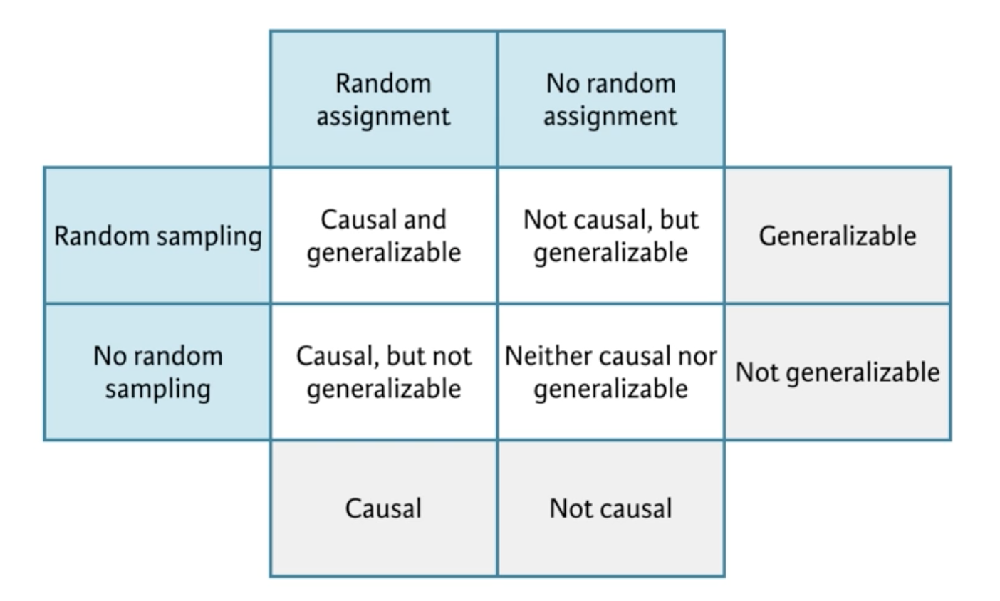
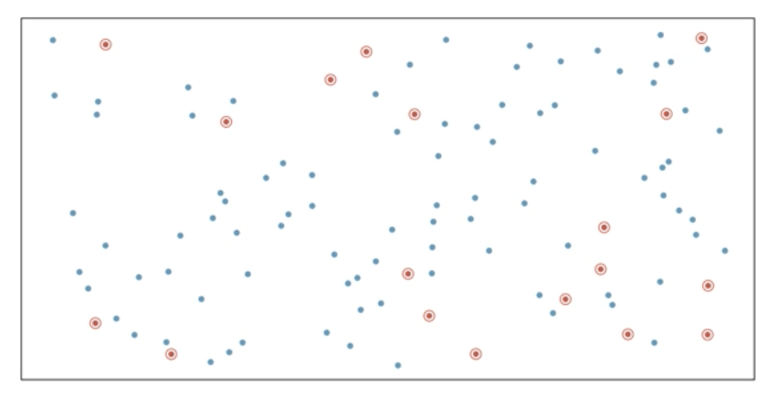
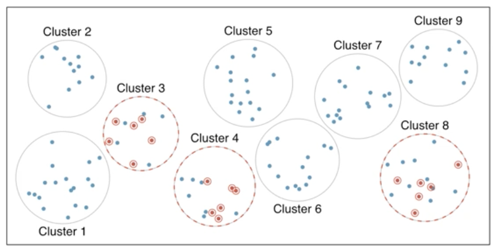
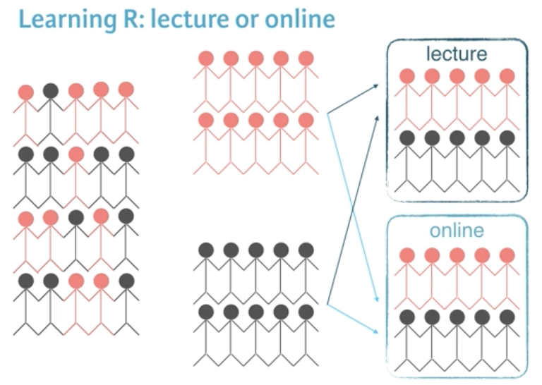

```{r setup, include=FALSE}
knitr::opts_chunk$set(eval=T, echo=T, cache=T, message=F, warning=F)
```

# Introduction

  - Course notes from the [Introduction to Data](https://www.datacamp.com/courses/introduction-to-data) course on DataCamp
  
## Whats Covered

  - Language of data
  - Study types and cautionary tales
  - Sampling strategies and experimental design
  - Case study

## Libraries and Data

```{r} 

library(dplyr)
library(tidyr)
library(ggplot2)
library(openintro)
library(gapminder)

```


&nbsp; &nbsp;

***  
# Language of data
***  

## Welcome to the course!

### -- Loading data into R

```{r}

## email50 dataset is in the openintro library which has been loaded

# Load data
data(email50)

# View its structure
str(email50)

```

## Types of variables

  - Numerical (qualitative): numerical values
    - Continuous: infinite number of values within a given range, often measured
    - Discrete: specific set of numeric values that can be counted or enumerated, often counted
  - Categorical (qualitative): limited number of distinct categories
    - Ordinal: finite number of values within a given range, often measured.

### -- Identify variable types
  
```{r}

glimpse(email50)

```

## Categorical data in R: factors

  - Often stored as factors in R
    - Importatn use: statsitical modeling
    - Sometimes undesirable, sometimes, essential
  - Common in subgroup analysis
    - Only interested in a subset of the data
    - Filter for specific levels of categorical variable

### -- Filtering based on a factor

```{r}

# Subset of emails with big numbers: email50_big
email50_big <- email50 %>%
  filter(number == "big")

# Glimpse the subset
glimpse(email50_big)

```

### -- Complete filtering based on a factor

```{r}

# Table of number variable
table(email50_big$number)

# Drop levels
email50_big$number <- droplevels(email50_big$number)

# Another table of number variable
table(email50_big$number)

```

## Discretize a variable

  - Use an `ifelse` statement to convert a numerical variable to a categorical variable based on a set criteria

### -- Discretize a different variable

```{r}

# Calculate median number of characters: med_num_char
med_num_char <- median(email50$num_char)

# Create num_char_cat variable in email50
email50 <- email50 %>%
  mutate(num_char_cat = ifelse(num_char < med_num_char, "below median", "at or above median"))
  
# Count emails in each category
table(email50$num_char_cat)

```

### -- Combining levels of a different factor

```{r}

# Create number_yn column in email50
email50 <- email50 %>%
  mutate(number_yn = ifelse(number == "none", "no", "yes"))

# Visualize number_yn
ggplot(email50, aes(x = number_yn)) +
  geom_bar()

```

## Visualizing numerical data

### -- Visualizing numerical and categorical data

```{r}

# Load ggplot2

# Scatterplot of exclaim_mess vs. num_char
ggplot(email50, aes(x = num_char, y = exclaim_mess, color = factor(spam))) +
  geom_point()

```


&nbsp; &nbsp;

***  
# Study tpes and cautionary tales
***  

## Observational studies and experiments

  - Observational study:
    - Collect data in a way that does not directly interfere with how the data arise
    - Only correlation can be inferred
  - Experiment:
    - Randomly assign subjects to various treatments
    - Causation can be inferred
  - In experiments, the decision to do something or not is not left of to the participants but decided by the researchers
  
### -- Identify study type

A study is designed to evaluate whether people read text faster in Arial or Helvetica font. A group of volunteers who agreed to be a part of the study are randomly assigned to two groups: one where they read some text in Arial, and another where they read the same text in Helvetica. At the end, average reading speeds from the two groups are compared.

What type of study is this?

  - Experiment
  
### -- Identify the type of study

```{r}

# Load data
data(gapminder)

# Glimpse data
glimpse(gapminder)

```

  - What type of study is this data from?
    - observational

## Random sampling and random assignment

  - Random samping:
    - At selection of subjects from popultion
    - Helps generalizability of results
  - Random assignmnet:
    - Asssignment of subjects to various treatments
    - Helps infer causation from results
    

### -- Random sampling or random assignment?

One of the early studies linking smoking and lung cancer compared patients who are already hospitalized with lung cancer to similar patients without lung cancer (hospitalized for other reasons), and recorded whether each patient smoked. Then, proportions of smokers for patients with and without lung cancer were compared.

Does this study employ random sampling and/or random assignment?

  - Neither random sampling 
    - Dealth only with patients that were already hospitalized. It would not be appropriate to apply the findings back to the population as a whole.
  - nor random assignment
    - The conditions are not imposed on the patients by the people conducting the study
    - If the researchers has one group of people smoke and the other not, this would be random assignment. 
  
### -- Identify the scope of inference of study

Volunteers were recruited to participate in a study where they were asked to type 40 bits of trivia—for example, "an ostrich’s eye is bigger than its brain"—into a computer. A randomly selected half of these subjects were told the information would be saved in the computer; the other half were told the items they typed would be erased.

Then, the subjects were asked to remember these bits of trivia, and the number of bits of trivia each subject could correctly recall were recorded. It was found that the subjects were significantly more likely to remember information if they thought they would not be able to find it later.

  - The results of the study `cannot` be generalized to all people 
  - A causal link between believing information is stored and memory `can` be inferred based on these results.

## Simpson's paradox

  - When the relationship between two variable is reversed when a new variable is introduced
  - e.g. a grouping variable is added and its then clear that the trend is negative for both groups. 
  
  
### -- Number of males and females admitted

```{r}

# dplyr and tidyr are already loaded

load('data/ucb_admit.Rdata')
str(ucb_admit)

# Count number of male and female applicants admitted
ucb_counts <- ucb_admit %>%
  count(Gender, Admit)

# View result
ucb_counts
  
# Spread the output across columns
ucb_counts %>%
  spread(Admit, n)

```

### -- Proportion of males admitted overall

```{r}

str(ucb_admit)

ucb_admit %>%
  # Table of counts of admission status and gender
  count(Gender, Admit) %>%
  # Spread output across columns based on admission status
  spread(Admit, n) %>%
  # Create new variable
  mutate(Perc_Admit = Admitted / (Admitted + Rejected))
  
```

### -- Proportion of males admitted for each department

```{r}

str(ucb_admit)

# Table of counts of admission status and gender for each department
admit_by_dept <- ucb_admit %>%
  count(Dept, Gender, Admit) %>%
  spread(Admit, n)

# View result
admit_by_dept

# Percentage of those admitted to each department
admit_by_dept %>%
  mutate(Perc_Admit = Admitted / (Admitted + Rejected))

```

### -- Contingency table results by group

  - Within most departments, female applicants are more likely to be admitted. 
  
## Recap: Simpson's paradox

  - Overall: males are more likely to be admitted
  - But within most departments: females more likely
  - When controlling for department, relationship between gender and admission status is reversed
  - Potential reason:
    - Women tended to apply to competitive departments with low admission rates
    - Men tended to apply to less competitive departments with high admission rates

&nbsp; &nbsp;

***  
# Sampling strategie and experimental design
***  

## Sampling strategies

  - Why not take a census?
    - Conducting a census is very resource intensive
    - (Nearly) impossible to collect data from all individuals, hence no guarantee of unbiased results. Some types of people may have more reason to avoid your survey. 
    - Populations constantly change
  - Sampling is like tasting your soup as you make it to see if its salty. 
    - stir well and then you can infer the taste of the soup from the small sample. 
    - but there are many sampling strategies in the real world...
  
Sample strategies:

  - Simple Random sample
    - each case is equally likekly to be selected
    
  - Stratified sample
    - Divide the population into homogeneous groups and then randomly sample from within each group
    - e.g. using zipcode or income level as a stratum and sampling equal numbers of people from each. 
    
  - Cluster sample
    - Divide population into clusters, randomly pick a few clusters, then sample all of these clusters.
    - The clusters are heterogenous and each cluster is similar to the other cluster so we can get away with just sampling a few of the clusters.  
    - e.g. cities could be clusters
    
  - Multistage sample
    - Multiple clusters
    - Often used for economical reasons
    - e.g. divide a city into similar geographical regions and then sample from some of them to avoid having to travel to every region. 
    
    
  
  
    

### -- Sampling strategies, determine which

A consulting company is planning a pilot study on marketing in Boston. They identify the zip codes that make up the greater Boston area, then sample 50 randomly selected addresses from each zip code and mail a coupon to these addresses. They then track whether the coupon was used in the following month.

What sampling strategy has this company used?

  - Stratified sample
  
## Sampling in R

  - simple random sample
    - dplyr: `sample_n`
  - stratified sample, 
    - first group by state than sample

### -- Simple random sample in R

```{r}

load('data/us_regions.RData')
str(us_regions)

# Simple random sample: states_srs
states_srs <- us_regions %>%
  sample_n(8)

# Count states by region
states_srs %>%
  count(region)
  
```

### -- Stratified sample in R

```{r}

# Stratified sample
states_str <- us_regions %>%
  group_by(region) %>%
  sample_n(2)

# Count states by region
states_str %>%
  count(region)

```

## Principles of experimental design

  - Control: compare treatment of interest to a control group
  - Randomize: randomly assign subjects to treatments
  - Replicate: collect a sufficiently large sample within a study, or replicate the entire study
  - Block: account for the potential effect of confounding variables
    - Group subjects into blocks based on these variables
    - Randomize within each bolock to treatment group
    - e.g. male and female, or prior programming experience
    

### -- Identifying components of a study

A researcher designs a study to test the effect of light and noise levels on exam performance of students. The researcher also believes that light and noise levels might have different effects on males and females, so she wants to make sure both genders are represented equally under different conditions.

What variables are involved in this study?

  - 2 explanatory variables (light and noise)
  - 1 blocking variable (gender)
  - 1 response variable (exam performance)
  
### -- Experimental design terminology

`Explanatory` variables are conditions you can impose on the experimental units, while `blocking` variables are characteristics that the experimental units come with that you would like to control for.

### -- Connect blocking and stratifying

  - In random sampling, you use `stratifying` to control for a variable. 
  - In random assignment, you use `blocking` to achieve the same goal.


&nbsp; &nbsp;

***  
# Case Study
***  

## Beauty in the classroom

### -- Inspect the data

```{r}

# Inspect evals
load('data/evals.RData')
glimpse(evals)

```

### -- Identify type of study

  - This is an observational study

### -- Sampling / experimental attributes

  - The data from this study were gathered by randomly sampling classes
  
## Variables in the data

  - score - range form 1 to 5 with 1 being poor evaluation
  - rank - the type of position of the professor
  - cls_ - summary information about the class
  - bty_ - beauty rating from females and males, lower and upper level (junior or senior)
  - pic_ - data on the outifu and if the photo was black and white

### -- Identify variable types

```{r}

# Inspect variable types
glimpse(evals)

# Remove non-factor variables from this vector
cat_vars <- c("rank", "ethnicity", "gender", "language",
              "cls_level", "cls_profs", "cls_credits",
              "pic_outfit", "pic_color")
              
```

### -- Recode a variable

```{r}

# Recode cls_students as cls_type: evals
evals <- evals %>%
  # Create new variable
  mutate(cls_type = ifelse(cls_students <= 18, 'small', 
                      ifelse(cls_students <= 59, 'midsize', 'large')))

table(evals$cls_type)

```

### -- Create a scatterplot

```{r}

# Scatterplot of score vs. bty_avg
ggplot(evals, aes(bty_avg, score)) +
  geom_point()

```

### -- Create a scatterplot, with an added layer

```{r}

# Scatterplot of score vs. bty_avg colored by cls_type
ggplot(evals, aes(bty_avg, score, color = cls_type)) +
  geom_point()

```

## Conclusion

  - This was a pretty simple class. 
  - It could have used a lot more examples and actual work 
  - It was more like a lecture from a university than a real online class with examples and doing. 
    - This was taught by a university professor so maybe that is why. 
    
