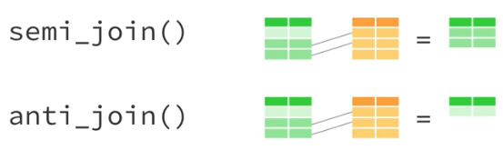
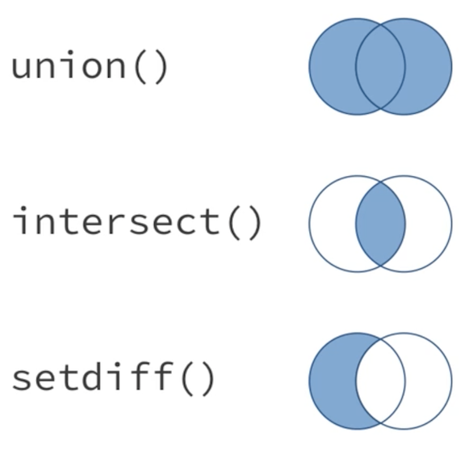
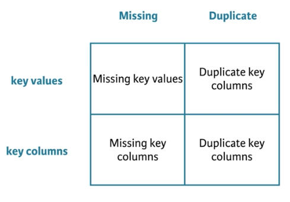
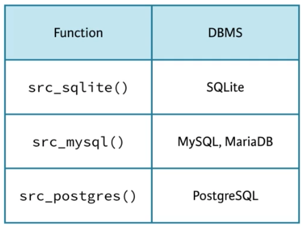

```{r setup, include=FALSE}
knitr::opts_chunk$set(eval=T, echo=T, cache=T, message=F, warning=F)

source("create_datasets.R")

library(dplyr)

```

# Introduction

  - Course notes from the [Joining Data in R with dplyr](https://www.datacamp.com/courses/joining-data-in-r-with-dplyr) course on DataCamp

## Whats Covered

  - Mutating joins
  - Filtering joins and set operations
  - Assembling data
  - Advanced joining
  - Case Study
    
## Aditional Resources
  
  - [R for Data Science Book](http://r4ds.had.co.nz/)
  - [Data Wrangling Cheatsheet](https://www.rstudio.com/wp-content/uploads/2015/02/data-wrangling-cheatsheet.pdf)
  - [dplyr two table verbs vignette](https://cran.r-project.org/web/packages/dplyr/vignettes/two-table.html)
  - [dbplyr vignette](https://cran.r-project.org/web/packages/dbplyr/vignettes/dbplyr.html)
  
&nbsp; &nbsp;

***  
# Mutating Joins
***  

## Welcome to the course!

  - Advantages to `dplyr` over base R `merge` function for joing data
    - dplyr always preserves the row order
    - dplyr has much more intuitive syntax
    - dplyr can be applied to databases, or spark
  - dplyr is a front end language for maniulating data that can be converted to multiple backends like SQL or spark. 
    - This is pretty useful. Everything we cover in this class could work on a spark dataframe or a sql table

## Keys

  - The Primary key needs to be unique in a table
  - The foreign key in the second table can be duplicated
  - second table will be matched to the primary table based on the primary key
  - The primary key may be one, two or even more columns in the table

### Primary Keys

  - What is the primary key in artists dataset?
    - `name`
  
```{r}

head(artists0, 10)

```

### Secondary Keys

  - Which datasets have a primary key that matches `artists$name`?
    - `bands$name`
    - `songs$writer`
  
```{r}

head(albums0)
head(bands0)
head(songs0)

```

### Multi-variable keys

  - What is the primary key in artists?
    - The combination of `first` and `last`
    
```{r}

head(artists)

```

## Joins

  - Joins in dplyr will work on data frames, tibbles (tbl_df), and tbl references
  <div style="width:500px">
  
  </div> 


### A basic join

```{r}

head(artists)
head(bands)

# Complete the code to join artists to bands
bands2 <- left_join(bands, artists, by = c('first','last'))

# Examine the results
bands2

```

### A second join

   - Notice how the `last` column is pulled in as `last.x` and `last.y` if not included in the join
    - And how all combination of rows are created for each name that is duplicated, e.g. john
   
```{r}

left_join(bands, artists, by = "first")

# Fix the code to recreate bands3
left_join(bands, artists, by = c("first","last"))

```

### A right join

```{r}

# Finish the code below to recreate bands3 with a right join
bands2 <- left_join(bands, artists, by = c("first", "last"))

bands3 <- right_join(artists, bands, by = c("first", "last"))

# Check that bands2 is equal to bands3
head(bands2)
head(bands3)
setequal(bands2, bands3)

```

## Variations on joins

  - `left_join` - prioritizes left dataset
  - `right_join` - prioritizes right dataset
  - `inner_join` - only retains rows in both datasets
  - `full_join` - retains all rows
  - Use %>% (pipes) to string together these joins

### inner joins and full joins

```{r}

head(songs)
head(albums)
inner_join(songs, albums, by = "album")

# Join bands to artists using full_join()
head(artists)
head(bands)
full_join(artists, bands, by = c("first","last"))

```

### Pipes

```{r}

# Find guitarists in bands dataset (don't change)
temp <- left_join(bands, artists, by = c("first", "last"))
temp <- filter(temp, instrument == "Guitar")
select(temp, first, last, band)

# Reproduce code above using pipes
bands %>% 
  left_join(artists, by = c("first","last")) %>%
  filter(instrument == "Guitar") %>%
  select(first, last, band)

```

### Practice with pipes and joins

```{r}

# Examine the contents of the goal dataset
goal

# Create goal2 using full_join() and inner_join() 
head(artists)
head(bands)
head(songs)

goal2 <- artists %>%
  full_join(bands, by = c("first","last")) %>%
  inner_join(songs, by = c("first","last"))
  
# Check that goal and goal2 are the same
setequal(goal, goal2)

```

### Choose your joins

```{r}

# Create one table that combines all information
collection <- artists %>%
  full_join(bands, by = c("first","last")) %>%
  full_join(songs, by = c("first","last")) %>%
  full_join(albums, by = c("album", "band"))
  
collection

```

&nbsp; &nbsp;

***  
# Filtering joins and set operations
***  
  
  - Filtering joins return a copy of the dataset that has been filtered, not augmented (as with mutating joins)
  <div style="width:500px">
  
  </div> 

## Semi-joins

### Apply a semi-join

```{r}

# View the output of semi_join()
artists %>% 
  semi_join(songs, by = c("first", "last"))

# Create the same result
artists %>% 
  right_join(songs, by = c("first", "last")) %>% 
  filter(!is.na(instrument)) %>% 
  select(first, last, instrument)

```

### Exploring with semi-joins

```{r}

albums %>% 
  # Collect the albums made by a band
  semi_join(bands, by = "band") %>% 
  # Count the albums made by a band
  nrow()

```

### A more precise way to filter?

  - You can use semi_joins with a df of date you want to match to easily filter
  
```{r}

tracks
matches

# With semi-join
tracks %>% 
  semi_join(matches,by = c("band", "year", "first"))

# With dply filter statement
tracks %>% 
  filter(
    (band == "The Beatles" & year == 1964 & first == "Paul") |
    (band == "The Beatles" & year == 1965 & first == "John") |
    (band == "Simon and Garfunkel" & year == 1966 & first == "Paul")
  )

```

## Anti-joins

### Apply an anti-join

```{r}

# Return rows of artists that don't have bands info
artists %>% 
  anti_join(bands, by = c("first","last"))

```

### Apply another anti-join

```{r}

# Check whether album names in labels are mis-entered
glimpse(labels)
glimpse(albums)

labels %>% 
  anti_join(albums, by = c("album"))

```

### Which filtering join?

```{r}

# Determine which key joins labels and songs
labels
songs

# Check your understanding
songs %>% 
  # Find the rows of songs that match a row in labels
  semi_join(labels, by = c("album")) %>% 
  # Number of matches between labels and songs
  nrow()

```

## Set operations

  - `union` will return every row that appears in one or more of the datasets
    - If a row appears multiple times `union` will only return it once
  - `interesect` will return only the rows that appear in both datasets
  - `setdiff` will return the rows that appear in the first dataset but not the second
  <div style="width:300px; height=200px">
  
  </div>  

### How many songs are there?

  - How many unique songs do these two albums contain in total?
  
```{r}

head(aerosmith)
head(greatest_hits)

aerosmith %>% 
  # Create the new dataset using a set operation
  union(greatest_hits) %>% 
  # Count the total number of songs
  nrow()

```

### Greatest hits

  - Which songs from Aerosmith made it onto Greates Hits?
  
```{r}

# Create the new dataset using a set operation
aerosmith %>% 
  intersect(greatest_hits)

```

### Live! Bootleg songs

  - Which songs are on Live! Bootleg but not on Greatest Hits? Notice that the length of songs may be different when they are performed live.
  
```{r}

# Select the song names from live
live_songs <- live %>% 
  select(song)

# Select the song names from greatest_hits
greatest_songs <- greatest_hits %>% 
  select(song)

# Create the new dataset using a set operation
live_songs %>% 
  setdiff(greatest_songs)

```

### Multiple operations

  - Which songs appear on one of Live! Bootleg or Greatest Hits, but not both?

```{r}

# Select songs from live and greatest_hits
live_songs <- live %>% select(song)
greatest_songs <- greatest_hits %>% select(song)

# Return the songs that only exist in one dataset
all_songs <- union(live_songs, greatest_songs)
both_songs <- intersect(live_songs, greatest_songs)
one_songs <- setdiff(all_songs, both_songs)
one_songs

```

## Comparing datasets

  - Its common to want to know if one data set is the same as another dataset
  - dplyr's `setequal` will do this easily
  - base R's `identical` is will only return true if the datasets have the exact same rows in the exact same order
  
Recap:

  - Mutating Joins:  
    - `left_join`
    - `right_join`
    - `inner_join`
    - `full_join`
  - Filtering Joins:  
    - `semi_join`
    - `anti_join`
  - Set Operations:  
    - `union`
    - `intersect`
    - `setdiff`
  - Comparisions  
    - `setequal`
    
### Apply setequal

  - Both anthologies claim to contain the complete studio recordings of Led Zeppelin, but do the anthologies contain the same exact songs?
  
```{r}

# Check if same order: definitive and complete
identical(definitive, complete)

# Check if any order: definitive and complete
setequal(definitive, complete)

# Songs in definitive but not complete
setdiff(definitive, complete)

# Songs in complete but not definitive
setdiff(complete, definitive)

```

### Apply setequal again

  - If the datasets have the same columns and all are used in the key, then `intersect` is analagous to `semi_join`
  - In the same scenario `setdiff` is similar to `anti_join`
  
```{r}

# Return songs in definitive that are not in complete
definitive %>% 
  anti_join(complete, by = c("song", "album"))

# Return songs in complete that are not in definitive
complete %>% 
  anti_join(definitive, by = c("song", "album"))

```

### Comparing albums

  - Is the soundtrack of *The Song Remains the Same* the only difference between The Definitive Collection and The Complete Studio Recordings? 
  
```{r}

nrow(complete)
nrow(definitive)

# Check if same order: definitive and union of complete and soundtrack
union(complete, soundtrack) %>%
  identical(definitive)


# Check if any order: definitive and union of complete and soundtrack
union(complete, soundtrack) %>%
  setequal(definitive)

```


&nbsp; &nbsp;

***  
# Assembling data
***  

## Binds

  - Base R binds
    - `rbind`, `cbind`
  - dplyr binds
    - `bind_rows`, `bind_cols`  
    

&nbsp;

  - Advantages of dplyr versions
    - faster
    - return a tibble (advanced data frame)
    - can handle lists of dataframes
    - `.id` argument in `bind_rows` allows you to pass in a name for each source dataframe
      - this will be added as a column to the result dataset
      - this is really handy when one of the variables for the data set is stored in the table name. 
      - e.g. houly weather data for different days
    - `rbind` will return an error if the column names do not match exactly. 
      - `bind_rows` will create a column for each unique column and distribute `NA`s appropriately

### Which bind?

```{r}

# Examine side_one and side_two
side_one
side_two

# Bind side_one and side_two into a single dataset
side_one %>% 
  bind_rows(side_two)

```

### Bind rows

  - you can pass bind_rows() a list of data frames like jimi to bind together into a single data frame
  - you can save the name of the list element into a column with the `.id` argument

```{r}

# Examine discography and jimi
discography
jimi

jimi %>% 
  # Bind jimi into a single data frame
  bind_rows(.id = "album") %>% 
  # Make a complete data frame
  left_join(discography, by = c("album"))

```

### Bind columns

```{r}

# Examine hank_years and hank_charts
hank_years
hank_charts

hank_years %>% 
  # Reorder hank_years alphabetically by song title
  arrange(song) %>% 
  # Select just the year column
  select(year) %>% 
  # Bind the year column
  bind_cols(hank_charts) %>% 
  # Arrange the finished dataset
  arrange(year, song)

```

### Danger

  - The biggest risk when using `bind_cols` is that the observations may not align acros the rows of your data frame
  
## Build a better data frame

  - R Base way to create a dataframe
    - `data.frame()` and `as.data.frame()`
  - dplyr way to create a dataframe
    - `data_frame()` and `as_data_frame()`
  - Advantages of using `data_frame()`:
    - will never change the data type of a vector. (e.g. strings to factors)
    - will never add row names
    - will not changes unusual column names
    - only recycles length 1 inputs
    - evaluate lazily and in order. (So you can reference a column in the next column definition)
    - outputs a tibble (class tbl_df)
  - `as_data_frame` does all these same things
    - its just used on a list of columns

### Make a data frame

```{r}

head(hank_year)
head(hank_song)
head(hank_peak)

# Make combined data frame using data_frame()
data_frame(
  year = hank_year,
  song = hank_song,
  peak = hank_peak
  ) %>% 
  # Extract songs where peak equals 1
  filter(peak == 1)

```

### Lists of columns

```{r}

# Examine the contents of hank
str(hank)

# Convert the hank list into a data frame
as_data_frame(hank) %>% 
  # Extract songs where peak equals 1
  filter(peak == 1)

```

### List of rows (data frames)

```{r}

# Examine the contents of michael
str(michael, give.attr = F)

bind_rows(michael, .id = "album") %>% 
  group_by(album) %>% 
  mutate(rank = min_rank(peak)) %>% 
  filter(rank == 1) %>% 
  select(-rank, -peak)

```

## Working with data types

  - Be aware of data types when combining vectors or data frames
    - R will need to make a decision about the resulting type if the original types differ for a vector/column
    <div style="width:300px; height=200px">
    
    </div>  
    
  - 6 atomic data types in R
    - logical
    - character
    - double
    - integer
    - complex
    - raw

```{r}

typeof(TRUE)
typeof("hello")
typeof(3.14)
typeof(1L)
typeof(1 + 2i)
typeof(raw(1))

```

### Atomic data types

  - R will coerce logicals and numerics to strings if strings are present
  - R will coerce logicals to numerics if numerics are present
  - as.character() will coerce factors to their labels as strings if strings are present
  - as.numeric() will coerce factors to their levels as numerics if numerics are present

## dplyr's coercion rules

Base R coercion rules:

  - in general the more specific type of data will convert to the more general
    - integer and logical will go to integer
    - double and integer/locgical will go to double
    - character and integer/double/logical will go to character
  - factors are tricky
    - if joining to an integer or double the factor integer values will be used
    - if joining to a character the factor labels will be used
    - be careful if you have numeric labels for your factors

dplyr's coercion rules:

  - dplyr functions will not automatically coerce data types
    - returns and error
    - expects you to manyally coerce data
  - Exception: factors
    - dplyr coverts non-aligning factors to strings
    - gives warning message
  
### dplyr and coercion

  - dplyr's two table functions will
    - coerce two factors to a string if the factors have different levels
    - coerce two factors to a string if the factors have the same levels in a different order
    - return an error instead of coercing logicals, integers, and numerics to a character

### Determining type

  - eighties has the year variable stores as a factor
  - sevnties has it stored as a character
  - when combined it will be a character
    - we will get a warning message
  
```{r, warning=T}

seventies

eighties

both <- seventies %>% bind_rows(eighties)

head(both)
```

### Results

```{r, error=T}

# sixties$year is a numeric and seventies$year is a factor
str(sixties)
str(seventies)

# This gives an error about not converting factor to numeric
seventies %>% bind_rows(sixties)

# So lets convert it....
# But this converts the year to the integer factor value, not the year. Whoops
seventies %>% 
  mutate(year = as.numeric(year))

# We need to make it a character first to get the year, then convert to numeric
seventies %>% mutate(year = as.numeric(as.character(year)))
  
# Now we can join the datasets correctly
seventies %>% 
  # Coerce seventies$year into a useful numeric
  mutate(year = as.numeric(as.character(year))) %>% 
  # Bind the updated version of seventies to sixties
  bind_rows(sixties) %>% 
  arrange(year)

```


&nbsp; &nbsp;

***  
# Advanced Joining
***  

## What can go wrong?

  - This chapter is about becoming a master at joining data
  - The main problems with joins come from missing or duplicate key values or columns
  - NA in the key column?
    - Probably just need to remove these rows
  - Missing key column? 
    - it might be in the row name. use `rownames_to_column` in `tibble` package
  - duplicate keys?
    - Might just need to include another column in the key criteria
    - If you really have duplicates be careful as you will get every combination of key value matches across datasets.
  
  <div style="width:500px">
  
  </div> 

### Spot the key

```{r}

# Whoops, the primary key is in the row names for stage_songs
# We need to fix that before joining to stage_writers
stage_songs
stage_writers

# Load the tibble package
library(tibble)

stage_songs %>% 
  # Add row names as a column named song
  rownames_to_column("song") %>% 
  # Left join stage_writers to stage_songs
  left_join(stage_writers, by = "song")

```

### Non-unique keys

  - Non unique keys can be okay if you want the info for each entry and don't mind it being duplicated. 
    - like years will get duplicated here because there are non unique keys in the musical column of composers dataset
    
```{r}

shows

# There are more than one composer for some musicals, so the musical column has duplicate key values. 
composers

# join by musical
shows %>% left_join(composers, by = "musical")
```

### Two non-unique keys

  - But in this case its kind of a problem becuse the key is duplicated in both show_songs and composers datasets
    - There are multiple songs in a musical and multiple composers for a musical
    - We end up with two rows for every song if there were two composers for that musical

```{r}

show_songs

show_songs %>% 
  left_join(composers, by = "musical") %>%
  arrange(musical) %>% 
  head(12)


```

### Missing keys

  - Missing keys can mistakenly join two rows that do not belong toegether
  
```{r}

singers
two_songs

# Examine the result of joining singers to two_songs
two_songs %>% inner_join(singers, by = "movie")

# Remove NA's from key before joining
two_songs %>% 
  filter(!is.na(movie)) %>% 
  inner_join(singers, by = "movie")

```

## Defining the keys
  - If you do not set a `by` argument dplyr will join on all columns that match across the two datasets
  - You can use named vetors to match column with different names `by = c("name1"" = "name2")`
  - If there are non-key columns with the same names they wil show up as `name.x` and `name.y`
    - You can change this by adding the `suffix` argument. `suffix = c("name1","name2")`

### A subset of keys

  - The `movie` column is the key and `name` refers to different things in these two datasets
    - We will clean up the name columns after the join

```{r}
movie_years

movie_studios

movie_years %>% 
  # Left join movie_studios to movie_years
  left_join(movie_studios, by = "movie") %>% 
  # Rename the columns: artist and studio
  rename(artist = name.x, studio = name.y)
  
```

### Mis-matched key names

  - Here we use the named argument to create the correct join since the keys have different column names
    - This is a very common case in most relational databases. You will have `something_dimension_id` in the fact table and just `id` as the key in the dimension table
    
```{r}

# Identify the key column
elvis_songs
elvis_movies

elvis_movies %>% 
  # Left join elvis_songs to elvis_movies by this column
  left_join(elvis_songs, by = c("name" = "movie")) %>% 
  # Rename columns
  rename(movie = name, song = name.y)

```

### More mismatched names

  - We can rename columns in the select statment
  
```{r}

# Identify the key columns
movie_directors
movie_years

movie_years %>% 
  # Left join movie_directors to movie_years
  left_join(movie_directors, by = c("movie" = "name")) %>% 
  # Arrange the columns using select()
  select(year, movie, artist = name, director, studio)

```

## Joining multiple tables

  - To join multiple tables we could do a bunch of `left_join`s in a row
  - The `purrr` package has a function `reduce()` that lets us apply a function recursively to a list of datasets
  - `purrr` is also written by hadley wickham so it will work well with `dplyr` functions
  - the purpose of `purrr` is to help us apply R functions to data in efficient ways
  
### Join multiple tables

  - Using reduce to do a left_quick join of all tables
  
```{r}

# Load the purrr library
library(purrr)

# Place supergroups, more_bands, and more_artists into a list
list(supergroups, more_bands, more_artists) %>% 
  # Use reduce to join together the contents of the list
  reduce(left_join, by = c("first" = "first","last" = "last"))

```

### Filter multiple tables

  - Here we use reduce to do a filtering semi_join
  
```{r}

list(more_artists, more_bands, supergroups) %>% 
  # Return rows of more_artists in all three datasets
  reduce(semi_join, by = c("first","last"))

```

## Other implementations

  - We can do the same joins as we have been using here wih the `merge` function, but the syntax is more confusing
    - I will always just use `dplyr` joins
  - The `dplyr` joins translate to sql joins as show
    - These are good to know as often I am exploring a sql database before pulling data into R. It happens. 
      <div style="width:500px">
      
      </div> 
  - These are the DBMSs (Database management systems) you can easily connect to from R
    - Once you have connected you can write `dplyr` code and it will be translated to sql and run in the DBMS
    - This is incredible useful. Its worthy of its own corse. 
    - checkout [`vignette("dbplyr")`](https://cran.r-project.org/web/packages/dbplyr/vignettes/dbplyr.html) to see more about `dplyr`'s database capabilities
    - We can use `collect` to pull the data into R when we are ready or `data.frame` will also pull it in. 
      <div style="width:500px">
      
      </div>
    
### SQL

  - Each `dplyr` join has an SQL equivalent, and when you apply a dplyr join to a SQL data source (instead of a data frame), `dplyr` automatically converts your join to its SQL equivalent and runs it in the database.

### Base R

```{r}

# Alter the code to perform the join with a dplyr function
merge(bands, artists, by = c("first", "last"), all.x = TRUE) %>%
  arrange(band)
  
bands %>% left_join(artists, by = c("first", "last"))

```


&nbsp; &nbsp;

***  
# Case Study
***  

## Lahman's Baseball Database

  - library(Lahman)
  - Sean Lahman's baseball database
  - 26 tables
  - A great example of real worl relational data
  
### Universal keys?

  - In particular, do any variable names span all of the datasets?
  
```{r}

library(Lahman)

# Examine lahmanNames
str(lahmanNames)

# Find variables in common
reduce(lahmanNames, intersect)
```

### Common keys?

```{r}

lahmanNames %>%  
  # Bind the data frames in lahmanNames
  bind_rows(.id = 'dataframe') %>%
  # Group the result by var
  group_by(var) %>%
  # Tally the number of appearances
  tally() %>%
  # Filter the data
  filter(n > 1) %>% 
  # Arrange the results
  arrange(desc(n))

```

### playerID

```{r}

lahmanNames %>% 
  # Bind the data frames
  bind_rows(.id = 'dataframe') %>%
  # Filter the results
  filter(var == 'playerID') %>% 
  # Extract the dataframe variable
  `$`(dataframe)

```

## Salaries

### Who are the players?

  - Get count of distinct players

```{r}

players <- Master %>% 
  # Return one row for each distinct player
  distinct(playerID, nameFirst, nameLast)
  
nrow(players)
nrow(Master)

```

### Missing salaries

  - How many players are completely missing salary information?
  
```{r}

head(players)
head(Salaries)

players %>% 
  # Find all players who do not appear in Salaries
  anti_join(Salaries, by = 'playerID') %>%
  # Count them
  count()

```

### Unpaid games?

  - Is it possible that these players somehow did not play (and hence did not earn a salary)?
  
```{r}

head(Appearances)

players %>% 
  anti_join(Salaries, by = "playerID") %>% 
  # How many unsalaried players appear in Appearances?
  semi_join(Appearances, by = "playerID") %>% 
  count()

```

### How many games?

  - Can you determine how many games each of these unsalaried players played?

```{r}

players %>% 
  # Find all players who do not appear in Salaries
  anti_join(Salaries, by = "playerID") %>% 
  # Join them to Appearances
  left_join(Appearances, by = "playerID") %>% 
  # Calculate total_games for each player
  group_by(playerID) %>%
  summarise(total_games = sum(G_all, na.rm = T)) %>%
  # Arrange in descending order by total_games
  arrange(desc(total_games))

```

### How many at-bats?

  Is it possible that the unsalaried players did not actually play in the games that they appeared in? 
  
```{r}

head(Batting)

players %>%
  # Find unsalaried players
  anti_join(Salaries, by = "playerID") %>% 
  # Join Batting to the unsalaried players
  left_join(Batting, by = "playerID") %>% 
  # Group by player
  group_by(playerID) %>% 
  # Sum at-bats for each player
  summarize(total_at_bat = sum(AB, na.rm = T)) %>% 
  # Arrange in descending order
  arrange(desc(total_at_bat))

```

## Introducing the hall of fame

### Hall of fame nominations

  - Let's see how many players have been nominated for the Hall of Fame.
  
```{r}

head(HallOfFame)

# Find the distinct players that appear in HallOfFame
nominated <- HallOfFame %>% 
  distinct(playerID)

nominated %>% 
  # Count the number of players in nominated
  count()

nominated_full <- nominated %>% 
  # Join to Master
  left_join(Master, by = "playerID") %>% 
  # Return playerID, nameFirst, nameLast
  select(playerID, nameFirst, nameLast)

head(nominated_full)
```

### Hall of fame inductions

  - Let's now see how many players were admitted to the hall of fame to examine how selective the voting process is.
  
```{r}

  
# Find distinct players in HallOfFame with inducted == "Y"
inducted <- HallOfFame %>% 
  filter(inducted == "Y") %>%
  distinct(playerID)

# Note if you wanted to keep all of the columns you can use keep_all in the distinct function
HallOfFame %>%
  distinct(playerID, .keep_all = TRUE) %>%
  filter(inducted == "Y") %>% 
  head()

inducted %>% 
  # Count the number of players in inducted
  count()

inducted_full <- inducted %>% 
  # Join to Master
  left_join(Master, by = "playerID") %>% 
  # Return playerID, nameFirst, nameLast
  select(playerID, nameFirst, nameLast)

head(inducted_full)

```

### Awards

  - Did nominees who were inducted earn more awards than nominees who were not inducted?
  
```{r}

# Tally the number of awards in AwardsPlayers by playerID
nAwards <- AwardsPlayers %>% 
  group_by(playerID) %>% 
  tally()

head(nAwards)

nAwards %>% 
  # Filter to just the players in inducted 
  semi_join(inducted, by = "playerID") %>% 
  # Calculate the mean number of awards per player
  summarize(avg_n = mean(n, na.rm = T))

nAwards %>% 
  # Filter to just the players in nominated 
  semi_join(nominated, by = "playerID") %>% 
  # Filter to players NOT in inducted 
  anti_join(inducted, by = "playerID") %>%
  # Calculate the mean number of awards per player
  summarize(avg_n = mean(n, na.rm = T))

```

### Salary

  - Does the maximum salary earned by inductees tend to be greater than the maximum salary earned by nominees who were not inducted?
  
```{r}

# Find the players who are in nominated, but not inducted
notInducted <- nominated %>% 
  setdiff(inducted, by = "playerID")

Salaries %>% 
  # Find the players who are in notInducted
  semi_join(notInducted) %>%
  # Calculate the max salary by player
  group_by(playerID) %>% 
  summarize(max_salary = max(salary)) %>% 
  # Calculate the average of the max salaries
  summarize(avg_salary = mean(max_salary))

# Repeat for players who were inducted
Salaries %>% 
  semi_join(inducted) %>%
  # Calculate the max salary by player
  group_by(playerID) %>% 
  summarize(max_salary = max(salary)) %>% 
  # Calculate the average of the max salaries
  summarize(avg_salary = mean(max_salary))
  
```

### Retirement

  - One of the rules of the Hall of Fame is that players cannot be nominated until five years after they retire. Is this reflected in our data?
  
```{r}

head(Appearances)

Appearances %>% 
  # Filter Appearances against nominated
  semi_join(nominated, by = "playerID") %>%
  # Find last year played by player
  group_by(playerID) %>% 
  summarize(last_year = max(yearID)) %>%
  # Join to full HallOfFame
  left_join(HallOfFame, by = "playerID") %>% 
  # Filter for unusual observations
  filter(yearID <= last_year)

```
